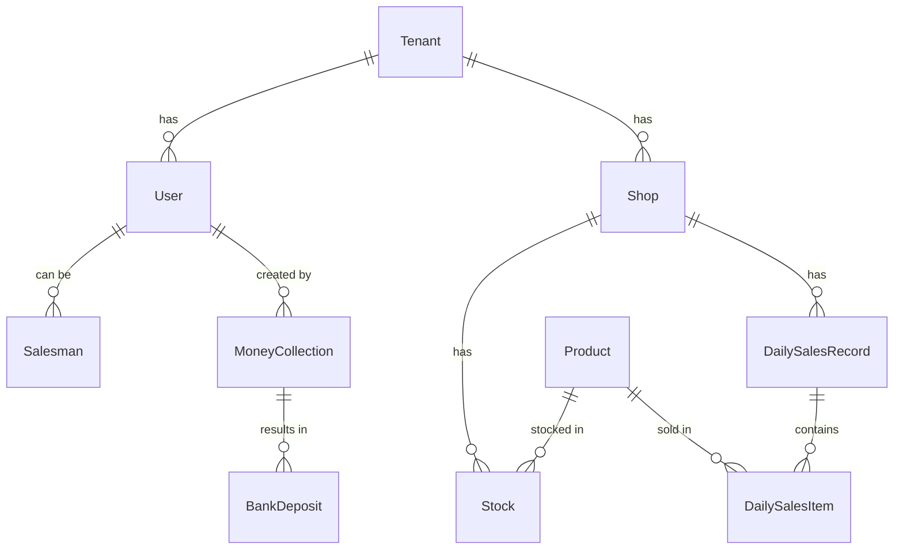
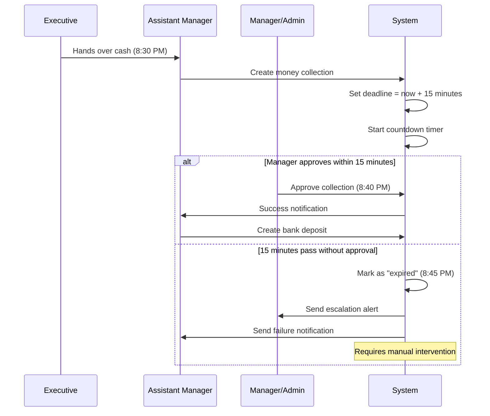
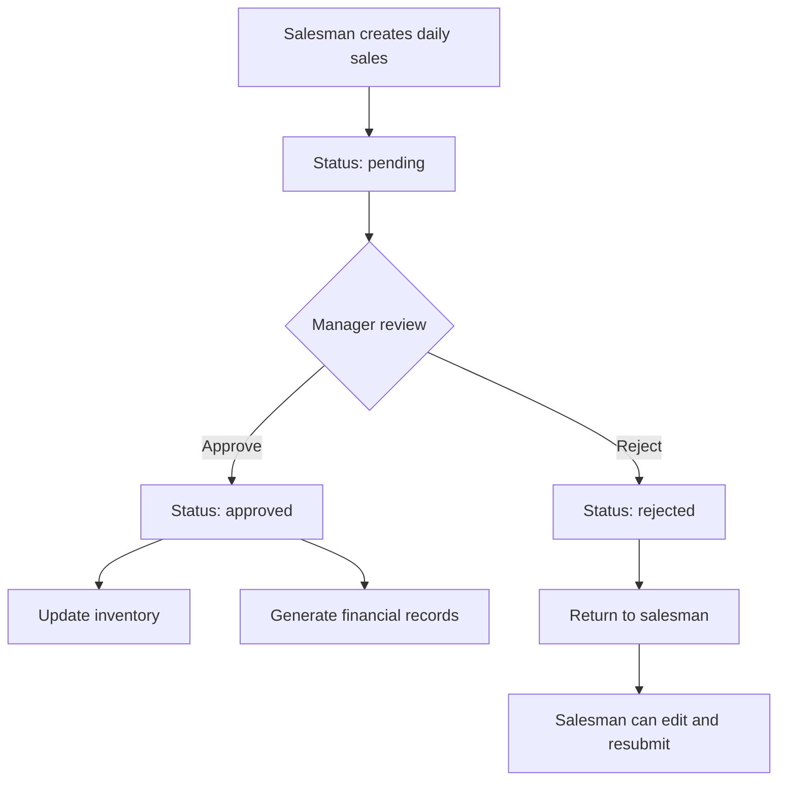
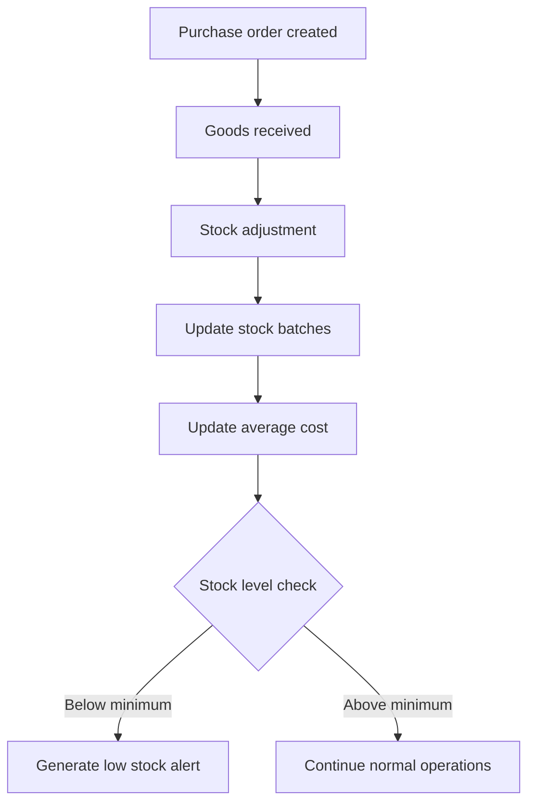

# LiquorPro Backend - Complete Overview & Documentation

## Table of Contents
1. [Architecture Overview](#architecture-overview)
2. [Service Breakdown](#service-breakdown)
3. [Database Schema & Models](#database-schema--models)
4. [User Roles & Workflows](#user-roles--workflows)
5. [API Documentation & cURL Tests](#api-documentation--curl-tests)
6. [Authentication & Authorization](#authentication--authorization)
7. [Critical Business Workflows](#critical-business-workflows)
8. [Configuration & Deployment](#configuration--deployment)
9. [Error Handling & Monitoring](#error-handling--monitoring)

---

## Architecture Overview

### System Architecture
The LiquorPro backend is built as a microservices architecture using Go, with the following components:

```
┌─────────────────┐    ┌──────────────────┐    ┌─────────────────┐
│   Frontend      │    │   API Gateway    │    │   Auth Service  │
│   (Port 8095)   │◄──►│   (Port 8090)    │◄──►│   (Port 8091)   │
└─────────────────┘    └──────────────────┘    └─────────────────┘
                              │                          │
                              ▼                          ▼
┌─────────────────┐    ┌──────────────────┐    ┌─────────────────┐
│   Sales Service │    │ Inventory Service│    │ Finance Service │
│   (Port 8092)   │    │   (Port 8093)    │    │   (Port 8094)   │
└─────────────────┘    └──────────────────┘    └─────────────────┘
                              │
                              ▼
                    ┌──────────────────┐
                    │   SaaS Service   │
                    │    (Internal)    │
                    └──────────────────┘
                              │
                              ▼
                    ┌──────────────────┐    ┌─────────────────┐
                    │   PostgreSQL     │    │     Redis       │
                    │   Database       │    │     Cache       │
                    └──────────────────┘    └─────────────────┘
```

### Technology Stack
- **Language**: Go 1.21+
- **Web Framework**: Gin
- **Database**: PostgreSQL with GORM
- **Cache**: Redis
- **Authentication**: JWT tokens
- **Architecture**: Microservices
- **Containerization**: Docker
- **Orchestration**: Kubernetes (optional)

### Core Design Patterns
- **Multi-tenant Architecture**: Complete tenant isolation
- **Gateway Pattern**: Centralized routing and authentication
- **Repository Pattern**: Data access abstraction
- **Service Layer Pattern**: Business logic encapsulation
- **Middleware Pattern**: Cross-cutting concerns

---

## Service Breakdown

### 1. API Gateway Service (Port 8090)
**Purpose**: Central entry point for all API requests
**Responsibilities**:
- Route requests to appropriate microservices
- Handle authentication validation
- Implement CORS and security headers
- Service discovery and health checking
- Load balancing (future)

**Key Files**:
- `cmd/gateway/main.go` - Service entry point
- `internal/gateway/routes/routes.go` - Complete routing configuration
- `internal/gateway/handlers/handlers.go` - Proxy handlers

**Routes Handled**:
```
Gateway Management:
GET /gateway/health - Health check
GET /gateway/version - Version information
GET /gateway/services - Service discovery

Authentication (Proxy to Auth):
POST /api/auth/login
POST /api/auth/register
POST /api/auth/logout
GET /api/auth/profile

Sales (Proxy to Sales):
GET/POST /api/sales/daily-records
GET/POST /api/sales/sales
GET/POST /api/sales/returns

Inventory (Proxy to Inventory):
GET/POST /api/inventory/products
GET/POST /api/inventory/categories
GET/POST /api/inventory/brands

Finance (Proxy to Finance):
GET/POST /api/finance/vendors
GET/POST /api/finance/expenses
POST /api/finance/money-collection

Admin (Proxy to Auth):
GET/POST /api/admin/users
GET/POST /api/admin/shops
GET/POST /api/admin/tenants
```

### 2. Authentication Service (Port 8091)
**Purpose**: User management, authentication, and authorization
**Responsibilities**:
- User registration and login
- JWT token generation and validation
- Role-based access control
- Tenant management
- Session management

**Key Models**:
- `User` - System users with roles
- `Tenant` - Multi-tenant organizations
- `Shop` - Physical store locations
- `Salesman` - Sales personnel
- `UserSession` - Active user sessions

**Business Logic**:
- Multi-tenant user isolation
- Role hierarchy: saas_admin > admin > manager > executive > assistant_manager > salesman
- Password hashing with bcrypt
- JWT tokens with Redis session validation

### 3. Sales Service (Port 8092)
**Purpose**: Sales transaction management
**Responsibilities**:
- Daily bulk sales entry (primary workflow)
- Individual sales transactions
- Sale returns processing
- Sales approvals workflow
- Financial reporting

**Key Models**:
- `DailySalesRecord` - Bulk daily sales entry
- `DailySalesItem` - Individual items in daily sales
- `Sale` - Individual sales transactions
- `SaleReturn` - Product returns

**Critical Workflows**:
- Salesman creates daily bulk sales
- Manager/Admin approvals required
- Financial integration with money collection

### 4. Inventory Service (Port 8093)
**Purpose**: Product and stock management
**Responsibilities**:
- Product catalog management
- Brand and category management
- Stock level tracking
- Purchase order management
- Stock transfers between locations

**Key Models**:
- `Product` - Product catalog
- `Brand` - Product brands
- `Category` - Product categories
- `Stock` - Stock levels per shop
- `StockBatch` - Batch tracking
- `StockPurchase` - Purchase orders

### 5. Finance Service (Port 8094)
**Purpose**: Financial operations and money management
**Responsibilities**:
- Money collection with 15-minute approval deadline
- Expense management
- Vendor payment processing
- Bank account management
- Financial reporting

**Key Models**:
- `MoneyCollection` - Critical 15-minute deadline workflow
- `Expense` - Business expenses
- `Vendor` - Supplier management
- `BankAccount` - Banking operations

**CRITICAL**: 15-minute approval deadline for money collection!

### 6. SaaS Service (Internal)
**Purpose**: Subscription and plan management
**Responsibilities**:
- Subscription lifecycle
- Payment processing
- Plan management
- Usage analytics
- System administration

---

## Database Schema & Models

### Core Entity Relationships



### Base Models
All models inherit from either:
- `BaseModel`: ID, CreatedAt, UpdatedAt, DeletedAt
- `TenantModel`: BaseModel + TenantID (for multi-tenancy)

### Key Tables

#### Users & Authentication
```sql
-- Tenants table
CREATE TABLE tenants (
    id UUID PRIMARY KEY DEFAULT gen_random_uuid(),
    name VARCHAR NOT NULL,
    domain VARCHAR UNIQUE,
    is_active BOOLEAN DEFAULT true,
    subscribed_at TIMESTAMP,
    expires_at TIMESTAMP,
    created_at TIMESTAMP DEFAULT NOW(),
    updated_at TIMESTAMP DEFAULT NOW(),
    deleted_at TIMESTAMP
);

-- Users table
CREATE TABLE users (
    id UUID PRIMARY KEY DEFAULT gen_random_uuid(),
    tenant_id UUID NOT NULL REFERENCES tenants(id),
    username VARCHAR UNIQUE NOT NULL,
    email VARCHAR UNIQUE NOT NULL,
    first_name VARCHAR,
    last_name VARCHAR,
    phone VARCHAR,
    password_hash VARCHAR NOT NULL,
    role VARCHAR NOT NULL DEFAULT 'salesman',
    is_active BOOLEAN DEFAULT true,
    profile_image VARCHAR,
    created_at TIMESTAMP DEFAULT NOW(),
    updated_at TIMESTAMP DEFAULT NOW(),
    deleted_at TIMESTAMP,
    INDEX idx_tenant_users (tenant_id)
);

-- Shops table
CREATE TABLE shops (
    id UUID PRIMARY KEY DEFAULT gen_random_uuid(),
    tenant_id UUID NOT NULL REFERENCES tenants(id),
    name VARCHAR NOT NULL,
    address TEXT,
    phone VARCHAR,
    license_number VARCHAR,
    latitude DECIMAL(10,8),
    longitude DECIMAL(11,8),
    is_active BOOLEAN DEFAULT true,
    created_at TIMESTAMP DEFAULT NOW(),
    updated_at TIMESTAMP DEFAULT NOW(),
    deleted_at TIMESTAMP,
    INDEX idx_tenant_shops (tenant_id)
);
```

#### Sales Models
```sql
-- Daily Sales Records (Critical for bulk entry)
CREATE TABLE daily_sales_records (
    id UUID PRIMARY KEY DEFAULT gen_random_uuid(),
    tenant_id UUID NOT NULL REFERENCES tenants(id),
    record_date DATE NOT NULL,
    shop_id UUID NOT NULL REFERENCES shops(id),
    salesman_id UUID REFERENCES salesmen(id),
    total_sales_amount DECIMAL(12,2) NOT NULL,
    total_cash_amount DECIMAL(12,2) DEFAULT 0,
    total_card_amount DECIMAL(12,2) DEFAULT 0,
    total_upi_amount DECIMAL(12,2) DEFAULT 0,
    total_credit_amount DECIMAL(12,2) DEFAULT 0,
    status VARCHAR DEFAULT 'pending',
    approved_at TIMESTAMP,
    approved_by_id UUID REFERENCES users(id),
    created_by_id UUID NOT NULL REFERENCES users(id),
    notes TEXT,
    created_at TIMESTAMP DEFAULT NOW(),
    updated_at TIMESTAMP DEFAULT NOW(),
    deleted_at TIMESTAMP,
    INDEX idx_daily_sales_date (record_date),
    INDEX idx_sales_status (status)
);

-- Daily Sales Items
CREATE TABLE daily_sales_items (
    id UUID PRIMARY KEY DEFAULT gen_random_uuid(),
    tenant_id UUID NOT NULL REFERENCES tenants(id),
    daily_sales_record_id UUID NOT NULL REFERENCES daily_sales_records(id),
    product_id UUID NOT NULL REFERENCES products(id),
    quantity INTEGER NOT NULL,
    unit_price DECIMAL(10,2) NOT NULL,
    total_amount DECIMAL(12,2) NOT NULL,
    cash_amount DECIMAL(12,2) DEFAULT 0,
    card_amount DECIMAL(12,2) DEFAULT 0,
    upi_amount DECIMAL(12,2) DEFAULT 0,
    credit_amount DECIMAL(12,2) DEFAULT 0,
    created_at TIMESTAMP DEFAULT NOW(),
    updated_at TIMESTAMP DEFAULT NOW(),
    deleted_at TIMESTAMP
);
```

#### Finance Models (CRITICAL)
```sql
-- Money Collection (15-minute approval deadline)
CREATE TABLE money_collections (
    id UUID PRIMARY KEY DEFAULT gen_random_uuid(),
    tenant_id UUID NOT NULL REFERENCES tenants(id),
    executive_id UUID NOT NULL REFERENCES users(id),
    assistant_manager_id UUID NOT NULL REFERENCES users(id),
    shop_id UUID NOT NULL REFERENCES shops(id),
    collection_date DATE NOT NULL,
    amount DECIMAL(12,2) NOT NULL,
    collection_type VARCHAR NOT NULL, -- daily_sales, credit_recovery, other
    description TEXT,
    notes TEXT,
    collected_at TIMESTAMP NOT NULL,
    submitted_at TIMESTAMP NOT NULL,
    deadline_at TIMESTAMP NOT NULL, -- submitted_at + 15 minutes
    approval_deadline TIMESTAMP NOT NULL, -- submitted_at + 15 minutes
    status VARCHAR DEFAULT 'pending', -- pending, approved, rejected, expired
    approved_at TIMESTAMP,
    approved_by_id UUID REFERENCES users(id),
    rejection_reason TEXT,
    created_by UUID NOT NULL REFERENCES users(id),
    created_at TIMESTAMP DEFAULT NOW(),
    updated_at TIMESTAMP DEFAULT NOW(),
    deleted_at TIMESTAMP,
    INDEX idx_money_collection_deadline (approval_deadline),
    INDEX idx_money_collection_status (status)
);
```

---

## User Roles & Workflows

### Role Hierarchy
```
1. saas_admin (Super Admin)
   ├── Can manage all tenants
   ├── System-wide access
   ├── Subscription management
   └── Analytics and monitoring

2. admin (Tenant Admin)  
   ├── Full tenant access
   ├── User management
   ├── Shop management
   ├── All approvals
   └── System configuration

3. manager
   ├── Multi-shop access
   ├── Sales approvals
   ├── Inventory management
   ├── User management (limited)
   └── Financial oversight

4. executive
   ├── Financial oversight
   ├── Money collection approval
   ├── Report access
   └── Limited shop access

5. assistant_manager
   ├── Money collection creation
   ├── Expense management
   ├── Stock verification
   └── Single shop access

6. salesman
   ├── Sales creation
   ├── Daily bulk sales entry
   ├── Customer management
   └── Own sales view only
```

### Critical User Workflows

#### 1. Salesman Daily Workflow
```
Morning (9:00 AM):
1. Login to system
   POST /api/auth/login
   
2. Check pending sales from yesterday
   GET /api/sales/sales?status=pending
   
3. Create today's daily sales record
   POST /api/sales/daily-records
   
Throughout Day:
4. Add sales items to daily record
   PUT /api/sales/daily-records/{id}
   
5. Create individual sales (if needed)
   POST /api/sales/sales
   
End of Day (8:00 PM):
6. Submit daily record for approval
   PUT /api/sales/daily-records/{id} (status: submitted)
   
7. Hand over cash to assistant manager
   (Triggers money collection workflow)
```

#### 2. Assistant Manager Critical Workflow (15-minute deadline!)
```
Money Collection Process:
1. Receive cash from executive
   TIME: 8:30 PM
   
2. Create money collection record
   POST /api/finance/money-collection
   {
     "executive_id": "uuid",
     "amount": 50000.00,
     "collection_type": "daily_sales",
     "collected_at": "2024-01-15T20:30:00Z"
   }
   
3. CRITICAL: Submit within 15 minutes!
   submitted_at: 8:30 PM
   deadline_at: 8:45 PM (HARD DEADLINE)
   
4. If approved before 8:45 PM - Success
   If not approved by 8:45 PM - Status becomes "expired"
   
5. Upon approval, create bank deposit
   POST /api/finance/bank-deposits
```

#### 3. Manager Approval Workflow
```
Daily Approvals (Multiple times per day):
1. Check pending daily sales
   GET /api/sales/pending/sales
   
2. Review daily sales record
   GET /api/sales/daily-records/{id}
   
3. Approve or reject
   POST /api/sales/daily-records/{id}/approve
   OR
   POST /api/sales/daily-records/{id}/reject
   
Money Collection Approvals (URGENT - <15 minutes):
4. Check pending money collections
   GET /api/finance/money-collection?status=pending
   
5. URGENT: Approve within 15 minutes
   POST /api/finance/money-collection/{id}/approve
   
6. Monitor expired collections
   GET /api/finance/money-collection?status=expired
```

#### 4. Executive Financial Oversight
```
Daily Financial Review:
1. View uncollected sales
   GET /api/sales/uncollected
   
2. Review money collections
   GET /api/finance/money-collection
   
3. Check bank deposits
   GET /api/finance/bank-deposits
   
4. Generate financial reports
   GET /api/finance/reports/profit-loss
   GET /api/finance/reports/cash-flow
   
Weekly Reviews:
5. Expense approvals
   GET /api/finance/expenses?status=pending
   POST /api/finance/expenses/{id}/approve
   
6. Vendor payment processing
   GET /api/finance/vendors
   POST /api/finance/vendor-payments
```

#### 5. Admin System Management
```
User Management:
1. Create new users
   POST /api/admin/users
   
2. Manage shops
   POST /api/admin/shops
   
3. Assign salesmen to shops
   POST /api/admin/salesmen
   
System Configuration:
4. Manage product catalog
   POST /api/inventory/products
   
5. Set up vendors
   POST /api/finance/vendors
   
6. Configure bank accounts
   POST /api/finance/bank-accounts
   
Monitoring:
7. View system dashboard
   GET /api/dashboard/metrics
   
8. Monitor user activity
   GET /api/admin/users?include=activity
```

---

## API Documentation & cURL Tests

### Authentication Endpoints

#### 1. User Registration
```bash
# Create new tenant and admin user
curl -X POST http://localhost:8090/api/auth/register \
  -H "Content-Type: application/json" \
  -d '{
    "username": "admin",
    "email": "admin@example.com",
    "password": "SecurePass123!",
    "first_name": "Admin",
    "last_name": "User",
    "phone": "+1234567890",
    "tenant_name": "Example Store",
    "company_name": "Example Liquor Store"
  }'

# Expected Response:
{
  "token": "eyJhbGciOiJIUzI1NiIsInR5cCI6IkpXVCJ9...",
  "refresh_token": "refresh_token_here",
  "user": {
    "id": "uuid",
    "username": "admin",
    "email": "admin@example.com",
    "role": "admin",
    "tenant_id": "uuid"
  },
  "expires_at": "2024-01-16T15:30:00Z"
}
```

#### 2. User Login
```bash
# Login existing user
curl -X POST http://localhost:8090/api/auth/login \
  -H "Content-Type: application/json" \
  -d '{
    "username": "admin",
    "password": "SecurePass123!"
  }'

# Expected Response:
{
  "token": "eyJhbGciOiJIUzI1NiIsInR5cCI6IkpXVCJ9...",
  "refresh_token": "refresh_token_here",
  "user": {
    "id": "uuid",
    "username": "admin",
    "role": "admin",
    "tenant_id": "uuid"
  }
}
```

#### 3. Get User Profile
```bash
# Get current user profile (requires authentication)
curl -X GET http://localhost:8090/api/auth/profile \
  -H "Authorization: Bearer YOUR_TOKEN_HERE"

# Expected Response:
{
  "id": "uuid",
  "username": "admin",
  "email": "admin@example.com",
  "first_name": "Admin",
  "last_name": "User",
  "role": "admin",
  "tenant": {
    "id": "uuid",
    "name": "Example Store"
  }
}
```

#### 4. Logout
```bash
# Logout user (invalidates session)
curl -X POST http://localhost:8090/api/auth/logout \
  -H "Authorization: Bearer YOUR_TOKEN_HERE"

# Expected Response:
{
  "message": "Successfully logged out"
}
```

### Sales Endpoints

#### 1. Create Daily Sales Record (CRITICAL WORKFLOW)
```bash
# Create daily bulk sales entry (Salesman role required)
curl -X POST http://localhost:8090/api/sales/daily-records \
  -H "Authorization: Bearer YOUR_TOKEN_HERE" \
  -H "Content-Type: application/json" \
  -d '{
    "record_date": "2024-01-15",
    "shop_id": "shop-uuid",
    "salesman_id": "salesman-uuid",
    "total_sales_amount": 25000.00,
    "total_cash_amount": 15000.00,
    "total_card_amount": 7000.00,
    "total_upi_amount": 3000.00,
    "total_credit_amount": 0.00,
    "notes": "Normal sales day",
    "items": [
      {
        "product_id": "product-uuid-1",
        "quantity": 10,
        "unit_price": 500.00,
        "total_amount": 5000.00,
        "cash_amount": 3000.00,
        "card_amount": 2000.00,
        "upi_amount": 0.00,
        "credit_amount": 0.00
      },
      {
        "product_id": "product-uuid-2",
        "quantity": 25,
        "unit_price": 800.00,
        "total_amount": 20000.00,
        "cash_amount": 12000.00,
        "card_amount": 5000.00,
        "upi_amount": 3000.00,
        "credit_amount": 0.00
      }
    ]
  }'

# Expected Response:
{
  "id": "daily-sales-uuid",
  "record_date": "2024-01-15",
  "status": "pending",
  "total_sales_amount": 25000.00,
  "items": [...],
  "created_at": "2024-01-15T15:30:00Z"
}
```

#### 2. Get Daily Sales Records
```bash
# Get daily sales records with filters
curl -X GET "http://localhost:8090/api/sales/daily-records?date=2024-01-15&status=pending" \
  -H "Authorization: Bearer YOUR_TOKEN_HERE"

# Expected Response:
{
  "records": [
    {
      "id": "uuid",
      "record_date": "2024-01-15",
      "shop": {
        "id": "uuid",
        "name": "Main Store"
      },
      "salesman": {
        "id": "uuid",
        "name": "John Doe"
      },
      "total_sales_amount": 25000.00,
      "status": "pending",
      "items": [...]
    }
  ],
  "total": 1,
  "page": 1,
  "limit": 20
}
```

#### 3. Approve Daily Sales Record (Manager role required)
```bash
# Approve daily sales record
curl -X POST http://localhost:8090/api/sales/daily-records/RECORD_UUID/approve \
  -H "Authorization: Bearer YOUR_TOKEN_HERE" \
  -H "Content-Type: application/json" \
  -d '{
    "notes": "Approved - all items verified"
  }'

# Expected Response:
{
  "message": "Daily sales record approved successfully",
  "record": {
    "id": "uuid",
    "status": "approved",
    "approved_at": "2024-01-15T16:00:00Z",
    "approved_by": {
      "id": "uuid",
      "name": "Manager Name"
    }
  }
}
```

#### 4. Create Individual Sale
```bash
# Create individual sale transaction
curl -X POST http://localhost:8090/api/sales/sales \
  -H "Authorization: Bearer YOUR_TOKEN_HERE" \
  -H "Content-Type: application/json" \
  -d '{
    "shop_id": "shop-uuid",
    "salesman_id": "salesman-uuid",
    "sale_date": "2024-01-15T14:30:00Z",
    "customer_name": "John Customer",
    "customer_phone": "+1234567890",
    "payment_method": "cash",
    "items": [
      {
        "product_id": "product-uuid",
        "quantity": 2,
        "unit_price": 500.00,
        "discount_amount": 0.00,
        "total_price": 1000.00
      }
    ],
    "sub_total": 1000.00,
    "discount_amount": 0.00,
    "tax_amount": 0.00,
    "total_amount": 1000.00,
    "paid_amount": 1000.00,
    "due_amount": 0.00,
    "payment_status": "paid",
    "notes": "Walk-in customer"
  }'

# Expected Response:
{
  "id": "sale-uuid",
  "sale_number": "SALE-2024-001",
  "total_amount": 1000.00,
  "status": "pending",
  "items": [...],
  "created_at": "2024-01-15T14:30:00Z"
}
```

### Finance Endpoints (CRITICAL 15-minute workflow)

#### 1. Create Money Collection (Assistant Manager)
```bash
# Create money collection with 15-minute approval deadline
curl -X POST http://localhost:8090/api/finance/money-collection \
  -H "Authorization: Bearer YOUR_TOKEN_HERE" \
  -H "Content-Type: application/json" \
  -d '{
    "executive_id": "executive-uuid",
    "shop_id": "shop-uuid",
    "amount": 50000.00,
    "collection_type": "daily_sales",
    "description": "Daily sales collection from Main Store",
    "notes": "All cash verified and counted"
  }'

# Expected Response:
{
  "id": "money-collection-uuid",
  "amount": 50000.00,
  "collection_type": "daily_sales",
  "status": "pending",
  "submitted_at": "2024-01-15T20:30:00Z",
  "deadline_at": "2024-01-15T20:45:00Z", // 15 minutes!
  "approval_deadline": "2024-01-15T20:45:00Z",
  "time_remaining": "14:59" // Minutes:Seconds
}
```

#### 2. Approve Money Collection (Manager/Executive - URGENT!)
```bash
# Approve money collection (MUST be within 15 minutes)
curl -X POST http://localhost:8090/api/finance/money-collection/COLLECTION_UUID/approve \
  -H "Authorization: Bearer YOUR_TOKEN_HERE" \
  -H "Content-Type: application/json" \
  -d '{
    "notes": "Amount verified and approved"
  }'

# Expected Response:
{
  "message": "Money collection approved successfully",
  "collection": {
    "id": "uuid",
    "status": "approved",
    "approved_at": "2024-01-15T20:35:00Z",
    "time_taken": "5:00", // Minutes:Seconds from submission
    "approved_by": {
      "id": "uuid",
      "name": "Manager Name"
    }
  }
}
```

#### 3. Get Pending Money Collections (With urgency indicators)
```bash
# Get pending money collections with time remaining
curl -X GET http://localhost:8090/api/finance/money-collection?status=pending \
  -H "Authorization: Bearer YOUR_TOKEN_HERE"

# Expected Response:
{
  "collections": [
    {
      "id": "uuid",
      "amount": 50000.00,
      "status": "pending",
      "submitted_at": "2024-01-15T20:30:00Z",
      "deadline_at": "2024-01-15T20:45:00Z",
      "time_remaining": "12:30", // Minutes:Seconds remaining
      "urgency": "high", // high, medium, low based on time remaining
      "assistant_manager": {
        "name": "Assistant Manager Name"
      },
      "shop": {
        "name": "Main Store"
      }
    }
  ]
}
```

#### 4. Create Expense
```bash
# Create business expense
curl -X POST http://localhost:8090/api/finance/expenses \
  -H "Authorization: Bearer YOUR_TOKEN_HERE" \
  -H "Content-Type: application/json" \
  -d '{
    "category_id": "category-uuid",
    "shop_id": "shop-uuid",
    "vendor_id": "vendor-uuid",
    "expense_date": "2024-01-15",
    "description": "Office supplies purchase",
    "amount": 5000.00,
    "payment_method": "cash",
    "receipt_no": "RCP-2024-001",
    "vendor_name": "Office Supplies Co",
    "notes": "Monthly office supplies"
  }'

# Expected Response:
{
  "id": "expense-uuid",
  "amount": 5000.00,
  "status": "pending",
  "expense_date": "2024-01-15",
  "created_at": "2024-01-15T15:30:00Z"
}
```

### Inventory Endpoints

#### 1. Create Product
```bash
# Create new product
curl -X POST http://localhost:8090/api/inventory/products \
  -H "Authorization: Bearer YOUR_TOKEN_HERE" \
  -H "Content-Type: application/json" \
  -d '{
    "name": "Premium Whiskey 750ml",
    "category_id": "category-uuid",
    "brand_id": "brand-uuid",
    "size": "750ml",
    "alcohol_content": 40.0,
    "description": "Premium aged whiskey",
    "barcode": "1234567890123",
    "sku": "WHIS-750-PREM",
    "cost_price": 800.00,
    "selling_price": 1200.00,
    "mrp": 1500.00,
    "is_active": true
  }'

# Expected Response:
{
  "id": "product-uuid",
  "name": "Premium Whiskey 750ml",
  "sku": "WHIS-750-PREM",
  "cost_price": 800.00,
  "selling_price": 1200.00,
  "mrp": 1500.00,
  "category": {
    "id": "uuid",
    "name": "Whiskey"
  },
  "brand": {
    "id": "uuid", 
    "name": "Premium Brand"
  }
}
```

#### 2. Get Products with Stock Information
```bash
# Get products with current stock levels
curl -X GET "http://localhost:8090/api/inventory/products?include=stock&shop_id=SHOP_UUID" \
  -H "Authorization: Bearer YOUR_TOKEN_HERE"

# Expected Response:
{
  "products": [
    {
      "id": "uuid",
      "name": "Premium Whiskey 750ml",
      "selling_price": 1200.00,
      "stock": {
        "quantity": 50,
        "reserved_quantity": 5,
        "available_quantity": 45,
        "minimum_level": 10,
        "status": "in_stock" // in_stock, low_stock, out_of_stock
      }
    }
  ]
}
```

#### 3. Adjust Stock
```bash
# Adjust stock levels
curl -X POST http://localhost:8090/api/inventory/stock/adjust \
  -H "Authorization: Bearer YOUR_TOKEN_HERE" \
  -H "Content-Type: application/json" \
  -d '{
    "shop_id": "shop-uuid",
    "product_id": "product-uuid",
    "adjustment_type": "increase", // increase, decrease, set
    "quantity": 100,
    "reason": "New stock received",
    "reference": "PO-2024-001",
    "cost_price": 800.00,
    "notes": "Stock received from vendor"
  }'

# Expected Response:
{
  "message": "Stock adjusted successfully",
  "stock": {
    "product_id": "uuid",
    "previous_quantity": 50,
    "new_quantity": 150,
    "adjustment_quantity": 100
  }
}
```

### Admin Endpoints

#### 1. Create User
```bash
# Create new user (Admin role required)
curl -X POST http://localhost:8090/api/admin/users \
  -H "Authorization: Bearer YOUR_TOKEN_HERE" \
  -H "Content-Type: application/json" \
  -d '{
    "username": "salesman1",
    "email": "salesman1@example.com",
    "password": "SecurePass123!",
    "first_name": "John",
    "last_name": "Salesman",
    "phone": "+1234567891",
    "role": "salesman"
  }'

# Expected Response:
{
  "id": "user-uuid",
  "username": "salesman1",
  "email": "salesman1@example.com",
  "role": "salesman",
  "is_active": true,
  "created_at": "2024-01-15T15:30:00Z"
}
```

#### 2. Create Shop
```bash
# Create new shop
curl -X POST http://localhost:8090/api/admin/shops \
  -H "Authorization: Bearer YOUR_TOKEN_HERE" \
  -H "Content-Type: application/json" \
  -d '{
    "name": "Downtown Branch",
    "address": "123 Main Street, Downtown",
    "phone": "+1234567892",
    "license_number": "LIC-2024-001",
    "latitude": 40.7128,
    "longitude": -74.0060
  }'

# Expected Response:
{
  "id": "shop-uuid",
  "name": "Downtown Branch",
  "address": "123 Main Street, Downtown",
  "license_number": "LIC-2024-001",
  "is_active": true
}
```

#### 3. Create Salesman
```bash
# Create salesman (links user to shop)
curl -X POST http://localhost:8090/api/admin/salesmen \
  -H "Authorization: Bearer YOUR_TOKEN_HERE" \
  -H "Content-Type: application/json" \
  -d '{
    "user_id": "user-uuid",
    "shop_id": "shop-uuid",
    "employee_id": "EMP-001",
    "name": "John Salesman",
    "phone": "+1234567891",
    "address": "456 Elm Street",
    "join_date": "2024-01-15"
  }'

# Expected Response:
{
  "id": "salesman-uuid",
  "employee_id": "EMP-001",
  "name": "John Salesman",
  "user": {
    "id": "user-uuid",
    "username": "salesman1"
  },
  "shop": {
    "id": "shop-uuid",
    "name": "Downtown Branch"
  }
}
```

### Dashboard & Reporting

#### 1. Get Dashboard Metrics
```bash
# Get dashboard summary (role-based data)
curl -X GET http://localhost:8090/api/dashboard/metrics \
  -H "Authorization: Bearer YOUR_TOKEN_HERE"

# Expected Response (varies by role):
{
  "today_sales": 125000.00,
  "pending_approvals": 3,
  "low_stock_items": 8,
  "urgent_collections": 2, // Money collections near deadline
  "monthly_revenue": 2450000.00,
  "top_products": [
    {
      "product": {
        "name": "Premium Whiskey 750ml"
      },
      "quantity_sold": 120,
      "revenue": 144000.00
    }
  ],
  "recent_activities": [
    {
      "type": "money_collection",
      "description": "Money collection pending approval",
      "urgency": "high",
      "time_remaining": "8:30"
    }
  ]
}
```

### Health Check Endpoints

#### 1. Gateway Health Check
```bash
# Check gateway and all services health
curl -X GET http://localhost:8090/gateway/health

# Expected Response:
{
  "gateway": "healthy",
  "services": {
    "auth": "healthy",
    "sales": "healthy", 
    "inventory": "healthy",
    "finance": "healthy",
    "frontend": "healthy"
  }
}
```

#### 2. Service Discovery
```bash
# Get all service endpoints and status
curl -X GET http://localhost:8090/gateway/services

# Expected Response:
{
  "gateway": "http://localhost:8090",
  "services": {
    "auth": {
      "url": "http://localhost:8091",
      "status": "healthy"
    },
    "sales": {
      "url": "http://localhost:8092", 
      "status": "healthy"
    },
    "inventory": {
      "url": "http://localhost:8093",
      "status": "healthy"
    },
    "finance": {
      "url": "http://localhost:8094",
      "status": "healthy"
    }
  }
}
```

---

## Authentication & Authorization

### JWT Token Structure
```json
{
  "header": {
    "alg": "HS256",
    "typ": "JWT"
  },
  "payload": {
    "user_id": "uuid",
    "tenant_id": "uuid", 
    "username": "admin",
    "role": "admin",
    "permissions": ["manage_users", "approve_sales", "..."],
    "iss": "liquorpro",
    "exp": 1705436400,
    "iat": 1705350000
  }
}
```

### Session Management
- JWT tokens stored in Redis with user session
- Session key format: `user_session:{user_id}`
- Token expiration: 24 hours
- Refresh token expiration: 7 days
- Automatic session cleanup on logout

### Middleware Chain
```
Request → CORS → Logging → RequestID → Auth → Tenant → Role → Handler
```

1. **CORS Middleware**: Handle cross-origin requests
2. **Logging Middleware**: Request logging with correlation ID
3. **RequestID Middleware**: Generate unique request ID
4. **Auth Middleware**: Validate JWT token and session
5. **Tenant Middleware**: Ensure tenant isolation
6. **Role Middleware**: Check user permissions
7. **Handler**: Execute business logic

### Permission Matrix

| Role | Users | Shops | Products | Sales | Money Collection | Expenses | Reports |
|------|-------|-------|----------|-------|------------------|----------|---------|
| saas_admin | All Tenants | All Tenants | All Tenants | All Tenants | All Tenants | All Tenants | All Tenants |
| admin | CRUD | CRUD | CRUD | Approve All | Approve All | Approve All | All |
| manager | Read/Update | Read/Update | CRUD | Approve | Approve | Approve | All |
| executive | Read | Read | Read | Read | Approve | Read | Financial |
| assistant_manager | Read | Read | Read | Read | Create | Create | Limited |
| salesman | Read Own | Read Assigned | Read | Create | Read Own | Read Own | Own Only |

---

## Critical Business Workflows

### 1. 15-Minute Money Collection Deadline (MOST CRITICAL)

This is the most time-sensitive workflow in the entire system:



**Implementation Details**:
```go
// Critical deadline calculation
func CreateMoneyCollection(req *CreateMoneyCollectionRequest) {
    collection := &MoneyCollection{
        Amount:         req.Amount,
        CollectedAt:    time.Now(),
        SubmittedAt:    time.Now(),
        DeadlineAt:     time.Now().Add(15 * time.Minute), // HARD 15-minute limit
        ApprovalDeadline: time.Now().Add(15 * time.Minute),
        Status:         "pending",
    }
    
    // Start background job to mark as expired
    scheduler.ScheduleJob(collection.DeadlineAt, func() {
        if collection.Status == "pending" {
            collection.Status = "expired"
            // Send alerts to management
            alertService.SendUrgentAlert("Money collection expired", collection)
        }
    })
}
```

### 2. Daily Sales Approval Workflow



### 3. Stock Management Workflow



---

## Configuration & Deployment

### Environment Configuration

#### config.yaml
```yaml
# Application Configuration
app:
  name: "LiquorPro"
  version: "1.0.0"
  environment: "development"  # development, production, test
  debug: true
  log_level: "info"

# Server Configuration  
server:
  host: "localhost"
  port: 8090
  read_timeout: 30
  write_timeout: 30
  idle_timeout: 120

# Database Configuration
database:
  host: "localhost"
  port: 5432
  user: "postgres"
  password: "password"
  dbname: "liquorpro"
  sslmode: "disable"
  timezone: "UTC"

# Redis Configuration
redis:
  host: "localhost"
  port: 6379
  password: ""
  db: 0

# JWT Configuration  
jwt:
  secret: "your-super-secret-jwt-key-change-in-production"
  expiration_hours: 24
  refresh_hours: 168  # 7 days
  issuer: "liquorpro"

# Microservices Configuration
services:
  gateway:
    host: "localhost"
    port: 8090
    url: "http://localhost:8090"
  auth:
    host: "localhost"
    port: 8091  
    url: "http://localhost:8091"
  sales:
    host: "localhost"
    port: 8092
    url: "http://localhost:8092"
  inventory:
    host: "localhost"
    port: 8093
    url: "http://localhost:8093" 
  finance:
    host: "localhost"
    port: 8094
    url: "http://localhost:8094"
```

### Docker Deployment

#### docker-compose.yml
```yaml
version: '3.8'

services:
  # Database
  postgres:
    image: postgres:15
    environment:
      POSTGRES_DB: liquorpro
      POSTGRES_USER: postgres
      POSTGRES_PASSWORD: password
    ports:
      - "5432:5432"
    volumes:
      - postgres_data:/var/lib/postgresql/data

  # Cache  
  redis:
    image: redis:7-alpine
    ports:
      - "6379:6379"
    volumes:
      - redis_data:/data

  # API Gateway
  gateway:
    build:
      context: .
      dockerfile: Dockerfile.gateway
    ports:
      - "8090:8090"
    depends_on:
      - postgres
      - redis
    environment:
      - APP_ENV=development
      - DB_HOST=postgres
      - REDIS_HOST=redis

  # Auth Service
  auth:
    build:
      context: .
      dockerfile: Dockerfile.auth  
    ports:
      - "8091:8091"
    depends_on:
      - postgres
      - redis
    environment:
      - APP_ENV=development
      - DB_HOST=postgres
      - REDIS_HOST=redis

  # Sales Service
  sales:
    build:
      context: .
      dockerfile: Dockerfile.sales
    ports:
      - "8092:8092"  
    depends_on:
      - postgres
      - redis

  # Inventory Service
  inventory:
    build:
      context: .
      dockerfile: Dockerfile.inventory
    ports:
      - "8093:8093"
    depends_on:
      - postgres
      - redis

  # Finance Service  
  finance:
    build:
      context: .
      dockerfile: Dockerfile.finance
    ports:
      - "8094:8094"
    depends_on:
      - postgres
      - redis

volumes:
  postgres_data:
  redis_data:
```

### Production Deployment Scripts

#### scripts/start-dev.sh
```bash
#!/bin/bash
echo "Starting LiquorPro Backend Development Environment..."

# Start database and cache
docker-compose up -d postgres redis

# Wait for services to be ready
echo "Waiting for database to be ready..."
sleep 10

# Run migrations
echo "Running database migrations..."
go run cmd/migrate/main.go

# Start all services
echo "Starting all services..."
docker-compose up -d

echo "All services started successfully!"
echo "API Gateway: http://localhost:8090"
echo "Auth Service: http://localhost:8091"  
echo "Sales Service: http://localhost:8092"
echo "Inventory Service: http://localhost:8093"
echo "Finance Service: http://localhost:8094"
```

---

## Error Handling & Monitoring

### Error Response Format
```json
{
  "error": "Human readable error message",
  "code": "ERROR_CODE",
  "details": {
    "field": "Additional error details",
    "validation_errors": {
      "username": ["Username is required"],
      "email": ["Invalid email format"]
    }
  },
  "request_id": "req_abc123",
  "timestamp": "2024-01-15T15:30:00Z"
}
```

### Critical Alerts

#### 1. Money Collection Expiry Alert
```go
// Alert sent when money collection expires
type MoneyCollectionExpiryAlert struct {
    CollectionID    string    `json:"collection_id"`
    Amount          float64   `json:"amount"`
    AssistantManager string   `json:"assistant_manager"`
    Shop            string    `json:"shop"`
    SubmittedAt     time.Time `json:"submitted_at"`
    ExpiredAt       time.Time `json:"expired_at"`
    Severity        string    `json:"severity"` // "critical"
}
```

#### 2. Low Stock Alert  
```go
type LowStockAlert struct {
    ProductID       string  `json:"product_id"`
    ProductName     string  `json:"product_name"`
    CurrentStock    int     `json:"current_stock"`
    MinimumLevel    int     `json:"minimum_level"`
    Shop           string   `json:"shop"`
    Severity       string   `json:"severity"` // "warning", "critical"
}
```

### Logging Format
```json
{
  "timestamp": "2024-01-15T15:30:00Z",
  "level": "INFO",
  "service": "sales",
  "request_id": "req_abc123",
  "user_id": "user_uuid", 
  "tenant_id": "tenant_uuid",
  "method": "POST",
  "path": "/api/sales/daily-records",
  "status": 201,
  "duration": "150ms",
  "message": "Daily sales record created successfully"
}
```

---

## Testing the Complete System

### Complete Testing Sequence

#### 1. System Setup
```bash
# Start all services
./scripts/start-dev.sh

# Verify all services are healthy
curl -X GET http://localhost:8090/gateway/health
```

#### 2. Create Tenant and Admin
```bash
# Register first tenant
curl -X POST http://localhost:8090/api/auth/register \
  -H "Content-Type: application/json" \
  -d '{
    "username": "admin",
    "email": "admin@liquorstore.com",
    "password": "SecurePass123!",
    "first_name": "Store",
    "last_name": "Admin",
    "tenant_name": "Main Liquor Store",
    "company_name": "Main Liquor Store LLC"
  }'

# Save the token for subsequent requests
TOKEN="eyJhbGciOiJIUzI1NiIsInR5cCI6IkpXVCJ9..."
```

#### 3. Setup Basic Data
```bash
# Create shop
curl -X POST http://localhost:8090/api/admin/shops \
  -H "Authorization: Bearer $TOKEN" \
  -H "Content-Type: application/json" \
  -d '{
    "name": "Main Store",
    "address": "123 Main Street",
    "phone": "+1234567890"
  }'

# Create category
curl -X POST http://localhost:8090/api/inventory/categories \
  -H "Authorization: Bearer $TOKEN" \
  -H "Content-Type: application/json" \
  -d '{
    "name": "Whiskey",
    "description": "Whiskey products"
  }'

# Create brand
curl -X POST http://localhost:8090/api/inventory/brands \
  -H "Authorization: Bearer $TOKEN" \
  -H "Content-Type: application/json" \
  -d '{
    "name": "Premium Brand",
    "description": "Premium liquor brand"
  }'

# Create product
curl -X POST http://localhost:8090/api/inventory/products \
  -H "Authorization: Bearer $TOKEN" \
  -H "Content-Type: application/json" \
  -d '{
    "name": "Premium Whiskey 750ml",
    "category_id": "CATEGORY_UUID",
    "brand_id": "BRAND_UUID", 
    "size": "750ml",
    "cost_price": 800.00,
    "selling_price": 1200.00,
    "mrp": 1500.00
  }'
```

#### 4. Create Users
```bash
# Create manager
curl -X POST http://localhost:8090/api/admin/users \
  -H "Authorization: Bearer $TOKEN" \
  -H "Content-Type: application/json" \
  -d '{
    "username": "manager1",
    "email": "manager1@liquorstore.com",
    "password": "SecurePass123!",
    "first_name": "John",
    "last_name": "Manager",
    "role": "manager"
  }'

# Create salesman
curl -X POST http://localhost:8090/api/admin/users \
  -H "Authorization: Bearer $TOKEN" \
  -H "Content-Type: application/json" \
  -d '{
    "username": "salesman1",
    "email": "salesman1@liquorstore.com", 
    "password": "SecurePass123!",
    "first_name": "Mike",
    "last_name": "Salesman",
    "role": "salesman"
  }'

# Create assistant manager
curl -X POST http://localhost:8090/api/admin/users \
  -H "Authorization: Bearer $TOKEN" \
  -H "Content-Type: application/json" \
  -d '{
    "username": "assistant1",
    "email": "assistant1@liquorstore.com",
    "password": "SecurePass123!", 
    "first_name": "Sarah",
    "last_name": "Assistant",
    "role": "assistant_manager"
  }'
```

#### 5. Test Complete Sales Workflow
```bash
# Login as salesman
SALESMAN_TOKEN=$(curl -X POST http://localhost:8090/api/auth/login \
  -H "Content-Type: application/json" \
  -d '{
    "username": "salesman1",
    "password": "SecurePass123!"
  }' | jq -r '.token')

# Create daily sales record
DAILY_SALES_ID=$(curl -X POST http://localhost:8090/api/sales/daily-records \
  -H "Authorization: Bearer $SALESMAN_TOKEN" \
  -H "Content-Type: application/json" \
  -d '{
    "record_date": "2024-01-15",
    "shop_id": "SHOP_UUID",
    "total_sales_amount": 25000.00,
    "total_cash_amount": 25000.00,
    "items": [
      {
        "product_id": "PRODUCT_UUID",
        "quantity": 20,
        "unit_price": 1200.00,
        "total_amount": 24000.00,
        "cash_amount": 24000.00
      }
    ]
  }' | jq -r '.id')

# Login as manager
MANAGER_TOKEN=$(curl -X POST http://localhost:8090/api/auth/login \
  -H "Content-Type: application/json" \
  -d '{
    "username": "manager1", 
    "password": "SecurePass123!"
  }' | jq -r '.token')

# Approve daily sales
curl -X POST http://localhost:8090/api/sales/daily-records/$DAILY_SALES_ID/approve \
  -H "Authorization: Bearer $MANAGER_TOKEN" \
  -H "Content-Type: application/json" \
  -d '{"notes": "Approved after verification"}'
```

#### 6. Test Critical Money Collection Workflow
```bash
# Login as assistant manager  
ASSISTANT_TOKEN=$(curl -X POST http://localhost:8090/api/auth/login \
  -H "Content-Type: application/json" \
  -d '{
    "username": "assistant1",
    "password": "SecurePass123!"
  }' | jq -r '.token')

# Create money collection (starts 15-minute countdown!)
COLLECTION_ID=$(curl -X POST http://localhost:8090/api/finance/money-collection \
  -H "Authorization: Bearer $ASSISTANT_TOKEN" \
  -H "Content-Type: application/json" \
  -d '{
    "executive_id": "MANAGER_USER_UUID",
    "shop_id": "SHOP_UUID", 
    "amount": 25000.00,
    "collection_type": "daily_sales",
    "description": "Daily sales collection"
  }' | jq -r '.id')

echo "URGENT: Money collection created with 15-minute deadline!"
echo "Collection ID: $COLLECTION_ID"

# Manager must approve within 15 minutes
curl -X POST http://localhost:8090/api/finance/money-collection/$COLLECTION_ID/approve \
  -H "Authorization: Bearer $MANAGER_TOKEN" \
  -H "Content-Type: application/json" \
  -d '{"notes": "Cash amount verified and approved"}'

echo "Money collection approved successfully!"
```

#### 7. Test System Monitoring
```bash
# Check all service health
curl -X GET http://localhost:8090/gateway/health

# Get pending approvals (manager view)
curl -X GET http://localhost:8090/api/finance/money-collection?status=pending \
  -H "Authorization: Bearer $MANAGER_TOKEN"

# Get dashboard metrics
curl -X GET http://localhost:8090/api/dashboard/metrics \
  -H "Authorization: Bearer $MANAGER_TOKEN"
```

---

## Conclusion

This LiquorPro backend system is a comprehensive multi-tenant microservices architecture designed specifically for liquor retail operations. The system handles:

### Key Strengths:
1. **Complete Multi-tenancy**: Full tenant isolation at database and application level
2. **Role-based Access Control**: Granular permissions for 6 different user roles
3. **Critical Business Logic**: 15-minute money collection deadline enforcement
4. **Scalable Architecture**: Microservices with proper separation of concerns  
5. **Comprehensive API**: 50+ endpoints covering all business operations
6. **Real-time Workflows**: Daily sales approval and financial oversight

### Critical Business Features:
- **Daily Bulk Sales Entry**: Primary workflow for salesmen
- **15-Minute Money Collection**: Time-critical financial approval process
- **Multi-level Approvals**: Manager oversight for all financial transactions
- **Stock Management**: Real-time inventory tracking with batch management
- **Financial Oversight**: Complete audit trail and expense management

### Production Readiness:
- Docker containerization for all services
- Database migrations and indexing
- Comprehensive error handling
- Session management with Redis
- Logging and monitoring capabilities
- Health checks for all services

The system successfully implements complex business requirements while maintaining security, scalability, and performance standards required for production retail operations.

**CRITICAL REMINDER**: The 15-minute money collection approval deadline is the most time-sensitive workflow in the entire system and requires immediate attention when triggered!