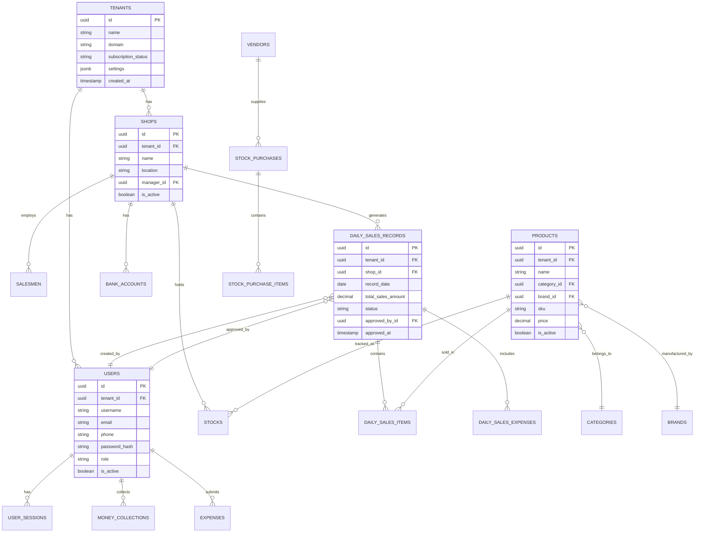

# Database Design Document

## Document Information

| Field | Value |
|-------|-------|
| **Document ID** | DB-DESIGN-001 |
| **Version** | 2.0.0 |
| **Database** | PostgreSQL 15+ |
| **ORM** | GORM v1.30.0 |
| **Last Updated** | January 2025 |

---

## 1. Database Overview

### 1.1 Design Principles

| Principle | Implementation |
|-----------|----------------|
| **Multi-Tenancy** | `tenant_id` column on all tenant-scoped tables |
| **Soft Deletes** | `deleted_at` timestamp for recoverable deletes |
| **Audit Trail** | `created_at`, `updated_at`, `created_by`, `updated_by` |
| **UUID Keys** | UUID primary keys for distributed ID generation |
| **Normalization** | 3NF with strategic denormalization for performance |

### 1.2 Naming Conventions

| Element | Convention | Example |
|---------|------------|---------|
| Tables | snake_case, plural | `daily_sales_records` |
| Columns | snake_case | `created_at`, `tenant_id` |
| Primary Keys | `id` | `id UUID PRIMARY KEY` |
| Foreign Keys | `{table}_id` | `user_id`, `shop_id` |
| Indexes | `idx_{table}_{columns}` | `idx_sales_tenant_date` |
| Constraints | `{table}_{type}_{columns}` | `users_unique_phone` |

---

## 2. Entity-Relationship Diagram

### 2.1 Core Domain Model



---

## 3. Table Definitions

### 3.1 Tenant & Organization Tables

#### tenants
```sql
CREATE TABLE tenants (
    id UUID PRIMARY KEY DEFAULT gen_random_uuid(),
    name VARCHAR(255) NOT NULL,
    domain VARCHAR(255) UNIQUE,
    subscription_status VARCHAR(50) DEFAULT 'active',
    subscription_plan VARCHAR(50) DEFAULT 'basic',
    max_shops INT DEFAULT 5,
    max_users INT DEFAULT 50,
    settings JSONB DEFAULT '{}',
    created_at TIMESTAMP WITH TIME ZONE DEFAULT NOW(),
    updated_at TIMESTAMP WITH TIME ZONE DEFAULT NOW(),
    deleted_at TIMESTAMP WITH TIME ZONE
);

CREATE INDEX idx_tenants_domain ON tenants(domain);
CREATE INDEX idx_tenants_status ON tenants(subscription_status);
```

#### shops
```sql
CREATE TABLE shops (
    id UUID PRIMARY KEY DEFAULT gen_random_uuid(),
    tenant_id UUID NOT NULL REFERENCES tenants(id),
    name VARCHAR(255) NOT NULL,
    code VARCHAR(50),
    address TEXT,
    city VARCHAR(100),
    state VARCHAR(100),
    pincode VARCHAR(20),
    phone VARCHAR(20),
    manager_id UUID REFERENCES users(id),
    license_number VARCHAR(100),
    license_expiry DATE,
    is_active BOOLEAN DEFAULT true,
    settings JSONB DEFAULT '{}',
    created_at TIMESTAMP WITH TIME ZONE DEFAULT NOW(),
    updated_at TIMESTAMP WITH TIME ZONE DEFAULT NOW(),
    deleted_at TIMESTAMP WITH TIME ZONE,

    CONSTRAINT shops_unique_code UNIQUE (tenant_id, code)
);

CREATE INDEX idx_shops_tenant ON shops(tenant_id);
CREATE INDEX idx_shops_active ON shops(tenant_id, is_active);
```

### 3.2 User & Authentication Tables

#### users
```sql
CREATE TABLE users (
    id UUID PRIMARY KEY DEFAULT gen_random_uuid(),
    tenant_id UUID REFERENCES tenants(id),
    username VARCHAR(100),
    email VARCHAR(255),
    phone VARCHAR(20) NOT NULL,
    password_hash VARCHAR(255) NOT NULL,
    role VARCHAR(50) NOT NULL DEFAULT 'salesman',
    first_name VARCHAR(100),
    last_name VARCHAR(100),
    profile_image VARCHAR(500),
    is_active BOOLEAN DEFAULT true,
    is_verified BOOLEAN DEFAULT false,
    last_login TIMESTAMP WITH TIME ZONE,
    password_changed_at TIMESTAMP WITH TIME ZONE,
    failed_login_attempts INT DEFAULT 0,
    locked_until TIMESTAMP WITH TIME ZONE,
    created_at TIMESTAMP WITH TIME ZONE DEFAULT NOW(),
    updated_at TIMESTAMP WITH TIME ZONE DEFAULT NOW(),
    deleted_at TIMESTAMP WITH TIME ZONE,

    -- Note: phone is indexed but NOT unique (allows re-registration)
    CONSTRAINT users_unique_email UNIQUE (email) WHERE email IS NOT NULL,
    CONSTRAINT users_valid_role CHECK (role IN (
        'salesman', 'executive', 'assistant_manager',
        'manager', 'admin', 'owner'
    ))
);

CREATE INDEX idx_users_tenant ON users(tenant_id);
CREATE INDEX idx_users_phone ON users(phone);
CREATE INDEX idx_users_role ON users(tenant_id, role);
```

#### user_sessions
```sql
CREATE TABLE user_sessions (
    id UUID PRIMARY KEY DEFAULT gen_random_uuid(),
    user_id UUID NOT NULL REFERENCES users(id) ON DELETE CASCADE,
    device_id VARCHAR(255),
    device_type VARCHAR(50),
    device_name VARCHAR(255),
    ip_address INET,
    user_agent TEXT,
    token_hash VARCHAR(255) NOT NULL,
    refresh_token_hash VARCHAR(255),
    is_active BOOLEAN DEFAULT true,
    last_activity TIMESTAMP WITH TIME ZONE DEFAULT NOW(),
    expires_at TIMESTAMP WITH TIME ZONE NOT NULL,
    created_at TIMESTAMP WITH TIME ZONE DEFAULT NOW(),

    CONSTRAINT sessions_unique_token UNIQUE (token_hash)
);

CREATE INDEX idx_sessions_user ON user_sessions(user_id, is_active);
CREATE INDEX idx_sessions_expires ON user_sessions(expires_at);
```

#### salesmen
```sql
CREATE TABLE salesmen (
    id UUID PRIMARY KEY DEFAULT gen_random_uuid(),
    tenant_id UUID NOT NULL REFERENCES tenants(id),
    user_id UUID REFERENCES users(id),
    shop_id UUID NOT NULL REFERENCES shops(id),
    name VARCHAR(255) NOT NULL,
    phone VARCHAR(20),
    address TEXT,
    certificate_image VARCHAR(500),
    join_date DATE,
    is_active BOOLEAN DEFAULT true,
    created_at TIMESTAMP WITH TIME ZONE DEFAULT NOW(),
    updated_at TIMESTAMP WITH TIME ZONE DEFAULT NOW(),
    deleted_at TIMESTAMP WITH TIME ZONE
);

CREATE INDEX idx_salesmen_tenant_shop ON salesmen(tenant_id, shop_id);
CREATE INDEX idx_salesmen_user ON salesmen(user_id);
```

### 3.3 Sales Tables

#### daily_sales_records
```sql
CREATE TABLE daily_sales_records (
    id UUID PRIMARY KEY DEFAULT gen_random_uuid(),
    tenant_id UUID NOT NULL REFERENCES tenants(id),
    shop_id UUID NOT NULL REFERENCES shops(id),
    salesman_id UUID REFERENCES salesmen(id),
    record_date DATE NOT NULL,
    -- Sales totals
    total_sales_amount DECIMAL(15,2) DEFAULT 0,
    total_items INT DEFAULT 0,
    total_discount DECIMAL(15,2) DEFAULT 0,
    total_tax DECIMAL(15,2) DEFAULT 0,
    -- Payment breakdown totals
    total_cash_amount DECIMAL(15,2) DEFAULT 0,
    total_card_amount DECIMAL(15,2) DEFAULT 0,
    total_upi_amount DECIMAL(15,2) DEFAULT 0,
    total_credit_amount DECIMAL(15,2) DEFAULT 0,
    total_expense_amount DECIMAL(15,2) DEFAULT 0,
    -- Status and workflow
    status VARCHAR(50) DEFAULT 'pending',
    notes TEXT,
    created_by_id UUID NOT NULL REFERENCES users(id),
    approved_by_id UUID REFERENCES users(id),
    approved_at TIMESTAMP WITH TIME ZONE,
    rejection_reason TEXT,
    -- OCR tracking
    ocr_session_id UUID REFERENCES ocr_sessions(id),
    is_ocr_generated BOOLEAN DEFAULT false,
    -- Location tracking
    latitude DECIMAL(10,8),
    longitude DECIMAL(11,8),
    -- Revert tracking
    is_reverted BOOLEAN DEFAULT false,
    reverted_by_id UUID REFERENCES users(id),
    reverted_at TIMESTAMP WITH TIME ZONE,
    revert_reason TEXT,
    -- Timestamps
    created_at TIMESTAMP WITH TIME ZONE DEFAULT NOW(),
    updated_at TIMESTAMP WITH TIME ZONE DEFAULT NOW(),
    deleted_at TIMESTAMP WITH TIME ZONE,

    CONSTRAINT dsr_unique_shop_date UNIQUE (shop_id, record_date),
    -- Note: Drafts are stored in separate `daily_sales_drafts` table
    CONSTRAINT dsr_valid_status CHECK (status IN (
        'pending', 'approved', 'rejected'
    ))
);

CREATE INDEX idx_dsr_tenant_date ON daily_sales_records(tenant_id, record_date);
CREATE INDEX idx_dsr_shop_status ON daily_sales_records(shop_id, status);
CREATE INDEX idx_dsr_pending ON daily_sales_records(tenant_id, status)
    WHERE status = 'pending';
```

#### daily_sales_items
```sql
CREATE TABLE daily_sales_items (
    id UUID PRIMARY KEY DEFAULT gen_random_uuid(),
    daily_sales_record_id UUID NOT NULL REFERENCES daily_sales_records(id) ON DELETE CASCADE,
    product_id UUID NOT NULL REFERENCES products(id),
    quantity INT NOT NULL,
    unit_price DECIMAL(10,2) NOT NULL,
    discount_amount DECIMAL(10,2) DEFAULT 0,
    discount_reason VARCHAR(255),
    tax_amount DECIMAL(10,2) DEFAULT 0,
    total_price DECIMAL(15,2) NOT NULL,
    -- Payment breakdown columns
    cash_amount DECIMAL(15,2) DEFAULT 0,
    card_amount DECIMAL(15,2) DEFAULT 0,
    upi_amount DECIMAL(15,2) DEFAULT 0,
    credit_amount DECIMAL(15,2) DEFAULT 0,
    -- Stock tracking
    opening_stock INT,
    closing_stock INT,
    notes TEXT,
    created_at TIMESTAMP WITH TIME ZONE DEFAULT NOW(),
    updated_at TIMESTAMP WITH TIME ZONE DEFAULT NOW(),

    CONSTRAINT dsi_positive_quantity CHECK (quantity > 0),
    CONSTRAINT dsi_positive_price CHECK (unit_price >= 0)
);

CREATE INDEX idx_dsi_record ON daily_sales_items(daily_sales_record_id);
CREATE INDEX idx_dsi_product ON daily_sales_items(product_id);
```

#### daily_sales_expenses
```sql
CREATE TABLE daily_sales_expenses (
    id UUID PRIMARY KEY DEFAULT gen_random_uuid(),
    daily_sales_record_id UUID NOT NULL REFERENCES daily_sales_records(id) ON DELETE CASCADE,
    expense_type VARCHAR(100) NOT NULL,
    amount DECIMAL(10,2) NOT NULL,
    description TEXT,
    receipt_image VARCHAR(500),
    created_at TIMESTAMP WITH TIME ZONE DEFAULT NOW(),
    updated_at TIMESTAMP WITH TIME ZONE DEFAULT NOW(),

    CONSTRAINT dse_positive_amount CHECK (amount > 0)
);

CREATE INDEX idx_dse_record ON daily_sales_expenses(daily_sales_record_id);
```

#### sales
```sql
CREATE TABLE sales (
    id UUID PRIMARY KEY DEFAULT gen_random_uuid(),
    tenant_id UUID NOT NULL REFERENCES tenants(id),
    shop_id UUID NOT NULL REFERENCES shops(id),
    salesman_id UUID REFERENCES salesmen(id),
    sale_number VARCHAR(50) NOT NULL,
    sale_date DATE NOT NULL,
    customer_name VARCHAR(255),
    customer_phone VARCHAR(20),
    sub_total DECIMAL(15,2) NOT NULL,
    discount_amount DECIMAL(10,2) DEFAULT 0,
    tax_amount DECIMAL(10,2) DEFAULT 0,
    total_amount DECIMAL(15,2) NOT NULL,
    paid_amount DECIMAL(15,2) DEFAULT 0,
    due_amount DECIMAL(15,2) DEFAULT 0,
    payment_method VARCHAR(50) DEFAULT 'cash',
    status VARCHAR(50) DEFAULT 'pending',
    parcha_image VARCHAR(500),
    notes TEXT,
    approved_by_id UUID REFERENCES users(id),
    approved_at TIMESTAMP WITH TIME ZONE,
    is_reverted BOOLEAN DEFAULT false,
    reverted_by_id UUID REFERENCES users(id),
    reverted_at TIMESTAMP WITH TIME ZONE,
    revert_reason TEXT,
    created_at TIMESTAMP WITH TIME ZONE DEFAULT NOW(),
    updated_at TIMESTAMP WITH TIME ZONE DEFAULT NOW(),
    deleted_at TIMESTAMP WITH TIME ZONE,

    CONSTRAINT sales_unique_number UNIQUE (tenant_id, sale_number)
);

CREATE INDEX idx_sales_tenant_date ON sales(tenant_id, sale_date);
CREATE INDEX idx_sales_shop ON sales(shop_id, sale_date);
CREATE INDEX idx_sales_status ON sales(tenant_id, status);
```

#### sale_items
```sql
CREATE TABLE sale_items (
    id UUID PRIMARY KEY DEFAULT gen_random_uuid(),
    sale_id UUID NOT NULL REFERENCES sales(id) ON DELETE CASCADE,
    product_id UUID NOT NULL REFERENCES products(id),
    batch_id UUID REFERENCES stock_batches(id),
    quantity INT NOT NULL,
    unit_price DECIMAL(10,2) NOT NULL,
    discount_amount DECIMAL(10,2) DEFAULT 0,
    tax_rate DECIMAL(5,2) DEFAULT 0,
    tax_amount DECIMAL(10,2) DEFAULT 0,
    total_price DECIMAL(15,2) NOT NULL,
    created_at TIMESTAMP WITH TIME ZONE DEFAULT NOW(),

    CONSTRAINT si_positive_quantity CHECK (quantity > 0)
);

CREATE INDEX idx_sale_items_sale ON sale_items(sale_id);
```

### 3.4 Inventory Tables

#### categories
```sql
CREATE TABLE categories (
    id UUID PRIMARY KEY DEFAULT gen_random_uuid(),
    tenant_id UUID NOT NULL REFERENCES tenants(id),
    name VARCHAR(255) NOT NULL,
    description TEXT,
    parent_id UUID REFERENCES categories(id),
    sort_order INT DEFAULT 0,
    is_active BOOLEAN DEFAULT true,
    created_at TIMESTAMP WITH TIME ZONE DEFAULT NOW(),
    updated_at TIMESTAMP WITH TIME ZONE DEFAULT NOW(),
    deleted_at TIMESTAMP WITH TIME ZONE,

    CONSTRAINT categories_unique_name UNIQUE (tenant_id, name)
);

CREATE INDEX idx_categories_tenant ON categories(tenant_id);
```

#### brands
```sql
CREATE TABLE brands (
    id UUID PRIMARY KEY DEFAULT gen_random_uuid(),
    tenant_id UUID NOT NULL REFERENCES tenants(id),
    saas_brand_id UUID REFERENCES saas_brands(id),
    name VARCHAR(255) NOT NULL,
    code VARCHAR(50),
    manufacturer VARCHAR(255),
    is_active BOOLEAN DEFAULT true,
    created_at TIMESTAMP WITH TIME ZONE DEFAULT NOW(),
    updated_at TIMESTAMP WITH TIME ZONE DEFAULT NOW(),
    deleted_at TIMESTAMP WITH TIME ZONE,

    CONSTRAINT brands_unique_name UNIQUE (tenant_id, name)
);

CREATE INDEX idx_brands_tenant ON brands(tenant_id);
```

#### products
```sql
CREATE TABLE products (
    id UUID PRIMARY KEY DEFAULT gen_random_uuid(),
    tenant_id UUID NOT NULL REFERENCES tenants(id),
    category_id UUID REFERENCES categories(id),
    brand_id UUID REFERENCES brands(id),
    name VARCHAR(255) NOT NULL,
    sku VARCHAR(100),
    barcode VARCHAR(100),
    description TEXT,
    size VARCHAR(50),
    unit VARCHAR(50) DEFAULT 'piece',
    cost_price DECIMAL(10,2),
    selling_price DECIMAL(10,2) NOT NULL,
    mrp DECIMAL(10,2),
    tax_rate DECIMAL(5,2) DEFAULT 0,
    reorder_level INT DEFAULT 10,
    is_active BOOLEAN DEFAULT true,
    attributes JSONB DEFAULT '{}',
    created_at TIMESTAMP WITH TIME ZONE DEFAULT NOW(),
    updated_at TIMESTAMP WITH TIME ZONE DEFAULT NOW(),
    deleted_at TIMESTAMP WITH TIME ZONE,

    CONSTRAINT products_unique_sku UNIQUE (tenant_id, sku)
);

CREATE INDEX idx_products_tenant ON products(tenant_id);
CREATE INDEX idx_products_category ON products(category_id);
CREATE INDEX idx_products_brand ON products(brand_id);
CREATE INDEX idx_products_sku ON products(tenant_id, sku);
CREATE INDEX idx_products_active ON products(tenant_id, is_active);
```

#### stocks
```sql
CREATE TABLE stocks (
    id UUID PRIMARY KEY DEFAULT gen_random_uuid(),
    tenant_id UUID NOT NULL REFERENCES tenants(id),
    shop_id UUID NOT NULL REFERENCES shops(id),
    product_id UUID NOT NULL REFERENCES products(id),
    quantity INT NOT NULL DEFAULT 0,
    reserved_quantity INT DEFAULT 0,
    reorder_level INT DEFAULT 10,
    cost_price DECIMAL(10,2),
    selling_price DECIMAL(10,2),
    last_purchase_date DATE,
    last_sale_date DATE,
    created_at TIMESTAMP WITH TIME ZONE DEFAULT NOW(),
    updated_at TIMESTAMP WITH TIME ZONE DEFAULT NOW(),

    CONSTRAINT stocks_unique_shop_product UNIQUE (shop_id, product_id),
    CONSTRAINT stocks_non_negative CHECK (quantity >= 0)
);

CREATE INDEX idx_stocks_shop ON stocks(shop_id);
CREATE INDEX idx_stocks_low ON stocks(shop_id)
    WHERE quantity <= reorder_level;
```

#### stock_batches
```sql
CREATE TABLE stock_batches (
    id UUID PRIMARY KEY DEFAULT gen_random_uuid(),
    stock_id UUID NOT NULL REFERENCES stocks(id),
    batch_number VARCHAR(100),
    quantity INT NOT NULL,
    remaining_quantity INT NOT NULL,
    cost_price DECIMAL(10,2),
    manufacturing_date DATE,
    expiry_date DATE,
    purchase_id UUID REFERENCES stock_purchases(id),
    created_at TIMESTAMP WITH TIME ZONE DEFAULT NOW(),
    updated_at TIMESTAMP WITH TIME ZONE DEFAULT NOW(),

    CONSTRAINT batches_positive CHECK (quantity > 0),
    CONSTRAINT batches_remaining CHECK (remaining_quantity >= 0)
);

CREATE INDEX idx_batches_stock ON stock_batches(stock_id);
CREATE INDEX idx_batches_expiry ON stock_batches(expiry_date);
```

### 3.5 Purchase Tables

#### vendors
```sql
CREATE TABLE vendors (
    id UUID PRIMARY KEY DEFAULT gen_random_uuid(),
    tenant_id UUID NOT NULL REFERENCES tenants(id),
    name VARCHAR(255) NOT NULL,
    code VARCHAR(50),
    contact_person VARCHAR(255),
    phone VARCHAR(20),
    email VARCHAR(255),
    address TEXT,
    city VARCHAR(100),
    state VARCHAR(100),
    gstin VARCHAR(20),
    pan VARCHAR(20),
    bank_name VARCHAR(255),
    bank_account VARCHAR(50),
    bank_ifsc VARCHAR(20),
    credit_limit DECIMAL(15,2) DEFAULT 0,
    credit_days INT DEFAULT 0,
    is_active BOOLEAN DEFAULT true,
    created_at TIMESTAMP WITH TIME ZONE DEFAULT NOW(),
    updated_at TIMESTAMP WITH TIME ZONE DEFAULT NOW(),
    deleted_at TIMESTAMP WITH TIME ZONE,

    CONSTRAINT vendors_unique_code UNIQUE (tenant_id, code)
);

CREATE INDEX idx_vendors_tenant ON vendors(tenant_id);
```

#### stock_purchases
```sql
CREATE TABLE stock_purchases (
    id UUID PRIMARY KEY DEFAULT gen_random_uuid(),
    tenant_id UUID NOT NULL REFERENCES tenants(id),
    shop_id UUID NOT NULL REFERENCES shops(id),
    vendor_id UUID NOT NULL REFERENCES vendors(id),
    purchase_number VARCHAR(50) NOT NULL,
    purchase_date DATE NOT NULL,
    expected_date DATE,
    received_date DATE,
    invoice_number VARCHAR(100),
    invoice_date DATE,
    sub_total DECIMAL(15,2) NOT NULL,
    discount_amount DECIMAL(10,2) DEFAULT 0,
    tax_amount DECIMAL(10,2) DEFAULT 0,
    total_amount DECIMAL(15,2) NOT NULL,
    paid_amount DECIMAL(15,2) DEFAULT 0,
    status VARCHAR(50) DEFAULT 'pending',
    notes TEXT,
    created_by_id UUID NOT NULL REFERENCES users(id),
    approved_by_id UUID REFERENCES users(id),
    approved_at TIMESTAMP WITH TIME ZONE,
    created_at TIMESTAMP WITH TIME ZONE DEFAULT NOW(),
    updated_at TIMESTAMP WITH TIME ZONE DEFAULT NOW(),
    deleted_at TIMESTAMP WITH TIME ZONE,

    CONSTRAINT purchases_unique_number UNIQUE (tenant_id, purchase_number),
    CONSTRAINT purchases_valid_status CHECK (status IN (
        'pending', 'approved', 'received', 'rejected'
    ))
);

CREATE INDEX idx_purchases_tenant_date ON stock_purchases(tenant_id, purchase_date);
CREATE INDEX idx_purchases_vendor ON stock_purchases(vendor_id);
CREATE INDEX idx_purchases_status ON stock_purchases(tenant_id, status);
```

#### stock_purchase_items
```sql
CREATE TABLE stock_purchase_items (
    id UUID PRIMARY KEY DEFAULT gen_random_uuid(),
    stock_purchase_id UUID NOT NULL REFERENCES stock_purchases(id) ON DELETE CASCADE,
    product_id UUID NOT NULL REFERENCES products(id),
    quantity INT NOT NULL,
    received_quantity INT DEFAULT 0,
    unit_price DECIMAL(10,2) NOT NULL,
    discount_amount DECIMAL(10,2) DEFAULT 0,
    tax_rate DECIMAL(5,2) DEFAULT 0,
    tax_amount DECIMAL(10,2) DEFAULT 0,
    total_price DECIMAL(15,2) NOT NULL,
    batch_number VARCHAR(100),
    expiry_date DATE,
    created_at TIMESTAMP WITH TIME ZONE DEFAULT NOW(),
    updated_at TIMESTAMP WITH TIME ZONE DEFAULT NOW(),

    CONSTRAINT spi_positive_quantity CHECK (quantity > 0)
);

CREATE INDEX idx_spi_purchase ON stock_purchase_items(stock_purchase_id);
```

### 3.6 Finance Tables

#### bank_accounts
```sql
CREATE TABLE bank_accounts (
    id UUID PRIMARY KEY DEFAULT gen_random_uuid(),
    tenant_id UUID NOT NULL REFERENCES tenants(id),
    shop_id UUID REFERENCES shops(id),
    account_name VARCHAR(255) NOT NULL,
    account_number VARCHAR(50),
    account_holder VARCHAR(255),
    bank_name VARCHAR(255),
    branch_name VARCHAR(255),
    ifsc_code VARCHAR(20),
    account_type VARCHAR(50) DEFAULT 'savings',
    balance_type VARCHAR(50) DEFAULT 'bank',
    current_balance DECIMAL(15,2) DEFAULT 0,
    is_default BOOLEAN DEFAULT false,
    is_active BOOLEAN DEFAULT true,
    created_at TIMESTAMP WITH TIME ZONE DEFAULT NOW(),
    updated_at TIMESTAMP WITH TIME ZONE DEFAULT NOW(),
    deleted_at TIMESTAMP WITH TIME ZONE,

    CONSTRAINT ba_valid_balance_type CHECK (balance_type IN ('cash', 'bank'))
);

CREATE INDEX idx_bank_accounts_tenant ON bank_accounts(tenant_id);
CREATE INDEX idx_bank_accounts_shop ON bank_accounts(shop_id);
```

#### money_collections
```sql
CREATE TABLE money_collections (
    id UUID PRIMARY KEY DEFAULT gen_random_uuid(),
    tenant_id UUID NOT NULL REFERENCES tenants(id),
    shop_id UUID NOT NULL REFERENCES shops(id),
    daily_sales_record_id UUID REFERENCES daily_sales_records(id),
    collected_by_id UUID NOT NULL REFERENCES users(id),
    collection_amount DECIMAL(15,2) NOT NULL,
    collection_time TIMESTAMP WITH TIME ZONE DEFAULT NOW(),
    approval_deadline TIMESTAMP WITH TIME ZONE NOT NULL,
    status VARCHAR(50) DEFAULT 'pending',
    approved_by_id UUID REFERENCES users(id),
    approved_at TIMESTAMP WITH TIME ZONE,
    notes TEXT,
    created_at TIMESTAMP WITH TIME ZONE DEFAULT NOW(),
    updated_at TIMESTAMP WITH TIME ZONE DEFAULT NOW(),

    CONSTRAINT mc_valid_status CHECK (status IN (
        'pending', 'approved', 'rejected', 'expired'
    ))
);

CREATE INDEX idx_mc_tenant_status ON money_collections(tenant_id, status);
CREATE INDEX idx_mc_deadline ON money_collections(approval_deadline)
    WHERE status = 'pending';
```

#### expenses
```sql
CREATE TABLE expenses (
    id UUID PRIMARY KEY DEFAULT gen_random_uuid(),
    tenant_id UUID NOT NULL REFERENCES tenants(id),
    shop_id UUID NOT NULL REFERENCES shops(id),
    expense_number VARCHAR(50) NOT NULL,
    expense_date DATE NOT NULL,
    category VARCHAR(100) NOT NULL,
    amount DECIMAL(10,2) NOT NULL,
    description TEXT,
    receipt_image VARCHAR(500),
    payment_method VARCHAR(50) DEFAULT 'cash',
    bank_account_id UUID REFERENCES bank_accounts(id),
    vendor_id UUID REFERENCES vendors(id),
    status VARCHAR(50) DEFAULT 'pending',
    submitted_by_id UUID NOT NULL REFERENCES users(id),
    approved_by_id UUID REFERENCES users(id),
    approved_at TIMESTAMP WITH TIME ZONE,
    rejection_reason TEXT,
    created_at TIMESTAMP WITH TIME ZONE DEFAULT NOW(),
    updated_at TIMESTAMP WITH TIME ZONE DEFAULT NOW(),
    deleted_at TIMESTAMP WITH TIME ZONE,

    CONSTRAINT expenses_unique_number UNIQUE (tenant_id, expense_number),
    CONSTRAINT expenses_positive_amount CHECK (amount > 0)
);

CREATE INDEX idx_expenses_tenant_date ON expenses(tenant_id, expense_date);
CREATE INDEX idx_expenses_shop ON expenses(shop_id, expense_date);
CREATE INDEX idx_expenses_status ON expenses(tenant_id, status);
```

### 3.7 Notification & Audit Tables

#### notifications
```sql
CREATE TABLE notifications (
    id UUID PRIMARY KEY DEFAULT gen_random_uuid(),
    tenant_id UUID NOT NULL REFERENCES tenants(id),
    user_id UUID NOT NULL REFERENCES users(id),
    type VARCHAR(100) NOT NULL,
    title VARCHAR(255) NOT NULL,
    message TEXT NOT NULL,
    data JSONB DEFAULT '{}',
    channels VARCHAR(50)[] DEFAULT '{"in_app"}',
    read_at TIMESTAMP WITH TIME ZONE,
    delivered_at TIMESTAMP WITH TIME ZONE,
    created_at TIMESTAMP WITH TIME ZONE DEFAULT NOW(),

    CONSTRAINT notif_valid_channels CHECK (
        channels <@ ARRAY['in_app', 'push', 'email', 'sms']::VARCHAR[]
    )
);

CREATE INDEX idx_notifications_user ON notifications(user_id, created_at DESC);
CREATE INDEX idx_notifications_unread ON notifications(user_id)
    WHERE read_at IS NULL;
```

#### audit_logs
```sql
CREATE TABLE audit_logs (
    id UUID PRIMARY KEY DEFAULT gen_random_uuid(),
    tenant_id UUID REFERENCES tenants(id),
    user_id UUID REFERENCES users(id),
    action VARCHAR(100) NOT NULL,
    resource_type VARCHAR(100) NOT NULL,
    resource_id VARCHAR(100),
    old_values JSONB,
    new_values JSONB,
    ip_address INET,
    user_agent TEXT,
    request_id VARCHAR(100),
    created_at TIMESTAMP WITH TIME ZONE DEFAULT NOW()
) PARTITION BY RANGE (created_at);

-- Monthly partitions
CREATE TABLE audit_logs_2025_01 PARTITION OF audit_logs
    FOR VALUES FROM ('2025-01-01') TO ('2025-02-01');

CREATE INDEX idx_audit_tenant_date ON audit_logs(tenant_id, created_at);
CREATE INDEX idx_audit_user ON audit_logs(user_id, created_at);
CREATE INDEX idx_audit_resource ON audit_logs(resource_type, resource_id);
```

### 3.8 Rate Limiting Tables

#### rate_limits
```sql
CREATE TABLE rate_limits (
    id UUID PRIMARY KEY DEFAULT gen_random_uuid(),
    tenant_id UUID REFERENCES tenants(id),
    name VARCHAR(100) NOT NULL,
    endpoint VARCHAR(255) NOT NULL,
    max_requests INT NOT NULL DEFAULT 100,
    time_window_seconds INT NOT NULL DEFAULT 60,
    is_active BOOLEAN DEFAULT true,
    created_at TIMESTAMP WITH TIME ZONE DEFAULT NOW(),
    updated_at TIMESTAMP WITH TIME ZONE DEFAULT NOW(),

    CONSTRAINT rl_unique_name UNIQUE (tenant_id, name)
);

CREATE INDEX idx_rate_limits_endpoint ON rate_limits(endpoint);
```

#### rate_limit_logs
```sql
CREATE TABLE rate_limit_logs (
    id UUID PRIMARY KEY DEFAULT gen_random_uuid(),
    rate_limit_id UUID REFERENCES rate_limits(id),
    identifier VARCHAR(255) NOT NULL,
    request_count INT DEFAULT 1,
    window_start TIMESTAMP WITH TIME ZONE NOT NULL,
    window_end TIMESTAMP WITH TIME ZONE NOT NULL,
    blocked_until TIMESTAMP WITH TIME ZONE,
    blocked_reason TEXT,
    created_at TIMESTAMP WITH TIME ZONE DEFAULT NOW(),
    updated_at TIMESTAMP WITH TIME ZONE DEFAULT NOW()
);

CREATE INDEX idx_rll_identifier ON rate_limit_logs(identifier, window_start);
CREATE INDEX idx_rll_blocked ON rate_limit_logs(blocked_until)
    WHERE blocked_until IS NOT NULL;
```

---

## 4. Indexes Strategy

### 4.1 Index Types

| Type | Use Case | Example |
|------|----------|---------|
| B-tree | Range queries, equality | Most indexes |
| Hash | Equality only | Session tokens |
| GIN | JSONB, arrays | `data` columns |
| Partial | Filtered queries | `WHERE status = 'pending'` |

### 4.2 Key Indexes

```sql
-- Tenant isolation (on every tenant-scoped table)
CREATE INDEX idx_{table}_tenant ON {table}(tenant_id);

-- Date-based queries
CREATE INDEX idx_dsr_tenant_date ON daily_sales_records(tenant_id, record_date);
CREATE INDEX idx_sales_tenant_date ON sales(tenant_id, sale_date);

-- Status filtering (partial for common queries)
CREATE INDEX idx_dsr_pending ON daily_sales_records(tenant_id, status)
    WHERE status = 'pending';

-- Foreign key lookups
CREATE INDEX idx_dsi_record ON daily_sales_items(daily_sales_record_id);
CREATE INDEX idx_stocks_shop ON stocks(shop_id);
```

---

## 5. Database Operations

### 5.1 Common Queries

#### Get Daily Sales for Dashboard
```sql
SELECT
    dsr.record_date,
    dsr.total_sales_amount,
    dsr.status,
    COUNT(dsi.id) as item_count,
    s.name as shop_name
FROM daily_sales_records dsr
JOIN shops s ON s.id = dsr.shop_id
LEFT JOIN daily_sales_items dsi ON dsi.daily_sales_record_id = dsr.id
WHERE dsr.tenant_id = $1
    AND dsr.record_date BETWEEN $2 AND $3
GROUP BY dsr.id, s.name
ORDER BY dsr.record_date DESC;
```

#### Check Low Stock
```sql
SELECT
    p.name as product_name,
    p.sku,
    st.quantity,
    st.reorder_level,
    sh.name as shop_name
FROM stocks st
JOIN products p ON p.id = st.product_id
JOIN shops sh ON sh.id = st.shop_id
WHERE st.quantity <= st.reorder_level
    AND st.tenant_id = $1
ORDER BY (st.quantity - st.reorder_level);
```

### 5.2 Maintenance Tasks

```sql
-- Vacuum analyze (scheduled daily)
VACUUM ANALYZE daily_sales_records;
VACUUM ANALYZE stocks;
VACUUM ANALYZE audit_logs;

-- Reindex (scheduled weekly)
REINDEX TABLE CONCURRENTLY daily_sales_items;

-- Partition maintenance (monthly)
-- Create next month's partition
-- Archive old partitions
```

### 3.9 Draft Management Tables

#### daily_sales_drafts
```sql
CREATE TABLE daily_sales_drafts (
    id UUID PRIMARY KEY DEFAULT gen_random_uuid(),
    tenant_id UUID NOT NULL REFERENCES tenants(id),
    user_id UUID NOT NULL REFERENCES users(id),
    shop_id UUID NOT NULL REFERENCES shops(id),
    record_date DATE NOT NULL,
    draft_data JSONB NOT NULL DEFAULT '{}',
    last_saved_at TIMESTAMP WITH TIME ZONE DEFAULT NOW(),
    created_at TIMESTAMP WITH TIME ZONE DEFAULT NOW(),
    updated_at TIMESTAMP WITH TIME ZONE DEFAULT NOW(),

    CONSTRAINT drafts_unique_user_shop_date UNIQUE (user_id, shop_id, record_date)
);

CREATE INDEX idx_drafts_user ON daily_sales_drafts(user_id);
CREATE INDEX idx_drafts_shop_date ON daily_sales_drafts(shop_id, record_date);
```

#### stock_purchase_drafts
```sql
CREATE TABLE stock_purchase_drafts (
    id UUID PRIMARY KEY DEFAULT gen_random_uuid(),
    tenant_id UUID NOT NULL REFERENCES tenants(id),
    user_id UUID NOT NULL REFERENCES users(id),
    shop_id UUID NOT NULL REFERENCES shops(id),
    draft_data JSONB NOT NULL DEFAULT '{}',
    last_saved_at TIMESTAMP WITH TIME ZONE DEFAULT NOW(),
    created_at TIMESTAMP WITH TIME ZONE DEFAULT NOW(),
    updated_at TIMESTAMP WITH TIME ZONE DEFAULT NOW(),

    CONSTRAINT purchase_drafts_unique UNIQUE (user_id, shop_id)
);

CREATE INDEX idx_purchase_drafts_user ON stock_purchase_drafts(user_id);
```

### 3.10 OCR & AI Tables

#### ocr_sessions
```sql
CREATE TABLE ocr_sessions (
    id UUID PRIMARY KEY DEFAULT gen_random_uuid(),
    tenant_id UUID NOT NULL REFERENCES tenants(id),
    shop_id UUID NOT NULL REFERENCES shops(id),
    user_id UUID NOT NULL REFERENCES users(id),
    status VARCHAR(50) DEFAULT 'processing',
    total_images INT DEFAULT 0,
    processed_images INT DEFAULT 0,
    error_message TEXT,
    created_at TIMESTAMP WITH TIME ZONE DEFAULT NOW(),
    updated_at TIMESTAMP WITH TIME ZONE DEFAULT NOW(),

    CONSTRAINT ocr_valid_status CHECK (status IN (
        'processing', 'completed', 'failed', 'partial'
    ))
);

CREATE INDEX idx_ocr_sessions_shop ON ocr_sessions(shop_id);
CREATE INDEX idx_ocr_sessions_user ON ocr_sessions(user_id);
```

#### ocr_images
```sql
CREATE TABLE ocr_images (
    id UUID PRIMARY KEY DEFAULT gen_random_uuid(),
    session_id UUID NOT NULL REFERENCES ocr_sessions(id) ON DELETE CASCADE,
    image_url VARCHAR(500) NOT NULL,
    status VARCHAR(50) DEFAULT 'pending',
    raw_text TEXT,
    processed_data JSONB,
    error_message TEXT,
    processing_time_ms INT,
    created_at TIMESTAMP WITH TIME ZONE DEFAULT NOW(),
    updated_at TIMESTAMP WITH TIME ZONE DEFAULT NOW()
);

CREATE INDEX idx_ocr_images_session ON ocr_images(session_id);
```

#### ocr_items
```sql
CREATE TABLE ocr_items (
    id UUID PRIMARY KEY DEFAULT gen_random_uuid(),
    session_id UUID NOT NULL REFERENCES ocr_sessions(id) ON DELETE CASCADE,
    image_id UUID REFERENCES ocr_images(id),
    row_index INT,
    raw_text VARCHAR(500),
    product_id UUID REFERENCES products(id),
    matched_product_name VARCHAR(255),
    quantity INT,
    unit_price DECIMAL(10,2),
    confidence_score DECIMAL(5,2),
    is_validated BOOLEAN DEFAULT false,
    is_imported BOOLEAN DEFAULT false,
    created_at TIMESTAMP WITH TIME ZONE DEFAULT NOW(),
    updated_at TIMESTAMP WITH TIME ZONE DEFAULT NOW()
);

CREATE INDEX idx_ocr_items_session ON ocr_items(session_id);
```

### 3.11 Security & Session Tables

#### security_events
```sql
CREATE TABLE security_events (
    id UUID PRIMARY KEY DEFAULT gen_random_uuid(),
    tenant_id UUID REFERENCES tenants(id),
    user_id UUID REFERENCES users(id),
    event_type VARCHAR(100) NOT NULL,
    severity VARCHAR(20) DEFAULT 'info',
    description TEXT,
    ip_address INET,
    user_agent TEXT,
    device_info JSONB,
    metadata JSONB DEFAULT '{}',
    created_at TIMESTAMP WITH TIME ZONE DEFAULT NOW(),

    CONSTRAINT se_valid_severity CHECK (severity IN (
        'info', 'warning', 'error', 'critical'
    ))
);

CREATE INDEX idx_security_events_user ON security_events(user_id, created_at);
CREATE INDEX idx_security_events_type ON security_events(event_type, created_at);
```

### 3.12 Cash Management Tables

#### cash_holdings
```sql
CREATE TABLE cash_holdings (
    id UUID PRIMARY KEY DEFAULT gen_random_uuid(),
    tenant_id UUID NOT NULL REFERENCES tenants(id),
    shop_id UUID NOT NULL REFERENCES shops(id),
    user_id UUID NOT NULL REFERENCES users(id),
    denomination_2000 INT DEFAULT 0,
    denomination_500 INT DEFAULT 0,
    denomination_200 INT DEFAULT 0,
    denomination_100 INT DEFAULT 0,
    denomination_50 INT DEFAULT 0,
    denomination_20 INT DEFAULT 0,
    denomination_10 INT DEFAULT 0,
    denomination_coins INT DEFAULT 0,
    total_amount DECIMAL(15,2) GENERATED ALWAYS AS (
        denomination_2000 * 2000 +
        denomination_500 * 500 +
        denomination_200 * 200 +
        denomination_100 * 100 +
        denomination_50 * 50 +
        denomination_20 * 20 +
        denomination_10 * 10 +
        denomination_coins
    ) STORED,
    recorded_at TIMESTAMP WITH TIME ZONE DEFAULT NOW(),
    created_at TIMESTAMP WITH TIME ZONE DEFAULT NOW()
);

CREATE INDEX idx_cash_holdings_shop ON cash_holdings(shop_id, recorded_at);
CREATE INDEX idx_cash_holdings_user ON cash_holdings(user_id, recorded_at);
```

#### cash_transactions
```sql
CREATE TABLE cash_transactions (
    id UUID PRIMARY KEY DEFAULT gen_random_uuid(),
    tenant_id UUID NOT NULL REFERENCES tenants(id),
    shop_id UUID NOT NULL REFERENCES shops(id),
    user_id UUID NOT NULL REFERENCES users(id),
    transaction_type VARCHAR(50) NOT NULL,
    amount DECIMAL(15,2) NOT NULL,
    balance_before DECIMAL(15,2),
    balance_after DECIMAL(15,2),
    reference_type VARCHAR(50),
    reference_id UUID,
    description TEXT,
    created_at TIMESTAMP WITH TIME ZONE DEFAULT NOW(),

    CONSTRAINT ct_valid_type CHECK (transaction_type IN (
        'sale', 'collection', 'expense', 'transfer_in', 'transfer_out', 'deposit', 'adjustment'
    ))
);

CREATE INDEX idx_cash_transactions_shop ON cash_transactions(shop_id, created_at);
CREATE INDEX idx_cash_transactions_user ON cash_transactions(user_id, created_at);
```

#### cash_requests
```sql
CREATE TABLE cash_requests (
    id UUID PRIMARY KEY DEFAULT gen_random_uuid(),
    tenant_id UUID NOT NULL REFERENCES tenants(id),
    from_user_id UUID NOT NULL REFERENCES users(id),
    to_user_id UUID NOT NULL REFERENCES users(id),
    shop_id UUID NOT NULL REFERENCES shops(id),
    amount DECIMAL(15,2) NOT NULL,
    status VARCHAR(50) DEFAULT 'pending',
    reason TEXT,
    approved_by_id UUID REFERENCES users(id),
    approved_at TIMESTAMP WITH TIME ZONE,
    rejection_reason TEXT,
    created_at TIMESTAMP WITH TIME ZONE DEFAULT NOW(),
    updated_at TIMESTAMP WITH TIME ZONE DEFAULT NOW(),

    CONSTRAINT cr_valid_status CHECK (status IN (
        'pending', 'approved', 'rejected', 'completed'
    ))
);

CREATE INDEX idx_cash_requests_status ON cash_requests(tenant_id, status);
```

### 3.13 Stock Movement Tables

#### stock_movements
```sql
CREATE TABLE stock_movements (
    id UUID PRIMARY KEY DEFAULT gen_random_uuid(),
    tenant_id UUID NOT NULL REFERENCES tenants(id),
    shop_id UUID NOT NULL REFERENCES shops(id),
    product_id UUID NOT NULL REFERENCES products(id),
    movement_type VARCHAR(50) NOT NULL,
    quantity INT NOT NULL,
    quantity_before INT,
    quantity_after INT,
    reference_type VARCHAR(50),
    reference_id UUID,
    notes TEXT,
    created_by_id UUID REFERENCES users(id),
    created_at TIMESTAMP WITH TIME ZONE DEFAULT NOW(),

    CONSTRAINT sm_valid_type CHECK (movement_type IN (
        'sale', 'purchase', 'return', 'transfer_in', 'transfer_out',
        'adjustment', 'damage', 'expired'
    ))
);

CREATE INDEX idx_stock_movements_product ON stock_movements(product_id, created_at);
CREATE INDEX idx_stock_movements_shop ON stock_movements(shop_id, created_at);
CREATE INDEX idx_stock_movements_type ON stock_movements(movement_type, created_at);
```

#### stock_transfers
```sql
CREATE TABLE stock_transfers (
    id UUID PRIMARY KEY DEFAULT gen_random_uuid(),
    tenant_id UUID NOT NULL REFERENCES tenants(id),
    from_shop_id UUID NOT NULL REFERENCES shops(id),
    to_shop_id UUID NOT NULL REFERENCES shops(id),
    transfer_number VARCHAR(50) NOT NULL,
    status VARCHAR(50) DEFAULT 'pending',
    notes TEXT,
    created_by_id UUID NOT NULL REFERENCES users(id),
    approved_by_id UUID REFERENCES users(id),
    approved_at TIMESTAMP WITH TIME ZONE,
    received_by_id UUID REFERENCES users(id),
    received_at TIMESTAMP WITH TIME ZONE,
    created_at TIMESTAMP WITH TIME ZONE DEFAULT NOW(),
    updated_at TIMESTAMP WITH TIME ZONE DEFAULT NOW(),

    CONSTRAINT st_valid_status CHECK (status IN (
        'pending', 'approved', 'in_transit', 'received', 'rejected'
    ))
);

CREATE INDEX idx_stock_transfers_from ON stock_transfers(from_shop_id, created_at);
CREATE INDEX idx_stock_transfers_to ON stock_transfers(to_shop_id, created_at);
```

#### stock_transfer_items
```sql
CREATE TABLE stock_transfer_items (
    id UUID PRIMARY KEY DEFAULT gen_random_uuid(),
    transfer_id UUID NOT NULL REFERENCES stock_transfers(id) ON DELETE CASCADE,
    product_id UUID NOT NULL REFERENCES products(id),
    quantity INT NOT NULL,
    received_quantity INT DEFAULT 0,
    created_at TIMESTAMP WITH TIME ZONE DEFAULT NOW()
);

CREATE INDEX idx_sti_transfer ON stock_transfer_items(transfer_id);
```

### 3.14 Expense Category Tables

#### expense_headers
```sql
CREATE TABLE expense_headers (
    id UUID PRIMARY KEY DEFAULT gen_random_uuid(),
    tenant_id UUID NOT NULL REFERENCES tenants(id),
    name VARCHAR(255) NOT NULL,
    code VARCHAR(50),
    description TEXT,
    is_active BOOLEAN DEFAULT true,
    sort_order INT DEFAULT 0,
    created_at TIMESTAMP WITH TIME ZONE DEFAULT NOW(),
    updated_at TIMESTAMP WITH TIME ZONE DEFAULT NOW(),
    deleted_at TIMESTAMP WITH TIME ZONE,

    CONSTRAINT eh_unique_name UNIQUE (tenant_id, name)
);

CREATE INDEX idx_expense_headers_tenant ON expense_headers(tenant_id);
```

### 3.15 Detection & Audit Tables

#### detection_alerts
```sql
CREATE TABLE detection_alerts (
    id UUID PRIMARY KEY DEFAULT gen_random_uuid(),
    tenant_id UUID NOT NULL REFERENCES tenants(id),
    shop_id UUID REFERENCES shops(id),
    user_id UUID REFERENCES users(id),
    alert_type VARCHAR(100) NOT NULL,
    severity VARCHAR(20) DEFAULT 'medium',
    description TEXT NOT NULL,
    amount_involved DECIMAL(15,2),
    reference_type VARCHAR(50),
    reference_id UUID,
    status VARCHAR(50) DEFAULT 'open',
    resolved_by_id UUID REFERENCES users(id),
    resolved_at TIMESTAMP WITH TIME ZONE,
    resolution_notes TEXT,
    metadata JSONB DEFAULT '{}',
    created_at TIMESTAMP WITH TIME ZONE DEFAULT NOW(),
    updated_at TIMESTAMP WITH TIME ZONE DEFAULT NOW(),

    CONSTRAINT da_valid_severity CHECK (severity IN ('low', 'medium', 'high', 'critical')),
    CONSTRAINT da_valid_status CHECK (status IN ('open', 'investigating', 'resolved', 'dismissed'))
);

CREATE INDEX idx_detection_alerts_tenant ON detection_alerts(tenant_id, status);
CREATE INDEX idx_detection_alerts_severity ON detection_alerts(severity, created_at);
```

#### audit_schedules
```sql
CREATE TABLE audit_schedules (
    id UUID PRIMARY KEY DEFAULT gen_random_uuid(),
    tenant_id UUID NOT NULL REFERENCES tenants(id),
    shop_id UUID REFERENCES shops(id),
    audit_type VARCHAR(100) NOT NULL,
    frequency VARCHAR(50) NOT NULL,
    next_scheduled_at TIMESTAMP WITH TIME ZONE,
    last_completed_at TIMESTAMP WITH TIME ZONE,
    is_active BOOLEAN DEFAULT true,
    created_by_id UUID REFERENCES users(id),
    created_at TIMESTAMP WITH TIME ZONE DEFAULT NOW(),
    updated_at TIMESTAMP WITH TIME ZONE DEFAULT NOW()
);

CREATE INDEX idx_audit_schedules_next ON audit_schedules(next_scheduled_at)
    WHERE is_active = true;
```

#### audit_sessions
```sql
CREATE TABLE audit_sessions (
    id UUID PRIMARY KEY DEFAULT gen_random_uuid(),
    tenant_id UUID NOT NULL REFERENCES tenants(id),
    shop_id UUID NOT NULL REFERENCES shops(id),
    schedule_id UUID REFERENCES audit_schedules(id),
    audit_type VARCHAR(100) NOT NULL,
    status VARCHAR(50) DEFAULT 'in_progress',
    started_at TIMESTAMP WITH TIME ZONE DEFAULT NOW(),
    completed_at TIMESTAMP WITH TIME ZONE,
    auditor_id UUID REFERENCES users(id),
    notes TEXT,
    findings_count INT DEFAULT 0,
    created_at TIMESTAMP WITH TIME ZONE DEFAULT NOW(),
    updated_at TIMESTAMP WITH TIME ZONE DEFAULT NOW()
);

CREATE INDEX idx_audit_sessions_shop ON audit_sessions(shop_id, started_at);
```

#### audit_findings
```sql
CREATE TABLE audit_findings (
    id UUID PRIMARY KEY DEFAULT gen_random_uuid(),
    session_id UUID NOT NULL REFERENCES audit_sessions(id) ON DELETE CASCADE,
    finding_type VARCHAR(100) NOT NULL,
    severity VARCHAR(20) DEFAULT 'medium',
    description TEXT NOT NULL,
    expected_value VARCHAR(255),
    actual_value VARCHAR(255),
    variance_amount DECIMAL(15,2),
    status VARCHAR(50) DEFAULT 'open',
    resolved_by_id UUID REFERENCES users(id),
    resolved_at TIMESTAMP WITH TIME ZONE,
    resolution_notes TEXT,
    created_at TIMESTAMP WITH TIME ZONE DEFAULT NOW(),
    updated_at TIMESTAMP WITH TIME ZONE DEFAULT NOW()
);

CREATE INDEX idx_audit_findings_session ON audit_findings(session_id);
```

### 3.16 Tips Management Tables

#### tips
```sql
CREATE TABLE tips (
    id UUID PRIMARY KEY DEFAULT gen_random_uuid(),
    tenant_id UUID NOT NULL REFERENCES tenants(id),
    shop_id UUID NOT NULL REFERENCES shops(id),
    user_id UUID NOT NULL REFERENCES users(id),
    amount DECIMAL(10,2) NOT NULL,
    tip_date DATE NOT NULL,
    source VARCHAR(50) DEFAULT 'customer',
    notes TEXT,
    created_at TIMESTAMP WITH TIME ZONE DEFAULT NOW(),
    updated_at TIMESTAMP WITH TIME ZONE DEFAULT NOW()
);

CREATE INDEX idx_tips_shop_date ON tips(shop_id, tip_date);
CREATE INDEX idx_tips_user ON tips(user_id, tip_date);
```

#### tip_pools
```sql
CREATE TABLE tip_pools (
    id UUID PRIMARY KEY DEFAULT gen_random_uuid(),
    tenant_id UUID NOT NULL REFERENCES tenants(id),
    shop_id UUID NOT NULL REFERENCES shops(id),
    name VARCHAR(255) NOT NULL,
    total_amount DECIMAL(15,2) DEFAULT 0,
    status VARCHAR(50) DEFAULT 'active',
    pool_date DATE NOT NULL,
    created_at TIMESTAMP WITH TIME ZONE DEFAULT NOW(),
    updated_at TIMESTAMP WITH TIME ZONE DEFAULT NOW()
);

CREATE INDEX idx_tip_pools_shop ON tip_pools(shop_id, pool_date);
```

#### tip_payouts
```sql
CREATE TABLE tip_payouts (
    id UUID PRIMARY KEY DEFAULT gen_random_uuid(),
    pool_id UUID NOT NULL REFERENCES tip_pools(id),
    user_id UUID NOT NULL REFERENCES users(id),
    amount DECIMAL(10,2) NOT NULL,
    status VARCHAR(50) DEFAULT 'pending',
    approved_by_id UUID REFERENCES users(id),
    approved_at TIMESTAMP WITH TIME ZONE,
    paid_at TIMESTAMP WITH TIME ZONE,
    created_at TIMESTAMP WITH TIME ZONE DEFAULT NOW(),
    updated_at TIMESTAMP WITH TIME ZONE DEFAULT NOW()
);

CREATE INDEX idx_tip_payouts_pool ON tip_payouts(pool_id);
CREATE INDEX idx_tip_payouts_user ON tip_payouts(user_id);
```

---

## 6. Migration Strategy

### 6.1 Migration Files

Migrations are in `/var/www/liquorpro/migrations/` and follow the pattern:
- `000_schema_migrations.sql` - Track applied migrations
- `001_initial_schema.sql` - Base schema
- `002_add_feature.sql` - Feature additions

### 6.2 Migration Commands

```bash
# Run pending migrations
make migrate-up

# Rollback last migration
make migrate-down

# Create new migration
make migrate-create name=add_new_feature
```

---

## Revision History

| Version | Date | Author | Changes |
|---------|------|--------|---------|
| 2.0.0 | Jan 2025 | DB Team | Complete documentation |
| 1.0.0 | Jul 2024 | DB Team | Initial release |
