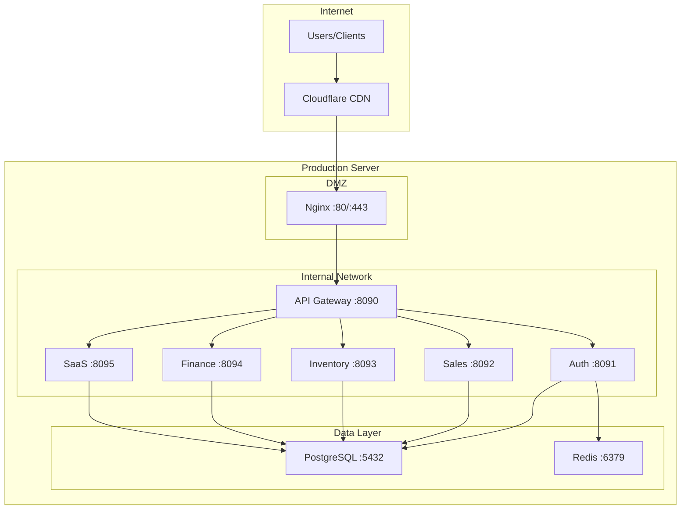

# Infrastructure Documentation

## Document Information

| Field | Value |
|-------|-------|
| **Document ID** | SYS-INFRA-001 |
| **Version** | 2.0.0 |
| **Classification** | Internal |
| **Last Updated** | January 2025 |

---

## 1. Server Infrastructure

### 1.1 Production Environment

| Component | Specification | Details |
|-----------|--------------|---------|
| **Primary Server** | VPS | IP: 72.60.96.174 |
| **Operating System** | Ubuntu 22.04 LTS | Kernel: 6.8.0-87-generic |
| **CPU** | 4 vCPU | AMD EPYC |
| **RAM** | 16 GB | DDR4 |
| **Storage** | 200 GB SSD | NVMe |
| **Network** | 1 Gbps | Dedicated |

### 1.2 Resource Allocation

```
┌────────────────────────────────────────────────────────────┐
│                    System Resources                         │
├────────────────────────────────────────────────────────────┤
│ Component          │ CPU    │ Memory  │ Storage            │
├────────────────────┼────────┼─────────┼────────────────────┤
│ PostgreSQL         │ 1 core │ 4 GB    │ 50 GB              │
│ Redis              │ 0.5    │ 1 GB    │ 2 GB               │
│ API Gateway        │ 0.5    │ 512 MB  │ 100 MB             │
│ Auth Service       │ 0.25   │ 256 MB  │ 100 MB             │
│ Sales Service      │ 0.5    │ 512 MB  │ 500 MB (OCR cache) │
│ Inventory Service  │ 0.25   │ 256 MB  │ 100 MB             │
│ Finance Service    │ 0.25   │ 256 MB  │ 100 MB             │
│ SaaS Service       │ 0.25   │ 256 MB  │ 100 MB             │
│ Nginx              │ 0.25   │ 256 MB  │ 100 MB             │
│ Monitoring Stack   │ 0.25   │ 512 MB  │ 5 GB               │
├────────────────────┼────────┼─────────┼────────────────────┤
│ Total Allocated    │ 4 core │ 8 GB    │ 58 GB              │
│ Buffer/Headroom    │ -      │ 8 GB    │ 142 GB             │
└────────────────────┴────────┴─────────┴────────────────────┘
```

---

## 2. Network Architecture

### 2.1 Network Topology



### 2.2 Port Allocation

| Port | Service | Exposure | Protocol |
|------|---------|----------|----------|
| 80 | Nginx HTTP | Public | HTTP → HTTPS redirect |
| 443 | Nginx HTTPS | Public | HTTPS |
| 5432 | PostgreSQL | Internal | PostgreSQL |
| 6379 | Redis | Internal | Redis |
| 8090 | API Gateway | Internal | HTTP |
| 8091 | Auth Service | Internal | HTTP |
| 8092 | Sales Service | Internal | HTTP |
| 8093 | Inventory Service | Internal | HTTP |
| 8094 | Finance Service | Internal | HTTP |
| 8095 | SaaS Service | Internal | HTTP |
| 9090 | Prometheus | Internal | HTTP |
| 3000 | Grafana | Internal | HTTP |

### 2.3 Firewall Rules (UFW)

```bash
# Default policies
ufw default deny incoming
ufw default allow outgoing

# Public access
ufw allow 22/tcp    # SSH (restricted to admin IPs)
ufw allow 80/tcp    # HTTP
ufw allow 443/tcp   # HTTPS

# Internal network (Docker bridge)
ufw allow from 172.20.0.0/16 to any
```

---

## 3. Docker Infrastructure

### 3.1 Docker Compose Configuration

```yaml
version: '3.8'

services:
  postgres:
    image: postgres:15-alpine
    container_name: liquorpro-db
    restart: unless-stopped
    environment:
      POSTGRES_DB: liquorpro
      POSTGRES_USER: liquorpro
      POSTGRES_PASSWORD: liquorpro_password  # Note: Use env var in production
    volumes:
      - postgres_data:/var/lib/postgresql/data
    networks:
      - liquorpro-network
    healthcheck:
      test: ["CMD-SHELL", "pg_isready -U liquorpro"]
      interval: 10s
      timeout: 5s
      retries: 5

  redis:
    image: redis:7-alpine
    container_name: liquorpro-redis
    restart: unless-stopped
    command: redis-server --requirepass redis_password  # Note: Use env var in production
    volumes:
      - redis_data:/data
    networks:
      - liquorpro-network
    healthcheck:
      test: ["CMD", "redis-cli", "ping"]
      interval: 10s
      timeout: 5s
      retries: 5

  gateway:
    build:
      context: .
      dockerfile: Dockerfile.gateway
    container_name: liquorpro-gateway
    restart: unless-stopped
    ports:
      - "8090:8090"
    environment:
      - APP_ENVIRONMENT=production
    depends_on:
      postgres:
        condition: service_healthy
      redis:
        condition: service_healthy
    networks:
      - liquorpro-network

  # ... other services follow same pattern

networks:
  liquorpro-network:
    driver: bridge
    ipam:
      config:
        - subnet: 172.20.0.0/16

volumes:
  postgres_data:
  redis_data:
  uploads:
```

### 3.2 Container Resource Limits

```yaml
# Per-service resource limits
services:
  gateway:
    deploy:
      resources:
        limits:
          cpus: '0.50'
          memory: 512M
        reservations:
          cpus: '0.25'
          memory: 256M

  auth:
    deploy:
      resources:
        limits:
          cpus: '0.25'
          memory: 256M
        reservations:
          cpus: '0.10'
          memory: 128M

  sales:
    deploy:
      resources:
        limits:
          cpus: '0.50'
          memory: 512M
        reservations:
          cpus: '0.25'
          memory: 256M

  inventory:
    deploy:
      resources:
        limits:
          cpus: '0.25'
          memory: 256M
        reservations:
          cpus: '0.10'
          memory: 128M

  finance:
    deploy:
      resources:
        limits:
          cpus: '0.25'
          memory: 256M
        reservations:
          cpus: '0.10'
          memory: 128M
```

---

## 4. Nginx Configuration

### 4.1 Main Configuration

```nginx
# /etc/nginx/nginx.conf
user nginx;
worker_processes auto;
error_log /var/log/nginx/error.log warn;
pid /var/run/nginx.pid;

events {
    worker_connections 4096;
    use epoll;
    multi_accept on;
}

http {
    include /etc/nginx/mime.types;
    default_type application/octet-stream;

    # Logging format
    log_format main '$remote_addr - $remote_user [$time_local] "$request" '
                    '$status $body_bytes_sent "$http_referer" '
                    '"$http_user_agent" "$http_x_forwarded_for" '
                    'rt=$request_time uct="$upstream_connect_time" '
                    'uht="$upstream_header_time" urt="$upstream_response_time"';

    access_log /var/log/nginx/access.log main;

    # Performance optimizations
    sendfile on;
    tcp_nopush on;
    tcp_nodelay on;
    keepalive_timeout 65;
    types_hash_max_size 2048;

    # Gzip compression
    gzip on;
    gzip_vary on;
    gzip_proxied any;
    gzip_comp_level 6;
    gzip_types text/plain text/css text/xml application/json
               application/javascript application/xml;

    # Rate limiting zones
    limit_req_zone $binary_remote_addr zone=api:10m rate=100r/s;
    limit_req_zone $binary_remote_addr zone=login:10m rate=5r/m;

    # Include virtual hosts
    include /etc/nginx/conf.d/*.conf;
}
```

### 4.2 LiquorPro Virtual Host

```nginx
# /etc/nginx/conf.d/liquorpro.conf
upstream liquorpro_api {
    server 127.0.0.1:8090;
    keepalive 32;
}

server {
    listen 80;
    server_name new.v2.floelife.in;
    return 301 https://$server_name$request_uri;
}

server {
    listen 443 ssl http2;
    server_name new.v2.floelife.in;

    # SSL Configuration
    ssl_certificate /etc/letsencrypt/live/new.v2.floelife.in/fullchain.pem;
    ssl_certificate_key /etc/letsencrypt/live/new.v2.floelife.in/privkey.pem;
    ssl_protocols TLSv1.2 TLSv1.3;
    ssl_prefer_server_ciphers on;
    ssl_ciphers ECDHE-ECDSA-AES128-GCM-SHA256:ECDHE-RSA-AES128-GCM-SHA256;

    # Security headers
    add_header X-Frame-Options "SAMEORIGIN" always;
    add_header X-Content-Type-Options "nosniff" always;
    add_header X-XSS-Protection "1; mode=block" always;
    add_header Strict-Transport-Security "max-age=31536000; includeSubDomains" always;

    # Client body size (for OCR uploads)
    client_max_body_size 100M;

    # API proxy
    location /api/ {
        limit_req zone=api burst=20 nodelay;

        proxy_pass http://liquorpro_api;
        proxy_http_version 1.1;
        proxy_set_header Host $host;
        proxy_set_header X-Real-IP $remote_addr;
        proxy_set_header X-Forwarded-For $proxy_add_x_forwarded_for;
        proxy_set_header X-Forwarded-Proto $scheme;
        proxy_set_header Connection "";

        proxy_connect_timeout 60s;
        proxy_send_timeout 60s;
        proxy_read_timeout 60s;
    }

    # WebSocket endpoint
    location /ws {
        proxy_pass http://liquorpro_api;
        proxy_http_version 1.1;
        proxy_set_header Upgrade $http_upgrade;
        proxy_set_header Connection "upgrade";
        proxy_set_header Host $host;
        proxy_read_timeout 3600s;
    }

    # Login rate limiting
    location /api/auth/login {
        limit_req zone=login burst=3 nodelay;

        proxy_pass http://liquorpro_api;
        proxy_http_version 1.1;
        proxy_set_header Host $host;
        proxy_set_header X-Real-IP $remote_addr;
        proxy_set_header X-Forwarded-For $proxy_add_x_forwarded_for;
        proxy_set_header X-Forwarded-Proto $scheme;
    }

    # Health check endpoint
    location /health {
        access_log off;
        return 200 "healthy\n";
    }
}
```

---

## 5. Database Infrastructure

### 5.1 PostgreSQL Configuration

```ini
# postgresql.conf optimizations

# Connection settings
max_connections = 300
superuser_reserved_connections = 3

# Memory settings
shared_buffers = 2GB
effective_cache_size = 6GB
maintenance_work_mem = 512MB
work_mem = 16MB

# Checkpoint settings
checkpoint_completion_target = 0.9
wal_buffers = 64MB
min_wal_size = 1GB
max_wal_size = 4GB

# Query planner
random_page_cost = 1.1
effective_io_concurrency = 200
default_statistics_target = 100

# Logging
log_min_duration_statement = 1000
log_checkpoints = on
log_connections = on
log_disconnections = on
log_lock_waits = on

# Autovacuum
autovacuum = on
autovacuum_max_workers = 3
autovacuum_vacuum_scale_factor = 0.1
autovacuum_analyze_scale_factor = 0.05
```

### 5.2 Connection Pooling

The application uses GORM's built-in connection pooling:

```go
// Database connection configuration
sqlDB.SetMaxOpenConns(100)      // Maximum open connections
sqlDB.SetMaxIdleConns(10)       // Maximum idle connections
sqlDB.SetConnMaxLifetime(time.Hour)  // Connection max lifetime
sqlDB.SetConnMaxIdleTime(10 * time.Minute)  // Idle connection timeout
```

---

## 6. Redis Configuration

### 6.1 Redis Settings

```conf
# redis.conf

# Network
bind 127.0.0.1
port 6379
protected-mode yes
requirepass ${REDIS_PASSWORD}

# Memory
maxmemory 1gb
maxmemory-policy allkeys-lru

# Persistence
save 900 1
save 300 10
save 60 10000
appendonly yes
appendfsync everysec

# Logging
loglevel notice

# Limits
maxclients 10000
timeout 300
```

---

## 7. Backup Infrastructure

### 7.1 PostgreSQL Backup Script

```bash
#!/bin/bash
# /opt/scripts/backup-postgres.sh

BACKUP_DIR="/backups/postgres"
TIMESTAMP=$(date +%Y%m%d_%H%M%S)
S3_BUCKET="s3://liquorpro-backups/postgres"

# Create backup
docker exec liquorpro-db pg_dump -U liquorpro liquorpro | gzip > \
    "${BACKUP_DIR}/liquorpro_${TIMESTAMP}.sql.gz"

# Upload to S3
aws s3 cp "${BACKUP_DIR}/liquorpro_${TIMESTAMP}.sql.gz" \
    "${S3_BUCKET}/liquorpro_${TIMESTAMP}.sql.gz"

# Clean up local backups older than 7 days
find ${BACKUP_DIR} -name "*.sql.gz" -mtime +7 -delete

# Verify backup
if [ $? -eq 0 ]; then
    echo "Backup completed successfully: liquorpro_${TIMESTAMP}.sql.gz"
else
    echo "Backup failed!" | mail -s "LiquorPro Backup Failed" admin@liquorpro.io
fi
```

### 7.2 Backup Schedule (Cron)

```cron
# PostgreSQL backups
0 2 * * * /opt/scripts/backup-postgres.sh
0 */6 * * * /opt/scripts/backup-postgres-incremental.sh

# Redis backups
0 * * * * docker exec liquorpro-redis redis-cli BGSAVE

# Log rotation
0 0 * * * /usr/sbin/logrotate /etc/logrotate.d/liquorpro

# Certificate renewal
0 3 * * 1 certbot renew --quiet
```

---

## 8. Monitoring Infrastructure

### 8.1 Prometheus Configuration

```yaml
# prometheus.yml
global:
  scrape_interval: 15s
  evaluation_interval: 15s

alerting:
  alertmanagers:
    - static_configs:
        - targets:
          - alertmanager:9093

rule_files:
  - "alerts/*.yml"

scrape_configs:
  - job_name: 'prometheus'
    static_configs:
      - targets: ['localhost:9090']

  - job_name: 'liquorpro-gateway'
    static_configs:
      - targets: ['gateway:8090']
    metrics_path: /metrics

  - job_name: 'liquorpro-auth'
    static_configs:
      - targets: ['auth:8091']
    metrics_path: /metrics

  - job_name: 'liquorpro-sales'
    static_configs:
      - targets: ['sales:8092']
    metrics_path: /metrics

  - job_name: 'liquorpro-inventory'
    static_configs:
      - targets: ['inventory:8093']
    metrics_path: /metrics

  - job_name: 'liquorpro-finance'
    static_configs:
      - targets: ['finance:8094']
    metrics_path: /metrics

  - job_name: 'postgres'
    static_configs:
      - targets: ['postgres-exporter:9187']

  - job_name: 'redis'
    static_configs:
      - targets: ['redis-exporter:9121']

  - job_name: 'nginx'
    static_configs:
      - targets: ['nginx-exporter:9113']
```

### 8.2 Alert Rules

```yaml
# alerts/liquorpro.yml
groups:
  - name: liquorpro
    rules:
      - alert: HighErrorRate
        expr: rate(http_requests_total{status=~"5.."}[5m]) > 0.1
        for: 5m
        labels:
          severity: critical
        annotations:
          summary: "High error rate detected"

      - alert: HighLatency
        expr: histogram_quantile(0.99, rate(http_request_duration_seconds_bucket[5m])) > 2
        for: 5m
        labels:
          severity: warning
        annotations:
          summary: "High latency detected"

      - alert: DatabaseConnectionPoolExhausted
        expr: pg_stat_activity_count > 250
        for: 5m
        labels:
          severity: critical
        annotations:
          summary: "Database connection pool near exhaustion"

      - alert: RedisMemoryHigh
        expr: redis_memory_used_bytes / redis_memory_max_bytes > 0.9
        for: 5m
        labels:
          severity: warning
        annotations:
          summary: "Redis memory usage above 90%"
```

---

## 9. Logging Infrastructure

### 9.1 Log Rotation

```conf
# /etc/logrotate.d/liquorpro
/var/log/liquorpro/*.log {
    daily
    rotate 14
    compress
    delaycompress
    missingok
    notifempty
    create 0640 www-data adm
    sharedscripts
    postrotate
        docker-compose -f /var/www/liquorpro/docker-compose.production.yml restart
    endscript
}
```

### 9.2 Centralized Logging (Loki)

```yaml
# loki-config.yml
auth_enabled: false

server:
  http_listen_port: 3100

ingester:
  lifecycler:
    ring:
      kvstore:
        store: inmemory
      replication_factor: 1

schema_config:
  configs:
    - from: 2024-01-01
      store: boltdb-shipper
      object_store: filesystem
      schema: v11
      index:
        prefix: index_
        period: 24h

storage_config:
  boltdb_shipper:
    active_index_directory: /loki/boltdb-shipper-active
    cache_location: /loki/boltdb-shipper-cache
  filesystem:
    directory: /loki/chunks

limits_config:
  enforce_metric_name: false
  reject_old_samples: true
  reject_old_samples_max_age: 168h
```

---

## 10. Disaster Recovery

### 10.1 Recovery Procedures

#### Database Recovery
```bash
#!/bin/bash
# Restore from backup
gunzip -c /backups/postgres/liquorpro_YYYYMMDD.sql.gz | \
    docker exec -i liquorpro-db psql -U liquorpro -d liquorpro
```

#### Service Recovery
```bash
#!/bin/bash
# Full service restart
cd /var/www/liquorpro
docker-compose -f docker-compose.production.yml down
docker-compose -f docker-compose.production.yml up -d

# Health check
sleep 30
curl -f http://localhost:8090/health || echo "Service unhealthy!"
```

### 10.2 Recovery Time Objectives

| Scenario | RTO | RPO | Procedure |
|----------|-----|-----|-----------|
| Single service failure | 5 min | 0 | Auto-restart via Docker |
| Database corruption | 1 hour | 1 hour | Restore from backup |
| Full server failure | 4 hours | 1 hour | Provision new server, restore |
| Datacenter failure | 8 hours | 1 hour | Failover to DR site |

---

## Revision History

| Version | Date | Author | Changes |
|---------|------|--------|---------|
| 2.0.0 | Jan 2025 | DevOps Team | Complete documentation |
| 1.0.0 | Jul 2024 | DevOps Team | Initial release |
