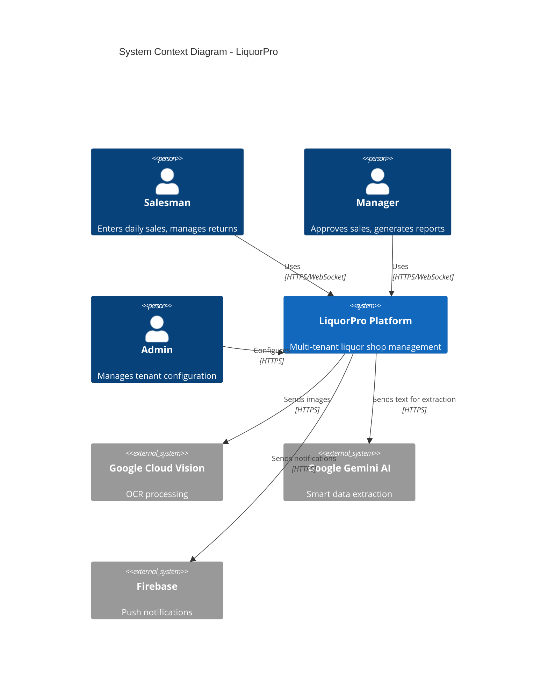
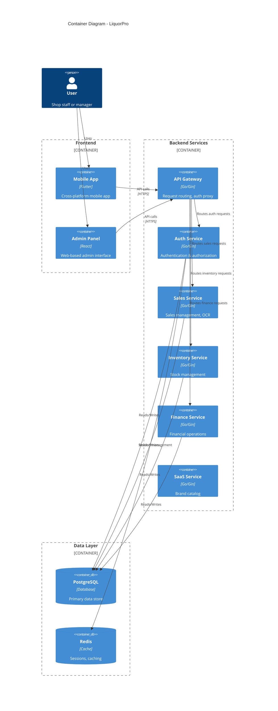
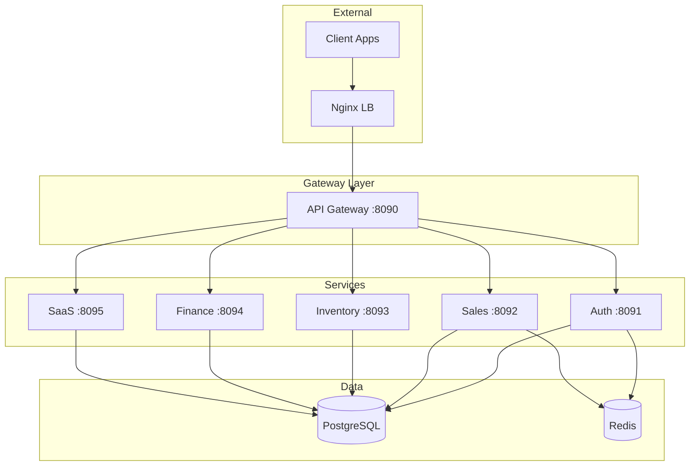
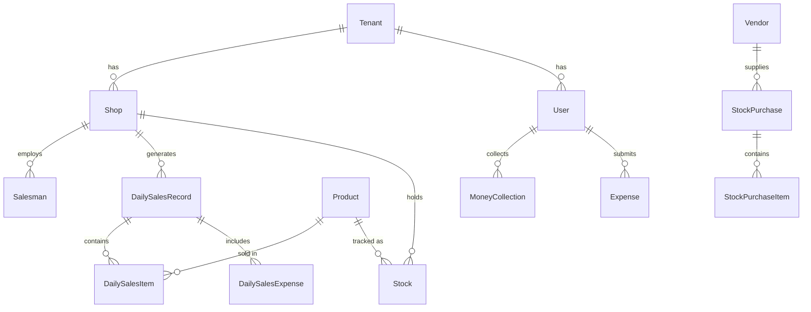
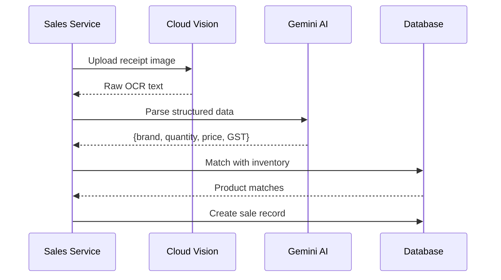

# System Architecture Overview

## Document Information

| Field | Value |
|-------|-------|
| **Document ID** | SYS-ARCH-001 |
| **Version** | 2.0.0 |
| **Classification** | Internal |
| **Last Updated** | January 2025 |
| **Author** | LiquorPro Engineering Team |

---

## 1. Executive Summary

LiquorPro is built on a **microservices architecture** with an **API Gateway pattern**, designed for scalability, maintainability, and high availability. The system supports multi-tenant SaaS operations with complete data isolation between tenants.

### Key Architectural Decisions

| Decision | Rationale |
|----------|-----------|
| Microservices | Independent scaling, fault isolation, technology flexibility |
| API Gateway | Centralized auth, rate limiting, request routing |
| PostgreSQL | ACID compliance, UUID support, JSON capabilities |
| Redis | Session management, caching, rate limiting |
| Go Language | Performance, concurrency, small memory footprint |

---

## 2. High-Level Architecture

### 2.1 System Context Diagram



### 2.2 Container Diagram



---

## 3. Service Architecture

### 3.1 Service Inventory

| Service | Port | Database | Cache | External Dependencies |
|---------|------|----------|-------|----------------------|
| API Gateway | 8090 | PostgreSQL | Redis | - |
| Auth Service | 8091 | PostgreSQL | Redis | - |
| Sales Service | 8092 | PostgreSQL | Redis | Cloud Vision, Gemini |
| Inventory Service | 8093 | PostgreSQL | Redis | - |
| Finance Service | 8094 | PostgreSQL | Redis | - |
| SaaS Service | 8095 | PostgreSQL | Redis | - |

### 3.2 Service Communication



### 3.3 Service Responsibilities

#### API Gateway (Port 8090)
- **Primary Function**: Central entry point for all API requests
- **Responsibilities**:
    - Request routing to appropriate services
    - JWT token validation
    - Rate limiting (per-endpoint and per-user)
    - CORS handling
    - WebSocket upgrade handling
    - Request/Response logging

#### Auth Service (Port 8091)
- **Primary Function**: User identity and access management
- **Responsibilities**:
    - User registration and login
    - OTP generation and verification
    - JWT token lifecycle management
    - Session management (2-device limit)
    - Role and permission management
    - Account deletion (App Store compliance)

#### Sales Service (Port 8092)
- **Primary Function**: Daily sales operations
- **Responsibilities**:
    - Daily sales record management (bulk entry)
    - Individual sale transactions
    - Sales return processing
    - Receipt OCR processing (Cloud Vision + Gemini)
    - Sales approval workflow
    - Dashboard and analytics
    - Pending sales scheduler (15-minute deadline)

#### Inventory Service (Port 8093)
- **Primary Function**: Product and stock management
- **Responsibilities**:
    - Product catalog management
    - Stock level tracking (FIFO/LIFO/Average)
    - Purchase order workflow
    - Stock transfers between shops
    - Brand onboarding from SaaS catalog
    - Low stock alerts

#### Finance Service (Port 8094)
- **Primary Function**: Financial operations
- **Responsibilities**:
    - Vendor management and ledger
    - Bank account tracking
    - Expense management with approval
    - Cash handling and handovers
    - Money collection deadline enforcement
    - Stock verification reports

#### SaaS Service (Port 8095)
- **Primary Function**: Platform-level catalog management
- **Responsibilities**:
    - Master brand catalog (39+ brands)
    - Brand categories and subcategories
    - Tenant-specific brand customization
    - Pricing synchronization

---

## 4. Data Architecture

### 4.1 Database Design Philosophy

- **Multi-Tenant Isolation**: Every table includes `tenant_id` for data isolation
- **Soft Deletes**: Critical entities use `deleted_at` for audit trail
- **UUID Primary Keys**: All primary keys use UUID for distributed generation
- **Audit Trail**: `created_at`, `updated_at`, `created_by`, `updated_by` on all entities

### 4.2 Core Entity Relationships



### 4.3 Database Sizing

| Table Category | Estimated Rows/Month | Growth Rate |
|----------------|---------------------|-------------|
| Daily Sales Records | 30 per shop | Linear |
| Daily Sales Items | 3,000 per shop | Linear |
| Products | 500 per tenant | Slow |
| Stock Movements | 1,000 per shop | Linear |
| Audit Logs | 50,000 per tenant | Linear |

---

## 5. Integration Architecture

### 5.1 External Service Integration



### 5.2 Webhook Architecture

LiquorPro supports outgoing webhooks for:

- Sales record created/approved/rejected
- Stock level changes
- Payment received
- Low stock alerts

---

## 6. Caching Strategy

### 6.1 Cache Layers

| Cache Type | Storage | TTL | Use Case |
|------------|---------|-----|----------|
| Session Cache | Redis | 24h | JWT tokens, user sessions |
| Rate Limit Cache | Redis | 1-15min | Request counting |
| Query Cache | Redis | 5min | Frequently accessed data |
| Static Data Cache | In-Memory | 1h | Configuration, lookups |

### 6.2 Cache Key Patterns

```
session:device:{session_id}     # Device session
user:session:{user_id}          # User session (legacy)
login:attempts:{phone}          # Login rate limiting
login:blocked:{phone}           # Blocked status
rate:{endpoint}:{identifier}    # API rate limiting
cache:products:{tenant_id}      # Product catalog cache
```

---

## 7. Deployment Architecture

### 7.1 Production Environment

```
┌─────────────────────────────────────────────────────────────────┐
│                        Internet                                  │
└─────────────────────────────┬───────────────────────────────────┘
                              │
┌─────────────────────────────▼───────────────────────────────────┐
│                     Cloudflare CDN                               │
│                  (DDoS Protection, SSL)                          │
└─────────────────────────────┬───────────────────────────────────┘
                              │
┌─────────────────────────────▼───────────────────────────────────┐
│                   Nginx Load Balancer                            │
│                 (SSL Termination, Routing)                       │
│                    Server: 72.60.96.174                          │
└─────────────────────────────┬───────────────────────────────────┘
                              │
┌─────────────────────────────▼───────────────────────────────────┐
│                   Docker Compose Stack                           │
│  ┌─────────┐ ┌─────────┐ ┌─────────┐ ┌─────────┐ ┌─────────┐   │
│  │ Gateway │ │  Auth   │ │  Sales  │ │Inventory│ │ Finance │   │
│  │  :8090  │ │  :8091  │ │  :8092  │ │  :8093  │ │  :8094  │   │
│  └─────────┘ └─────────┘ └─────────┘ └─────────┘ └─────────┘   │
│                                                                  │
│  ┌─────────────────────┐ ┌─────────────────────┐                │
│  │     PostgreSQL      │ │       Redis         │                │
│  │       :5432         │ │       :6379         │                │
│  └─────────────────────┘ └─────────────────────┘                │
└──────────────────────────────────────────────────────────────────┘
```

### 7.2 Domain Configuration

| Domain | Target | Purpose |
|--------|--------|---------|
| new.v2.floelife.in | 72.60.96.174 | Production API |
| admin.liquorpro.io | Admin Panel | Admin interface |
| docs.liquorpro.io | Documentation | This documentation |

---

## 8. Monitoring & Observability

### 8.1 Monitoring Stack

- **Metrics**: Prometheus + Grafana
- **Logging**: Structured JSON logs → Loki
- **Tracing**: Jaeger (OpenTracing)
- **Alerting**: Prometheus Alertmanager

### 8.2 Key Metrics

| Metric | Type | Alert Threshold |
|--------|------|-----------------|
| `http_request_duration_seconds` | Histogram | p99 > 2s |
| `http_requests_total` | Counter | Rate > 1000/min |
| `db_connection_pool_size` | Gauge | > 250 |
| `redis_connection_errors` | Counter | > 10/min |
| `ocr_processing_time_seconds` | Histogram | p95 > 30s |

---

## 9. Disaster Recovery

### 9.1 Backup Strategy

| Component | Frequency | Retention | Location |
|-----------|-----------|-----------|----------|
| PostgreSQL | Daily | 30 days | Off-site S3 |
| Redis | Hourly RDB | 24 hours | Local + S3 |
| Uploads | Real-time | 90 days | S3 |
| Configuration | On change | Unlimited | Git |

### 9.2 Recovery Objectives

| Metric | Target |
|--------|--------|
| **RTO** (Recovery Time Objective) | 4 hours |
| **RPO** (Recovery Point Objective) | 1 hour |
| **MTTR** (Mean Time to Recovery) | 2 hours |

---

## 10. Security Architecture

See [Security Documentation](security.md) for detailed security architecture.

### 10.1 Security Layers

1. **Network**: Cloudflare DDoS protection, firewall rules
2. **Transport**: TLS 1.3, certificate pinning
3. **Application**: JWT authentication, RBAC, rate limiting
4. **Data**: Tenant isolation, encryption at rest
5. **Audit**: Complete audit trail, access logging

---

## Revision History

| Version | Date | Author | Changes |
|---------|------|--------|---------|
| 2.0.0 | Jan 2025 | Engineering Team | Complete rewrite for v2 |
| 1.5.0 | Oct 2024 | Engineering Team | Added OCR architecture |
| 1.0.0 | Jul 2024 | Engineering Team | Initial release |
