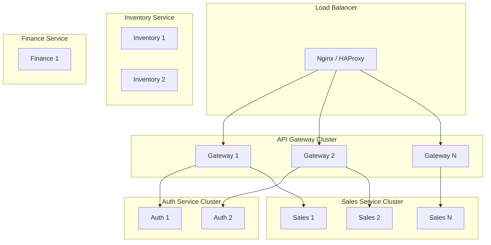
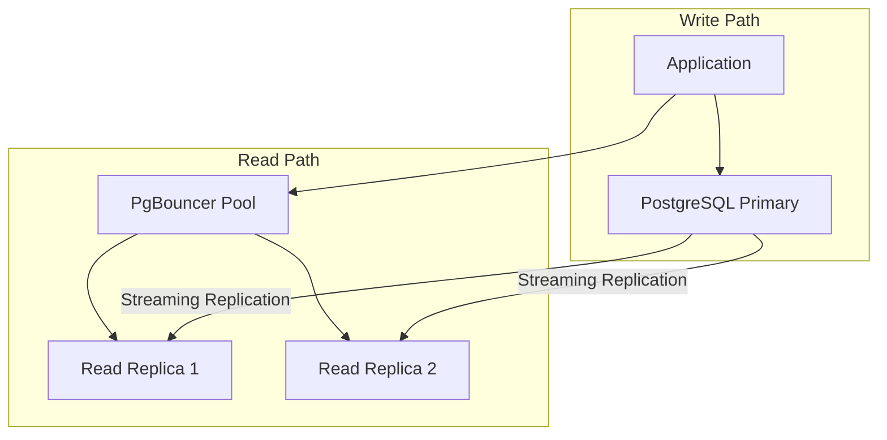
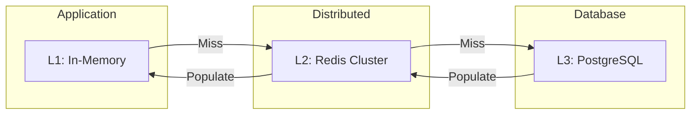
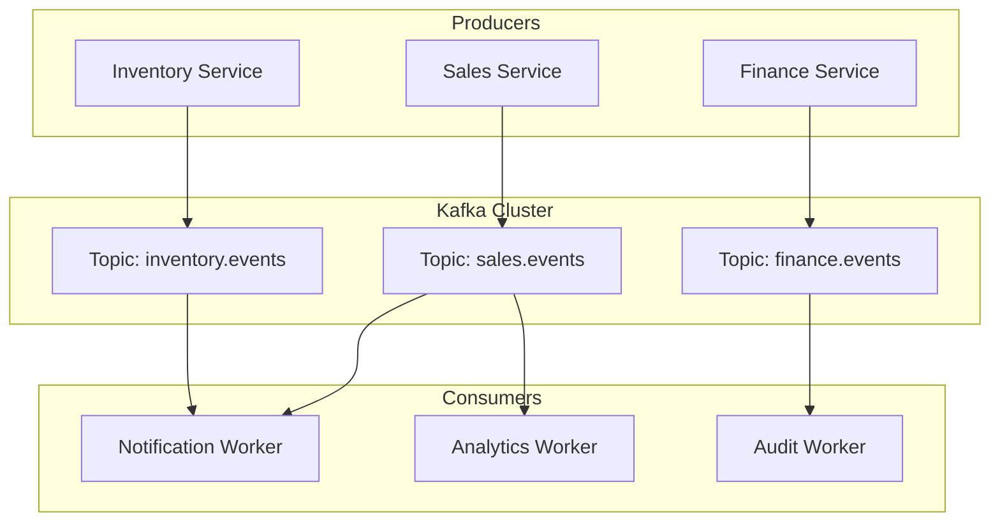
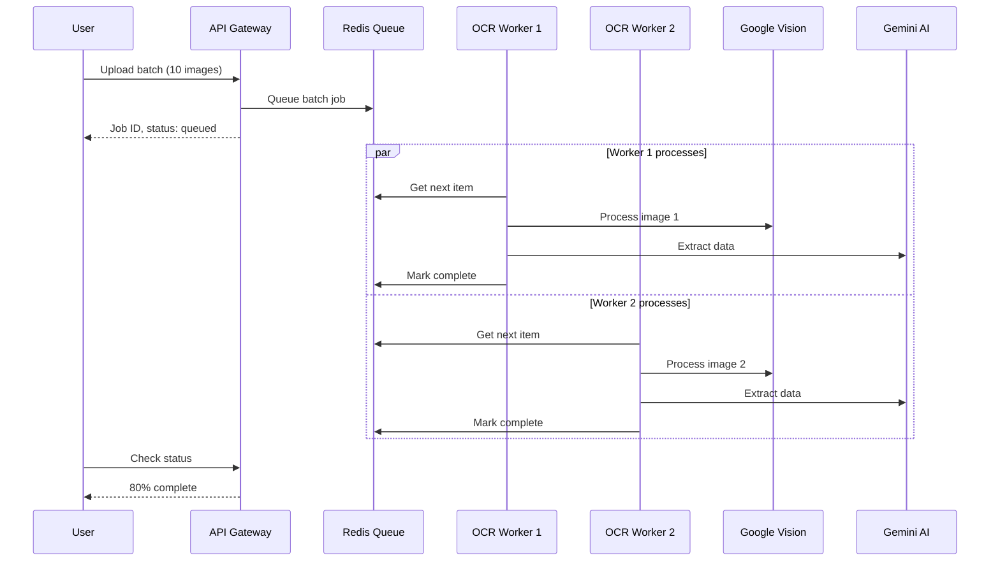

# Scalability Architecture

## Document Information

| Field | Value |
|-------|-------|
| **Document ID** | SYS-SCALE-001 |
| **Version** | 2.0.0 |
| **Last Updated** | January 2025 |

---

## 1. Scalability Overview

LiquorPro is designed for horizontal scalability, supporting growth from single-shop operations to enterprise multi-tenant deployments with thousands of concurrent users.

### 1.1 Scalability Dimensions

| Dimension | Current | Target | Strategy |
|-----------|---------|--------|----------|
| **Tenants** | 50 | 1,000+ | Database sharding |
| **Users/Tenant** | 100 | 500 | Connection pooling |
| **Concurrent Requests** | 500/sec | 5,000/sec | Horizontal scaling |
| **Data Volume** | 100 GB | 10 TB | Partitioning, archival |
| **OCR Requests** | 100/day | 10,000/day | Queue-based processing |

---

## 2. Horizontal Scaling Architecture

### 2.1 Service Scaling



### 2.2 Scaling Triggers

| Metric | Threshold | Action |
|--------|-----------|--------|
| CPU Usage | > 70% for 5 min | Add instance |
| Memory Usage | > 80% for 5 min | Add instance |
| Request Queue | > 100 pending | Add instance |
| Response Time | p99 > 2s | Add instance |
| Error Rate | > 1% for 5 min | Add instance |

### 2.3 Kubernetes HPA Configuration

```yaml
apiVersion: autoscaling/v2
kind: HorizontalPodAutoscaler
metadata:
  name: liquorpro-gateway-hpa
spec:
  scaleTargetRef:
    apiVersion: apps/v1
    kind: Deployment
    name: liquorpro-gateway
  minReplicas: 2
  maxReplicas: 10
  metrics:
    - type: Resource
      resource:
        name: cpu
        target:
          type: Utilization
          averageUtilization: 70
    - type: Resource
      resource:
        name: memory
        target:
          type: Utilization
          averageUtilization: 80
```

---

## 3. Database Scalability

### 3.1 Read Replica Architecture



### 3.2 Connection Pooling

```ini
# PgBouncer configuration
[databases]
liquorpro = host=primary port=5432 dbname=liquorpro
liquorpro_ro = host=replica1,replica2 port=5432 dbname=liquorpro

[pgbouncer]
pool_mode = transaction
max_client_conn = 1000
default_pool_size = 50
min_pool_size = 10
reserve_pool_size = 10
reserve_pool_timeout = 3
```

### 3.3 Table Partitioning

```sql
-- Partition daily_sales_records by month
CREATE TABLE daily_sales_records (
    id UUID PRIMARY KEY,
    tenant_id UUID NOT NULL,
    record_date DATE NOT NULL,
    -- other columns
) PARTITION BY RANGE (record_date);

-- Create monthly partitions
CREATE TABLE daily_sales_records_2025_01
    PARTITION OF daily_sales_records
    FOR VALUES FROM ('2025-01-01') TO ('2025-02-01');

CREATE TABLE daily_sales_records_2025_02
    PARTITION OF daily_sales_records
    FOR VALUES FROM ('2025-02-01') TO ('2025-03-01');
```

### 3.4 Data Archival Strategy

| Data Type | Hot Storage | Warm Storage | Archive |
|-----------|-------------|--------------|---------|
| Sales Records | 90 days | 1 year | S3 Glacier |
| Audit Logs | 30 days | 1 year | 7 years (S3) |
| OCR Images | 7 days | 90 days | Delete |
| Reports | 30 days | 1 year | S3 Standard |

---

## 4. Caching Strategy

### 4.1 Multi-Level Cache



### 4.2 Redis Cluster Configuration

```yaml
# Redis Cluster with 3 masters, 3 replicas
redis:
  cluster:
    enabled: true
    nodes:
      - redis-node-1:6379
      - redis-node-2:6379
      - redis-node-3:6379
    replicas: 1
  memory:
    maxmemory: 2gb
    maxmemory-policy: allkeys-lru
```

### 4.3 Cache Invalidation Strategy

| Strategy | Use Case | Implementation |
|----------|----------|----------------|
| TTL-based | Session data | 24h expiration |
| Event-based | Product catalog | Publish/Subscribe |
| Write-through | User profiles | Update cache on write |
| Cache-aside | Query results | Application manages |

---

## 5. Message Queue Scaling

### 5.1 Kafka Architecture



### 5.2 Topic Partitioning

```
sales.daily-records      → 6 partitions (by tenant_id)
inventory.stock-changes  → 3 partitions (by shop_id)
notifications.workflow   → 3 partitions (by user_id)
audit.logs              → 6 partitions (by timestamp)
```

---

## 6. OCR Processing Scalability

### 6.1 Batch Processing Architecture



### 6.2 Worker Scaling

| Load Level | Workers | Max Batch Size | Processing Time |
|------------|---------|----------------|-----------------|
| Low (< 100/day) | 2 | 50 images | < 5 min |
| Medium (100-1000/day) | 5 | 100 images | < 10 min |
| High (1000+/day) | 10+ | 200 images | < 15 min |

---

## 7. Performance Benchmarks

### 7.1 API Response Times

| Endpoint | p50 | p95 | p99 | Target |
|----------|-----|-----|-----|--------|
| GET /products | 15ms | 50ms | 100ms | < 100ms |
| POST /daily-sales | 50ms | 150ms | 300ms | < 300ms |
| GET /dashboard | 100ms | 300ms | 500ms | < 500ms |
| POST /ocr/batch | 200ms | 500ms | 1s | < 1s (queue) |

### 7.2 Throughput Targets

| Scenario | Current | Target |
|----------|---------|--------|
| Daily Sales Records/sec | 50 | 200 |
| Products Query/sec | 500 | 2000 |
| User Authentication/sec | 100 | 500 |
| Report Generation/min | 10 | 50 |

### 7.3 Load Testing Results

```
# k6 load test results
scenarios: (100% 300 VUs for 10m0s)

     ✓ status is 200
     ✓ response time < 500ms

     checks.........................: 99.98% ✓ 178453  ✗ 32
     data_received..................: 1.2 GB 2.0 MB/s
     data_sent......................: 89 MB  148 kB/s
     http_req_duration..............: avg=45ms min=5ms med=35ms max=2.1s p(90)=85ms p(95)=120ms
     http_reqs......................: 178485 297.475/s
     vus............................: 300    min=300   max=300
```

---

## 8. Capacity Planning

### 8.1 Growth Projections

| Metric | Current | 6 Months | 1 Year | 2 Years |
|--------|---------|----------|--------|---------|
| Tenants | 50 | 150 | 500 | 1,500 |
| Users | 500 | 2,000 | 7,500 | 25,000 |
| Daily Transactions | 5,000 | 20,000 | 75,000 | 250,000 |
| Storage (GB) | 100 | 300 | 1,000 | 3,000 |

### 8.2 Infrastructure Scaling Plan

| Phase | Timeline | Infrastructure |
|-------|----------|----------------|
| **Current** | Now | Single VPS, 16GB RAM |
| **Phase 1** | 6 months | 3-node cluster, 48GB total |
| **Phase 2** | 1 year | K8s cluster, auto-scaling |
| **Phase 3** | 2 years | Multi-region, 99.99% SLA |

---

## 9. Cost Optimization

### 9.1 Resource Efficiency

| Strategy | Savings | Implementation |
|----------|---------|----------------|
| Spot instances | 60-70% | Non-critical workloads |
| Reserved capacity | 30-40% | Database, core services |
| Auto-scaling | 20-30% | Scale down during off-hours |
| Data lifecycle | 40-50% | Archive old data to S3 Glacier |

### 9.2 Estimated Costs at Scale

| Tenants | Monthly Cost | Cost/Tenant |
|---------|--------------|-------------|
| 100 | $500 | $5.00 |
| 500 | $1,500 | $3.00 |
| 1,000 | $2,500 | $2.50 |
| 5,000 | $8,000 | $1.60 |

---

## Revision History

| Version | Date | Author | Changes |
|---------|------|--------|---------|
| 2.0.0 | Jan 2025 | Engineering Team | Complete documentation |
| 1.0.0 | Jul 2024 | Engineering Team | Initial release |
