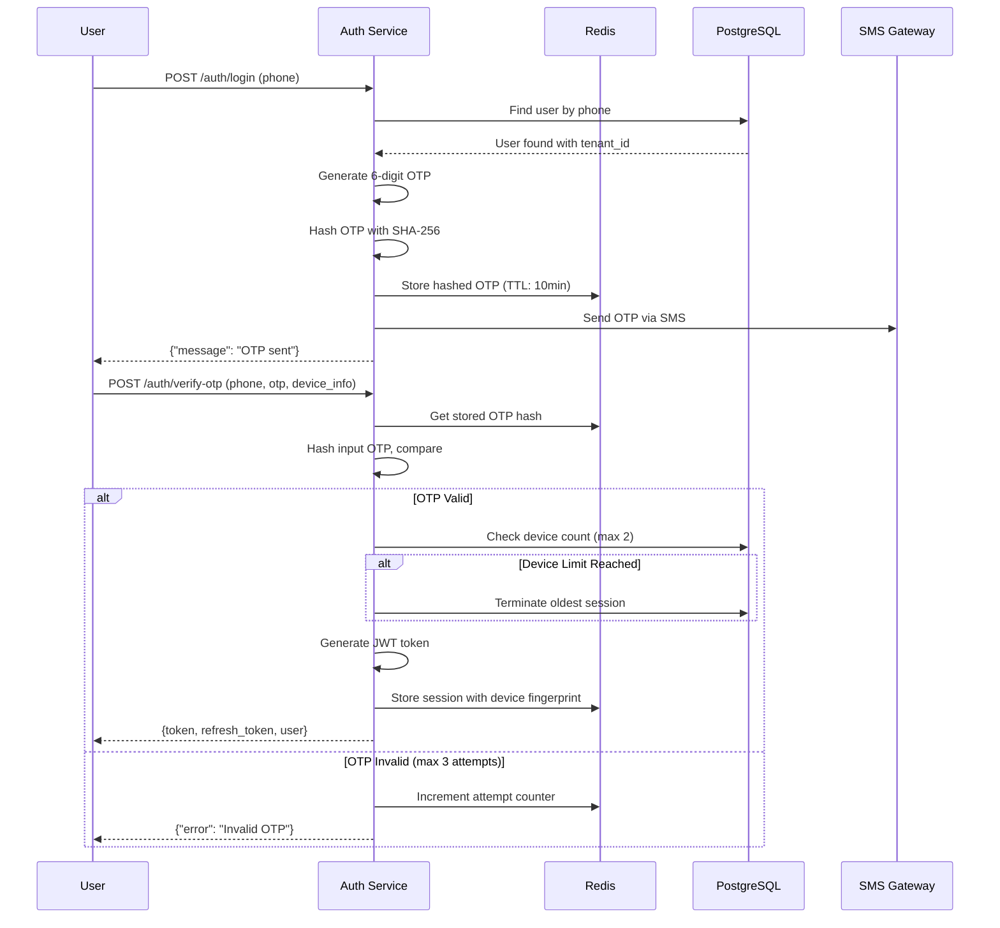
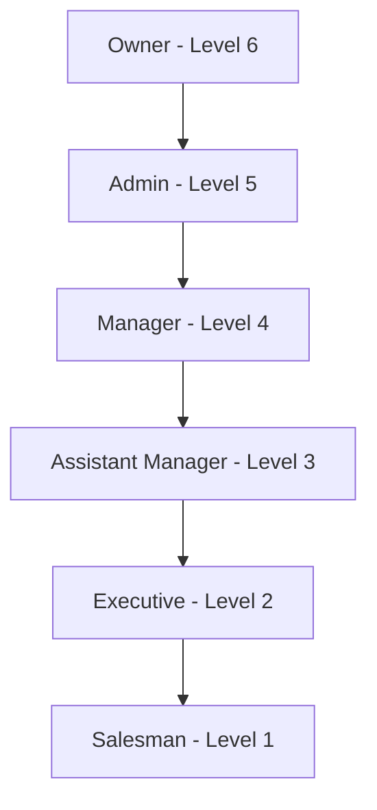
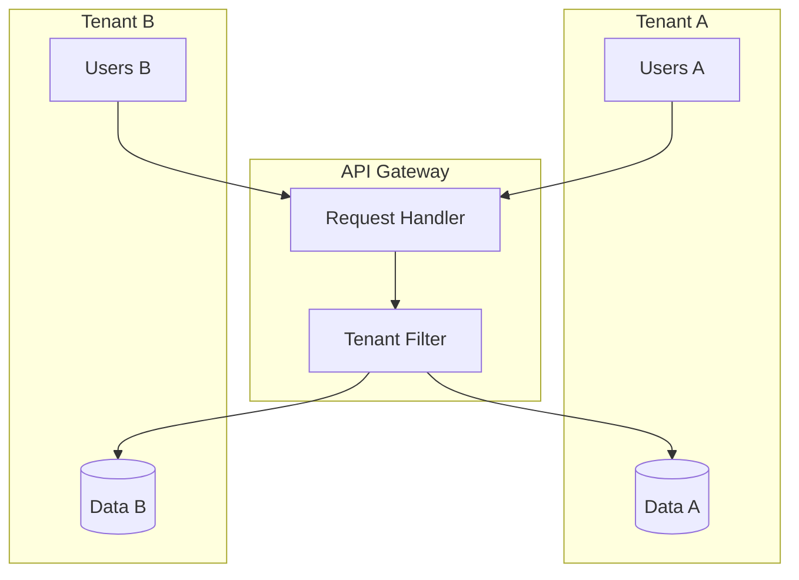

# Security Architecture

## Document Information

| Field | Value |
|-------|-------|
| **Document ID** | SYS-SEC-001 |
| **Version** | 2.0.0 |
| **Classification** | Confidential |
| **Last Updated** | January 2025 |
| **Compliance** | OWASP Top 10, PCI-DSS (partial) |

---

## 1. Security Overview

LiquorPro implements a defense-in-depth security model with multiple layers of protection. This document outlines the security architecture, controls, and best practices.

### 1.1 Security Principles

| Principle | Implementation |
|-----------|----------------|
| **Least Privilege** | Role-based access with minimal permissions |
| **Defense in Depth** | Multiple security layers |
| **Fail Secure** | Default deny on failures |
| **Separation of Duties** | Multi-tenant isolation |
| **Audit Trail** | Complete logging of all actions |

---

## 2. Authentication Architecture

### 2.1 Authentication Flow

LiquorPro uses **OTP-only authentication** (no passwords). Users login with their phone number and verify via a 6-digit OTP.



### 2.2 OTP Security Specifications

| Parameter | Value | Implementation |
|-----------|-------|----------------|
| **OTP Length** | 6 digits | `rand.Intn(900000) + 100000` |
| **Validity** | 10 minutes | `OTP_EXPIRE_TIME = 10 * time.Minute` |
| **Max Attempts** | 3 | Counter in Redis |
| **Hashing** | SHA-256 | Before Redis storage |
| **Master OTP** | 011001 | Development/testing only |
| **Resend Cooldown** | 60 seconds | Rate limited |

### 2.3 JWT Token Structure

```json
{
  "header": {
    "alg": "HS256",
    "typ": "JWT"
  },
  "payload": {
    "user_id": "uuid",
    "tenant_id": "uuid",
    "role": "manager",
    "permissions": ["sales:read", "sales:write"],
    "session_id": "uuid",
    "iat": 1704067200,
    "exp": 1704153600,
    "iss": "liquorpro"
  }
}
```

### 2.4 Token Security

| Aspect | Implementation |
|--------|----------------|
| **Algorithm** | HS256 (HMAC-SHA256) |
| **Secret** | 256-bit random key |
| **Access Token TTL** | 24 hours |
| **Refresh Token TTL** | 7 days |
| **Token Storage** | Redis with encryption |
| **Rotation** | On refresh, old token invalidated |

### 2.5 Session Management

```go
// Session key patterns in Redis
session:device:{session_id}     // Device-specific session
user:sessions:{user_id}         // User's active sessions list

// Session data structure
type SessionData struct {
    UserID      string    `json:"user_id"`
    TenantID    string    `json:"tenant_id"`
    DeviceID    string    `json:"device_id"`
    DeviceType  string    `json:"device_type"`
    IP          string    `json:"ip"`
    UserAgent   string    `json:"user_agent"`
    CreatedAt   time.Time `json:"created_at"`
    LastAccess  time.Time `json:"last_access"`
}
```

### 2.6 Device Limit (Swiggy-style)

- Maximum 2 concurrent device sessions per user
- New login on 3rd device terminates oldest session
- Users notified of session termination

---

## 3. Authorization Architecture

### 3.1 Role Hierarchy

LiquorPro uses a strict numeric hierarchy where higher levels inherit all permissions from lower levels.



**Role Level Constants** (from `role_hierarchy.go`):
```go
const (
    RoleLevelSalesman         = 1
    RoleLevelExecutive        = 2
    RoleLevelAssistantManager = 3
    RoleLevelManager          = 4
    RoleLevelAdmin            = 5
    RoleLevelOwner            = 6
)
```

### 3.2 Role Permissions Matrix

| Permission | Salesman | Executive | Asst. Manager | Manager | Admin | Owner |
|------------|----------|-----------|---------------|---------|-------|-------|
| sales:read | Yes | Yes | Yes | Yes | Yes | Yes |
| sales:write | Yes | Yes | Yes | Yes | Yes | Yes |
| sales:approve | No | No | Yes | Yes | Yes | Yes |
| sales:revert | No | No | No | No | Yes | Yes |
| inventory:read | Yes | Yes | Yes | Yes | Yes | Yes |
| inventory:write | No | No | No | Yes | Yes | Yes |
| finance:read | No | Yes | Yes | Yes | Yes | Yes |
| finance:approve | No | No | Yes | Yes | Yes | Yes |
| finance:revert | No | No | No | No | Yes | Yes |
| users:manage | No | No | No | Yes | Yes | Yes |
| tenant:configure | No | No | No | No | Yes | Yes |
| platform:manage | No | No | No | No | No | Yes |

### 3.3 Middleware Implementation

```go
// Role-based authorization middleware
func RoleMiddleware(requiredLevel int) gin.HandlerFunc {
    return func(c *gin.Context) {
        userRole := c.GetString("role")
        userLevel := GetRoleLevel(userRole)

        if userLevel < requiredLevel {
            c.AbortWithStatusJSON(403, gin.H{
                "error": "Insufficient permissions",
            })
            return
        }
        c.Next()
    }
}

// Permission-based authorization
func PermissionMiddleware(permission string) gin.HandlerFunc {
    return func(c *gin.Context) {
        permissions := c.GetStringSlice("permissions")

        if !contains(permissions, permission) {
            c.AbortWithStatusJSON(403, gin.H{
                "error": "Permission denied",
            })
            return
        }
        c.Next()
    }
}
```

---

## 4. Multi-Tenant Security

### 4.1 Tenant Isolation



### 4.2 Data Isolation Implementation

```go
// Every model includes tenant_id
type BaseModel struct {
    ID        uuid.UUID  `gorm:"type:uuid;primary_key"`
    TenantID  uuid.UUID  `gorm:"type:uuid;not null;index"`
    CreatedAt time.Time
    UpdatedAt time.Time
    DeletedAt *time.Time `gorm:"index"`
}

// Automatic tenant filtering via GORM scope
func TenantScope(db *gorm.DB, tenantID string) *gorm.DB {
    return db.Where("tenant_id = ?", tenantID)
}

// Usage in repository
func (r *Repository) FindProducts(tenantID string) ([]Product, error) {
    var products []Product
    err := TenantScope(r.db, tenantID).Find(&products).Error
    return products, err
}
```

### 4.3 Cross-Tenant Prevention

- All queries automatically scoped by tenant_id
- API requests validated against user's tenant
- Database-level RLS (Row Level Security) as additional layer
- Owner role bypass with explicit audit logging

---

## 5. API Security

### 5.1 Rate Limiting

```go
// Rate limit configuration
type RateLimitConfig struct {
    // Global limits
    GlobalRateLimit      int           // 1000 req/min
    GlobalBurstLimit     int           // 100 req/sec

    // Endpoint-specific limits
    LoginRateLimit       int           // 5 req/15min
    OTPRateLimit         int           // 3 req/min
    APIRateLimit         int           // 100 req/min

    // Role-based limits
    AdminRateLimit       int           // 500 req/min
    ManagerRateLimit     int           // 200 req/min
    SalesmanRateLimit    int           // 100 req/min
}
```

### 5.2 Rate Limit Headers

```
X-RateLimit-Limit: 100
X-RateLimit-Remaining: 95
X-RateLimit-Reset: 1704067260
Retry-After: 60 (when blocked)
```

### 5.3 Request Validation

```go
// Input validation using struct tags
type CreateSaleRequest struct {
    ShopID      string  `json:"shop_id" binding:"required,uuid"`
    SalesmanID  string  `json:"salesman_id" binding:"required,uuid"`
    CustomerName string `json:"customer_name" binding:"max=100"`
    Amount      float64 `json:"amount" binding:"required,gt=0,lt=10000000"`
    Items       []Item  `json:"items" binding:"required,min=1,max=100,dive"`
}

type Item struct {
    ProductID string  `json:"product_id" binding:"required,uuid"`
    Quantity  int     `json:"quantity" binding:"required,gt=0,lt=1000"`
    Price     float64 `json:"price" binding:"required,gt=0"`
}
```

### 5.4 SQL Injection Prevention

```go
// GORM parameterized queries (safe)
db.Where("tenant_id = ? AND status = ?", tenantID, status)

// Never use string concatenation
// BAD: db.Where("name = '" + name + "'")
// GOOD: db.Where("name = ?", name)
```

### 5.5 XSS Prevention

```go
// Response sanitization
func SanitizeOutput(input string) string {
    return html.EscapeString(input)
}

// Content-Type enforcement
c.Header("Content-Type", "application/json; charset=utf-8")
c.Header("X-Content-Type-Options", "nosniff")
```

---

## 6. Data Security

### 6.1 Encryption Standards

| Data Type | At Rest | In Transit |
|-----------|---------|------------|
| User passwords | bcrypt (cost 12) | TLS 1.3 |
| JWT tokens | N/A | TLS 1.3 |
| Session data | AES-256 (Redis) | TLS 1.3 |
| Database | AES-256 (disk) | TLS 1.2+ |
| Backups | AES-256 | TLS 1.3 (S3) |

### 6.2 Password Policy

```go
// Password requirements
type PasswordPolicy struct {
    MinLength         int  // 8
    RequireUppercase  bool // true
    RequireLowercase  bool // true
    RequireNumber     bool // true
    RequireSpecial    bool // false
    PreventReuse      int  // Last 5 passwords
    MaxAge            int  // 90 days (optional)
}

// Password hashing
func HashPassword(password string) (string, error) {
    bytes, err := bcrypt.GenerateFromPassword(
        []byte(password),
        bcrypt.DefaultCost, // 12
    )
    return string(bytes), err
}
```

### 6.3 Sensitive Data Handling

```go
// Fields never logged or returned in API
type User struct {
    // ... other fields
    PasswordHash string `json:"-" gorm:"column:password_hash"`
    OTPSecret    string `json:"-" gorm:"column:otp_secret"`
}

// Masking in logs
func MaskPhone(phone string) string {
    if len(phone) < 4 {
        return "****"
    }
    return phone[:2] + "****" + phone[len(phone)-2:]
}
// Result: 91****78
```

---

## 7. Audit & Logging

### 7.1 Audit Log Structure

```go
type AuditLog struct {
    ID          uuid.UUID `gorm:"type:uuid;primary_key"`
    TenantID    uuid.UUID `gorm:"type:uuid;not null;index"`
    UserID      uuid.UUID `gorm:"type:uuid;index"`
    Action      string    `gorm:"size:100;not null;index"`
    Resource    string    `gorm:"size:100;not null"`
    ResourceID  string    `gorm:"size:100"`
    OldValue    JSON      `gorm:"type:jsonb"`
    NewValue    JSON      `gorm:"type:jsonb"`
    IP          string    `gorm:"size:45"`
    UserAgent   string    `gorm:"size:500"`
    RequestID   string    `gorm:"size:100;index"`
    Timestamp   time.Time `gorm:"not null;index"`
}
```

### 7.2 Audited Actions

| Category | Actions |
|----------|---------|
| Authentication | login, logout, otp_sent, otp_verified, password_change |
| Users | create, update, delete, role_change, permission_change |
| Sales | create, update, approve, reject, revert |
| Inventory | stock_add, stock_remove, price_change, transfer |
| Finance | expense_create, expense_approve, payment_record |
| System | config_change, backup_create, user_export |

### 7.3 Log Retention

| Log Type | Retention | Storage |
|----------|-----------|---------|
| Audit logs | 7 years | PostgreSQL + Archive |
| Access logs | 90 days | Loki |
| Error logs | 30 days | Loki |
| Debug logs | 7 days | Local |

---

## 8. Network Security

### 8.1 TLS Configuration

```nginx
# Nginx SSL configuration
ssl_protocols TLSv1.2 TLSv1.3;
ssl_prefer_server_ciphers on;
ssl_ciphers ECDHE-ECDSA-AES128-GCM-SHA256:ECDHE-RSA-AES128-GCM-SHA256:ECDHE-ECDSA-AES256-GCM-SHA384:ECDHE-RSA-AES256-GCM-SHA384;

ssl_session_timeout 1d;
ssl_session_cache shared:SSL:50m;
ssl_session_tickets off;

ssl_stapling on;
ssl_stapling_verify on;
```

### 8.2 Security Headers

```nginx
# Security headers
add_header X-Frame-Options "SAMEORIGIN" always;
add_header X-Content-Type-Options "nosniff" always;
add_header X-XSS-Protection "1; mode=block" always;
add_header Referrer-Policy "strict-origin-when-cross-origin" always;
add_header Strict-Transport-Security "max-age=31536000; includeSubDomains; preload" always;
add_header Content-Security-Policy "default-src 'self'; script-src 'self'; style-src 'self' 'unsafe-inline';" always;
```

### 8.3 CORS Configuration

```go
// CORS middleware configuration
corsConfig := cors.Config{
    AllowOrigins:     []string{"https://admin.liquorpro.io", "https://app.liquorpro.io"},
    AllowMethods:     []string{"GET", "POST", "PUT", "PATCH", "DELETE", "OPTIONS"},
    AllowHeaders:     []string{"Origin", "Content-Type", "Authorization", "X-Request-ID"},
    ExposeHeaders:    []string{"Content-Length", "X-Request-ID"},
    AllowCredentials: true,
    MaxAge:           12 * time.Hour,
}
```

---

## 9. Incident Response

### 9.1 Security Incident Classification

| Level | Description | Response Time | Examples |
|-------|-------------|---------------|----------|
| **P1 - Critical** | Active breach, data loss | 15 minutes | Unauthorized access, data exfiltration |
| **P2 - High** | Potential breach | 1 hour | Suspicious activity, failed attacks |
| **P3 - Medium** | Security misconfiguration | 4 hours | Expired certificates, weak passwords |
| **P4 - Low** | Security improvement | 24 hours | Policy updates, minor vulnerabilities |

### 9.2 Incident Response Procedure

1. **Detection** - Automated alerts or manual report
2. **Containment** - Isolate affected systems
3. **Investigation** - Root cause analysis
4. **Eradication** - Remove threat
5. **Recovery** - Restore systems
6. **Post-Incident** - Documentation and improvements

### 9.3 Security Contacts

| Role | Responsibility |
|------|----------------|
| Security Lead | Incident coordination |
| DevOps | System access and containment |
| Legal | Regulatory compliance |
| Communications | External notifications |

---

## 10. Compliance

### 10.1 OWASP Top 10 Mitigation

| Risk | Mitigation |
|------|------------|
| A01 - Broken Access Control | RBAC, tenant isolation, permission middleware |
| A02 - Cryptographic Failures | TLS 1.3, bcrypt, AES-256 |
| A03 - Injection | Parameterized queries, input validation |
| A04 - Insecure Design | Security reviews, threat modeling |
| A05 - Security Misconfiguration | Hardened defaults, security headers |
| A06 - Vulnerable Components | Dependency scanning, updates |
| A07 - Auth Failures | OTP, rate limiting, session management |
| A08 - Software Integrity | Code signing, SBOM |
| A09 - Logging Failures | Comprehensive audit logging |
| A10 - SSRF | Input validation, allowlisting |

### 10.2 App Store Compliance

- **Account Deletion (5.1.1v)**: Users can delete accounts via settings
- **Data Privacy**: Clear privacy policy, GDPR-ready
- **Secure Data Storage**: Keychain for iOS, Keystore for Android

---

## Revision History

| Version | Date | Author | Changes |
|---------|------|--------|---------|
| 2.0.0 | Jan 2025 | Security Team | Complete rewrite |
| 1.0.0 | Jul 2024 | Security Team | Initial release |
