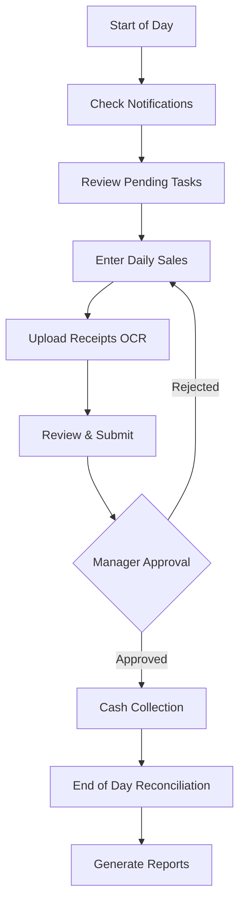

# Daily Operations Guide

## Overview

This guide covers the standard daily operations workflow in LiquorPro, ensuring you complete all necessary tasks efficiently and correctly.

---

## 1. Daily Workflow Overview



---

## 2. Morning Checklist

### 2.1 Opening Tasks

| Task | Role | Priority |
|------|------|----------|
| Check notifications | All | High |
| Review pending approvals | Manager | High |
| Check stock levels | All | Medium |
| Review yesterday's rejected items | Salesman | High |
| Verify cash float | Manager | High |

### 2.2 Starting Your Day

1. **Login to the App**
    - Enter credentials
    - Verify OTP

2. **Check Dashboard**
    - Review notification badges
    - Note any urgent items

3. **Review Pending Items**
    - Any rejected sales to correct?
    - Any pending approvals?

4. **Verify Inventory**
    - Check low stock alerts
    - Note products to reorder

---

## 3. Sales Entry Workflow

### 3.1 Creating Daily Sales Record

#### Step-by-Step Process

```
1. Navigate: Home → + New Daily Sales

2. Verify Details:
   ┌─────────────────────────────┐
   │ Date: January 11, 2025     │
   │ Shop: Main Street Store    │
   │ Salesman: [Auto-filled]    │
   └─────────────────────────────┘

3. Add Products:
   - Tap "Add Product"
   - Search by name or SKU
   - Enter quantity
   - Verify price (auto-filled)
   - Add discount if applicable
   - Confirm

4. Repeat for all products sold

5. Add Daily Expenses:
   - Transport costs
   - Packaging
   - Other shop expenses

6. Review Total:
   - Verify item count
   - Check total amount
   - Confirm discounts applied

7. Save or Submit:
   - Save Draft (continue later)
   - Submit for Approval (final)
```

### 3.2 Bulk Entry Grid

The bulk entry grid allows rapid data entry:

```
┌─────────────────────────────────────────────────────────────────┐
│ Daily Sales Entry - January 11, 2025                            │
├─────────────────────────────────────────────────────────────────┤
│                                                                 │
│  🔍 Quick Search: [____________] [Scan Barcode]                │
│                                                                 │
├─────────────────────────────────────────────────────────────────┤
│ # │ Product           │ SKU      │ Qty │ Rate   │ Disc │ Total │
├───┼───────────────────┼──────────┼─────┼────────┼──────┼───────┤
│ 1 │ Royal Challenge   │ RC-750   │ 10  │ ₹450   │ -    │ ₹4500 │
│ 2 │ Blenders Pride    │ BP-750   │ 5   │ ₹550   │ ₹50  │ ₹2700 │
│ 3 │ McDowell's No.1   │ MD-750   │ 20  │ ₹320   │ -    │ ₹6400 │
│ 4 │ [Add Product...]  │          │     │        │      │       │
├───┴───────────────────┴──────────┴─────┴────────┴──────┴───────┤
│                                                                 │
│  Items: 35          Discount: ₹50        Total: ₹13,600        │
│                                                                 │
├─────────────────────────────────────────────────────────────────┤
│ Daily Expenses:                                                 │
│  + Transport: ₹500                                              │
│  + Packaging: ₹200                                              │
│  [+ Add Expense]                                                │
├─────────────────────────────────────────────────────────────────┤
│                                           Grand Total: ₹14,300  │
├─────────────────────────────────────────────────────────────────┤
│  [Save Draft]    [Preview]    [Submit for Approval]            │
└─────────────────────────────────────────────────────────────────┘
```

### 3.3 Draft Management

**Auto-Save Feature:**
- Drafts are automatically saved every 30 seconds
- Manual save with "Save Draft" button
- Drafts persist across app restarts

**Recovering Drafts:**
```
1. Home → Daily Sales
2. Look for "Draft" status records
3. Tap to continue editing
4. Complete and submit
```

---

## 4. OCR Receipt Processing

### 4.1 Uploading Receipts

LiquorPro uses AI to extract data from receipt images:

```
1. Navigate: Home → Upload Receipts

2. Select Images:
   - Tap "Select Images"
   - Choose multiple receipts
   - Maximum 200 images per batch

3. Upload:
   - Tap "Upload Batch"
   - Wait for processing (1-2 min per image)

4. Review Results:
   ┌─────────────────────────────────────────┐
   │ OCR Results                             │
   ├─────────────────────────────────────────┤
   │ ✓ Image 1: Royal Challenge - 10 x ₹450  │
   │ ✓ Image 2: Blenders Pride - 5 x ₹550    │
   │ ⚠ Image 3: Low confidence - Review      │
   │ ✗ Image 4: Could not extract            │
   └─────────────────────────────────────────┘

5. Correct Errors:
   - Tap items with ⚠ to review
   - Compare with original image
   - Make corrections

6. Confirm & Save:
   - Verify all entries
   - Tap "Add to Daily Sales"
```

### 4.2 OCR Best Practices

!!! tip "Tips for Better OCR Results"
    - Use good lighting when photographing receipts
    - Ensure text is clearly visible
    - Avoid blurry or cropped images
    - Flatten creased receipts
    - Capture entire receipt in frame

---

## 5. Approval Workflow

### 5.1 Salesman View

After submitting daily sales:

```
Data Flow:
┌──────────────────┐       ┌──────────────────────────────────┐
│  Draft Storage   │       │      Daily Sales Records          │
│  (Auto-saved)    │       │                                   │
│                  │       │  ┌─────────┐    ┌──────────┐     │
│  draft_data:     │ Submit│  │ Pending │ →  │ Approved │     │
│  - items         │ ────► │  └────┬────┘    └──────────┘     │
│  - expenses      │       │       │                           │
│                  │       │       ↓                           │
└──────────────────┘       │  ┌──────────┐                    │
                           │  │ Rejected │ → (Copy & Edit)    │
                           │  └──────────┘                    │
                           └──────────────────────────────────┘

Note: Drafts are stored separately and deleted after submission.
The main daily sales record is created when you submit.

Tracking Submission:
1. Dashboard → My Submissions
2. View status: Pending, Approved, or Rejected
3. If rejected, view reason
4. Use "Copy" to create editable version and resubmit
```

### 5.2 Manager Approval

```
1. Home → Pending Approvals (Badge shows count)

2. Select Record to Review:
   ┌─────────────────────────────────────────┐
   │ Daily Sales Review                       │
   ├─────────────────────────────────────────┤
   │ Date: January 11, 2025                  │
   │ Salesman: John Doe                      │
   │ Shop: Main Street Store                 │
   ├─────────────────────────────────────────┤
   │ Summary:                                │
   │   Items: 35                             │
   │   Sales Total: ₹13,600                  │
   │   Expenses: ₹700                        │
   │   Grand Total: ₹14,300                  │
   ├─────────────────────────────────────────┤
   │ [View Details] [Compare with Stock]     │
   ├─────────────────────────────────────────┤
   │ Comments: [____________________________]│
   ├─────────────────────────────────────────┤
   │    [Reject]              [Approve]      │
   └─────────────────────────────────────────┘

3. Review Details:
   - Verify quantities against expected
   - Check for unusual discounts
   - Verify expenses are valid

4. Take Action:
   - Approve: Record is finalized
   - Reject: Specify reason, returns to salesman
```

---

## 6. Cash Collection (15-Minute Rule)

### 6.1 The Collection Deadline

!!! danger "Critical Business Rule"
    After a daily sales record is approved, the assigned collector has a deadline to collect the cash from the salesman. The default is **15 minutes**, but this can be configured per tenant in the system settings (`TenantSettings.MoneyCollectionDeadlineMinutes`). Check with your administrator for your organization's specific deadline.

### 6.2 Collection Process

```
Timeline:
┌─────────┬──────────────┬────────────────┬───────────────┐
│ Approved│  10 min mark │  15 min mark   │   Escalation  │
│    ↓    │      ↓       │       ↓        │       ↓       │
│ Start   │  Warning     │   Deadline     │  Manager Alert│
└─────────┴──────────────┴────────────────┴───────────────┘

Steps:
1. Receive notification: "Daily sales approved - Collect cash"

2. Navigate: Finance → Money Collection

3. Record Collection:
   ┌─────────────────────────────────────────┐
   │ Money Collection                        │
   ├─────────────────────────────────────────┤
   │ Record: Daily Sales - Jan 11            │
   │ Amount Due: ₹14,300                     │
   │ Time Remaining: 12:45                   │
   ├─────────────────────────────────────────┤
   │ Collected Amount: [₹14,300____________] │
   │ Notes: [_______________________________]│
   ├─────────────────────────────────────────┤
   │           [Record Collection]           │
   └─────────────────────────────────────────┘

4. Confirm collection within deadline

5. If missed:
   - Manager receives escalation alert
   - Reason must be provided
   - Incident is logged
```

### 6.3 Handling Deadline Issues

If you cannot collect within 15 minutes:

1. **Notify Manager immediately** (via app or call)
2. **Document the reason** in the system
3. **Complete collection ASAP**
4. **Review incident** in daily briefing

---

## 7. End of Day Procedures

### 7.1 Closing Checklist

| Task | Role | Verification |
|------|------|--------------|
| All sales submitted | Salesman | No draft records |
| All approvals completed | Manager | No pending queue |
| Cash collected | Asst. Manager | All collections recorded |
| Cash deposited | Manager | Bank deposit slip |
| Stock verified | All | Spot check complete |

### 7.2 Cash Reconciliation

```
1. Navigate: Finance → Daily Reconciliation

2. Verify Totals:
   ┌─────────────────────────────────────────┐
   │ Daily Cash Reconciliation               │
   │ Date: January 11, 2025                  │
   ├─────────────────────────────────────────┤
   │ Opening Float:           ₹5,000         │
   │ Total Sales (Cash):      ₹42,000        │
   │ Total Collections:       ₹42,000        │
   │ Expenses Paid:           ₹2,500         │
   │ Bank Deposit:            ₹40,000        │
   │ Closing Float:           ₹4,500         │
   ├─────────────────────────────────────────┤
   │ Expected:    ₹4,500                     │
   │ Actual:      ₹4,500                     │
   │ Variance:    ₹0                         │
   ├─────────────────────────────────────────┤
   │ [Variance Explanation] [Close Day]      │
   └─────────────────────────────────────────┘

3. Explain any variance (if applicable)

4. Close Day:
   - Confirms all transactions
   - Locks records for the day
   - Generates daily report
```

### 7.3 Daily Report Generation

```
1. Navigate: Reports → Daily Summary

2. Select Date: January 11, 2025

3. Generate Report:
   - PDF export available
   - Email to stakeholders
   - Print for records

Report Contents:
- Sales summary by product
- Sales by salesman
- Expense breakdown
- Cash flow summary
- Stock movement
```

---

## 8. Weekly Operations

### 8.1 Weekly Review

| Day | Task |
|-----|------|
| Monday | Review previous week's performance |
| Wednesday | Mid-week stock check |
| Friday | Prepare weekly report |
| Saturday | Stock verification |

### 8.2 Stock Verification

```
1. Navigate: Inventory → Stock Verification

2. Select Products to Verify:
   - System shows expected quantities
   - Enter actual counted quantities

3. Record Discrepancies:
   - Note differences
   - Provide explanation
   - Submit for review

4. Adjustment Approval:
   - Manager reviews discrepancies
   - Approves or investigates
   - Stock adjusted accordingly
```

---

## 9. Monthly Operations

### 9.1 Monthly Tasks

| Task | Timing | Owner |
|------|--------|-------|
| Full stock audit | 1st week | Manager |
| Vendor reconciliation | 1st-5th | Finance |
| Performance review | 10th | Manager |
| License renewal check | 15th | Admin |

### 9.2 Monthly Reports

- Sales trend analysis
- Stock turnover report
- Expense analysis
- Staff performance
- Vendor ledger statements

---

## 10. Troubleshooting Daily Operations

### 10.1 Common Issues

| Issue | Solution |
|-------|----------|
| Can't find product | Check if product is active, verify spelling |
| Price mismatch | Contact manager to update catalog |
| Draft won't submit | Check for required fields, verify total |
| OCR not working | Check image quality, retry upload |
| Approval delayed | Contact manager directly |

### 10.2 Emergency Procedures

**System Down:**
1. Record sales on paper backup forms
2. Photograph all receipts
3. Enter data when system is restored
4. Mark as "delayed entry" with notes

**Discrepancy Found:**
1. Stop and document immediately
2. Notify manager
3. Do not attempt to "fix" records
4. Wait for guidance

---

## Next Steps

- [Sales Management](sales-management.md) - Advanced sales features
- [Inventory Management](inventory-management.md) - Stock control
- [Finance Management](finance-management.md) - Financial operations
- [Reports & Analytics](reports.md) - Reporting capabilities
