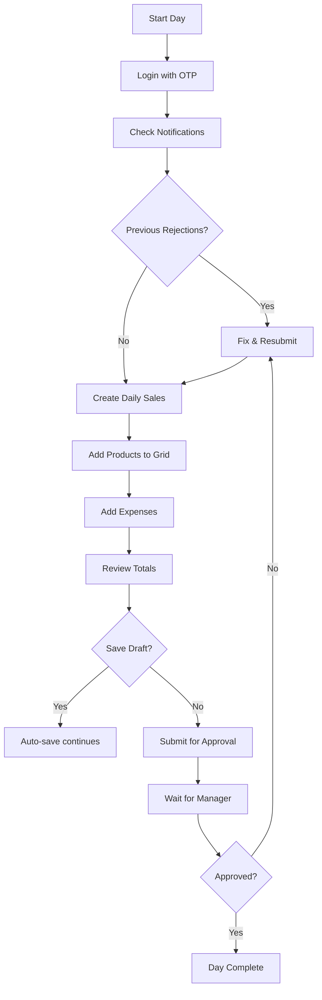
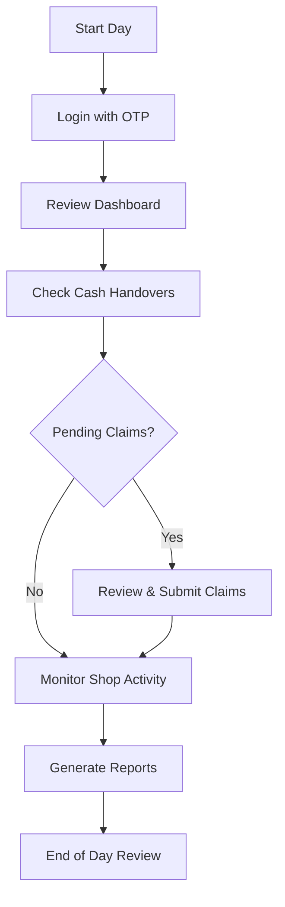
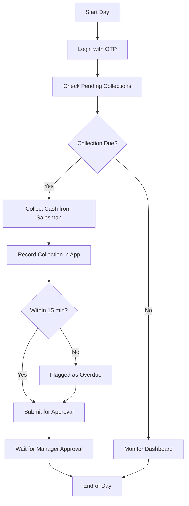
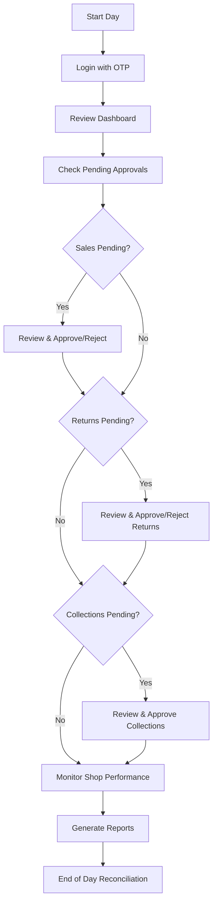
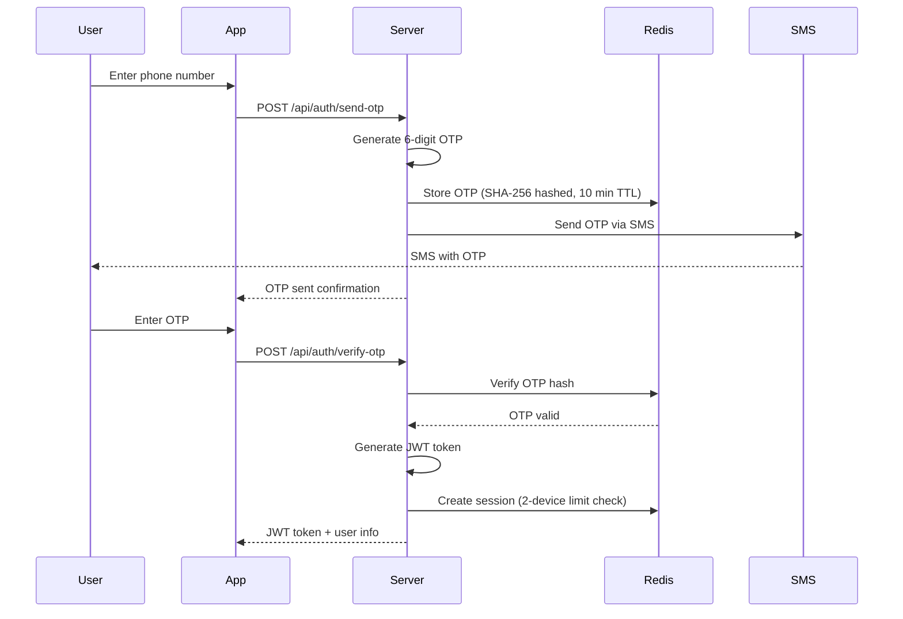

# Role-wise User Journeys

## Document Information

| Field | Value |
|-------|-------|
| **Document ID** | UG-ROLES-001 |
| **Version** | 2.0.0 |
| **Last Updated** | January 2025 |
| **Based On** | Actual Codebase Implementation |

---

## 1. Role Hierarchy

LiquorPro implements a strict role hierarchy where users can only interact with users at their level or below.

```
                    ┌─────────────────┐
                    │     Owner       │ Level 6 (Highest)
                    │  Full Control   │
                    └────────┬────────┘
                             │
                    ┌────────▼────────┐
                    │     Admin       │ Level 5
                    │ Tenant Admin    │
                    └────────┬────────┘
                             │
                    ┌────────▼────────┐
                    │    Manager      │ Level 4
                    │  Shop Manager   │
                    └────────┬────────┘
                             │
              ┌──────────────┼──────────────┐
              │              │              │
     ┌────────▼────────┐     │     ┌────────▼────────┐
     │ Asst. Manager   │     │     │   Executive     │
     │   Level 3       │     │     │    Level 2      │
     └─────────────────┘     │     └─────────────────┘
                             │
                    ┌────────▼────────┐
                    │    Salesman     │ Level 1 (Lowest)
                    │   Shop Staff    │
                    └─────────────────┘
```

### Role Capabilities Matrix

| Capability | Salesman | Executive | Asst. Mgr | Manager | Admin | Owner |
|------------|:--------:|:---------:|:---------:|:-------:|:-----:|:-----:|
| Enter daily sales | ✓ | ✓ | ✓ | ✓ | ✓ | ✓ |
| View own records | ✓ | ✓ | ✓ | ✓ | ✓ | ✓ |
| View all shop records | ✗ | ✓ | ✓ | ✓ | ✓ | ✓ |
| Collect money | ✗ | ✗ | ✓ | ✓ | ✓ | ✓ |
| Approve daily sales | ✗ | ✗ | ✗ | ✓ | ✓ | ✓ |
| Approve returns | ✗ | ✗ | ✗ | ✓ | ✓ | ✓ |
| Manage inventory | ✗ | ✗ | ✗ | ✓ | ✓ | ✓ |
| Manage users | ✗ | ✗ | ✗ | ✓ | ✓ | ✓ |
| Revert approved records | ✗ | ✗ | ✗ | ✗ | ✓ | ✓ |
| Configure tenant | ✗ | ✗ | ✗ | ✗ | ✓ | ✓ |
| Delete users | ✗ | ✗ | ✗ | ✗ | ✓ | ✓ |

---

## 2. Salesman Journey

### 2.1 Profile
- **Level**: 1 (Entry level)
- **Primary Function**: Daily sales data entry
- **Reports To**: Manager

### 2.2 Daily Workflow



### 2.3 Available Actions

| Action | Endpoint | Description |
|--------|----------|-------------|
| Create Daily Sales | `POST /api/daily-records` | Enter all products sold |
| Update Draft | `PUT /api/daily-records/:id` | Modify before submission |
| View My Records | `GET /api/daily-records` | See own submissions |
| Process Return | `POST /api/returns` | Create return request |
| Upload OCR Images | `POST /api/ocr/batch/sessions` | Batch receipt processing |

### 2.4 Salesman Screen Flow

```
┌─────────────────────────────────────────────────────────────────┐
│                     SALESMAN HOME                                │
├─────────────────────────────────────────────────────────────────┤
│                                                                 │
│  ┌─────────────────────────────────────────────────────────┐   │
│  │ Today's Status                                          │   │
│  │ ┌─────────┐  ┌─────────┐  ┌─────────┐  ┌─────────┐     │   │
│  │ │ Draft   │  │ Pending │  │Approved │  │Rejected │     │   │
│  │ │   1     │  │    0    │  │    0    │  │    0    │     │   │
│  │ └─────────┘  └─────────┘  └─────────┘  └─────────┘     │   │
│  └─────────────────────────────────────────────────────────┘   │
│                                                                 │
│  Quick Actions:                                                 │
│  ┌─────────────────┐  ┌─────────────────┐                      │
│  │ + Daily Sales   │  │ 📷 Upload OCR   │                      │
│  │   Entry         │  │   Receipts      │                      │
│  └─────────────────┘  └─────────────────┘                      │
│                                                                 │
│  Recent Submissions:                                            │
│  ┌─────────────────────────────────────────────────────────┐   │
│  │ Jan 10, 2025 │ ₹45,000 │ Approved ✓               │   │
│  │ Jan 09, 2025 │ ₹38,500 │ Approved ✓               │   │
│  │ Jan 08, 2025 │ ₹42,200 │ Approved ✓               │   │
│  └─────────────────────────────────────────────────────────┘   │
│                                                                 │
└─────────────────────────────────────────────────────────────────┘
```

### 2.5 Daily Sales Entry Screen

```
┌─────────────────────────────────────────────────────────────────┐
│ Daily Sales Entry - January 11, 2025                            │
├─────────────────────────────────────────────────────────────────┤
│ Shop: Main Street Store          Salesman: John Doe            │
├─────────────────────────────────────────────────────────────────┤
│                                                                 │
│ 🔍 Search Product: [_______________________] [Scan]            │
│                                                                 │
│ ┌───┬────────────────┬─────┬────────┬────────┬─────────────┐   │
│ │ # │ Product        │ Qty │ Rate   │ Amount │ Payment     │   │
│ ├───┼────────────────┼─────┼────────┼────────┼─────────────┤   │
│ │ 1 │ Royal Stag 750 │ 10  │ ₹450   │ ₹4,500 │ Cash        │   │
│ │ 2 │ Blenders 750   │ 5   │ ₹550   │ ₹2,750 │ UPI         │   │
│ │ 3 │ McDowell's 375 │ 20  │ ₹180   │ ₹3,600 │ Cash        │   │
│ │ 4 │ [Add Product]  │     │        │        │             │   │
│ └───┴────────────────┴─────┴────────┴────────┴─────────────┘   │
│                                                                 │
│ Summary:                                                        │
│ ┌─────────────────────────────────────────────────────────┐    │
│ │ Cash: ₹8,100  │ UPI: ₹2,750  │ Card: ₹0  │ Credit: ₹0  │    │
│ ├─────────────────────────────────────────────────────────┤    │
│ │ Total Items: 35           │  Grand Total: ₹10,850       │    │
│ └─────────────────────────────────────────────────────────┘    │
│                                                                 │
│ Expenses:                                                       │
│ ┌─────────────────────────────────────────────────────────┐    │
│ │ + Godam Charges: ₹200                                   │    │
│ │ + Transport: ₹150                                       │    │
│ │ [+ Add Expense]                                         │    │
│ └─────────────────────────────────────────────────────────┘    │
│                                                                 │
│ Auto-saved: 2 minutes ago                                       │
│                                                                 │
│ ┌─────────────┐  ┌─────────────┐  ┌───────────────────────┐    │
│ │ Save Draft  │  │   Preview   │  │ Submit for Approval   │    │
│ └─────────────┘  └─────────────┘  └───────────────────────┘    │
└─────────────────────────────────────────────────────────────────┘
```

---

## 3. Executive Journey

### 3.1 Profile
- **Level**: 2
- **Primary Function**: Financial oversight, expense claims
- **Reports To**: Manager

### 3.2 Daily Workflow



### 3.3 Available Actions

| Action | Endpoint | Description |
|--------|----------|-------------|
| View Shop Records | `GET /api/daily-records` | See all shop submissions |
| Submit Expense Claim | `POST /api/executive-finance` | Claim reimbursements |
| Cash Handover | `POST /api/executive-finance` | Record cash transfers |
| View Reports | `GET /api/reports/*` | Access financial reports |

---

## 4. Assistant Manager Journey

### 4.1 Profile
- **Level**: 3
- **Primary Function**: Cash collection within deadline
- **Reports To**: Manager
- **Critical Rule**: Must collect money within the configured deadline (default: 15 minutes, configurable via `TenantSettings.MoneyCollectionDeadlineMinutes`)

### 4.2 Daily Workflow



### 4.3 The Collection Deadline Rule (Critical)

```
┌─────────────────────────────────────────────────────────────────┐
│                   COLLECTION DEADLINE FLOW                       │
│                 (Default: 15 minutes, configurable)              │
├─────────────────────────────────────────────────────────────────┤
│                                                                 │
│  Manager Approves Daily Sales                                   │
│         │                                                       │
│         ▼                                                       │
│  ┌──────────────────────────────────────────────────────────┐  │
│  │ MoneyCollection record created: status = "pending"       │  │
│  │ TIMER STARTS based on tenant settings                    │  │
│  └──────────────────────────────────────────────────────────┘  │
│         │                                                       │
│         ├── 0:00  ─► Notification: "Collect ₹45,000 from John" │
│         │                                                       │
│         ├── 5:00  ─► Reminder notification                     │
│         │                                                       │
│         ├── 10:00 ─► WARNING: "5 minutes remaining!"           │
│         │                                                       │
│         ├── 14:00 ─► URGENT: "1 minute left!"                  │
│         │                                                       │
│         ▼                                                       │
│  ┌──────────────────────────────────────────────────────────┐  │
│  │ AT DEADLINE:                                              │  │
│  │                                                           │  │
│  │ If collected: Status = "collected" → Manager approves     │  │
│  │ If NOT collected: Status = "overdue" (escalation alert)   │  │
│  │                                                           │  │
│  │ Final states:                                             │  │
│  │ - "approved" (manager approves collected amount)          │  │
│  │ - "rejected" (manager rejects collection)                 │  │
│  └──────────────────────────────────────────────────────────┘  │
│         │                                                       │
│         ▼                                                       │
│  Manager receives escalation notification for overdue items     │
│                                                                 │
└─────────────────────────────────────────────────────────────────┘
```

### 4.4 Assistant Manager Screen

```
┌─────────────────────────────────────────────────────────────────┐
│                 ASSISTANT MANAGER DASHBOARD                      │
├─────────────────────────────────────────────────────────────────┤
│                                                                 │
│  🔴 URGENT COLLECTIONS (2)                                      │
│  ┌─────────────────────────────────────────────────────────┐   │
│  │ ⏰ John Doe - ₹45,000                                    │   │
│  │    Deadline: 12:45 (3 min remaining)                     │   │
│  │    [Collect Now]                                         │   │
│  ├─────────────────────────────────────────────────────────┤   │
│  │ ⏰ Jane Smith - ₹32,500                                  │   │
│  │    Deadline: 12:52 (10 min remaining)                    │   │
│  │    [Collect Now]                                         │   │
│  └─────────────────────────────────────────────────────────┘   │
│                                                                 │
│  📋 Pending Approval (3)                                        │
│  ┌─────────────────────────────────────────────────────────┐   │
│  │ Collection from Ram - ₹28,000 - Submitted 10 min ago    │   │
│  │ Collection from Shyam - ₹19,500 - Submitted 25 min ago  │   │
│  │ Collection from Mohan - ₹41,200 - Submitted 1 hr ago    │   │
│  └─────────────────────────────────────────────────────────┘   │
│                                                                 │
│  ⚠️ Overdue (1)                                                 │
│  ┌─────────────────────────────────────────────────────────┐   │
│  │ ❌ Vijay - ₹15,000 - Overdue by 20 min                  │   │
│  │    Reason required: [_________________________]          │   │
│  │    [Submit Overdue Collection]                           │   │
│  └─────────────────────────────────────────────────────────┘   │
│                                                                 │
│  Today's Stats:                                                 │
│  ┌─────────┬─────────┬─────────┬─────────┐                     │
│  │Collected│ Approved│ Pending │ Overdue │                     │
│  │₹1,25,000│₹98,500  │₹88,700  │₹15,000  │                     │
│  └─────────┴─────────┴─────────┴─────────┘                     │
│                                                                 │
└─────────────────────────────────────────────────────────────────┘
```

### 4.5 Available Actions

| Action | Endpoint | Description |
|--------|----------|-------------|
| View Pending Collections | `GET /api/assistant-manager/money-collections` | See what needs collecting |
| Record Collection | `POST /api/assistant-manager/money-collections` | Record cash collected |
| View Collection Status | `GET /api/assistant-manager/money-collections/:id` | Track specific collection |

---

## 5. Manager Journey

### 5.1 Profile
- **Level**: 4
- **Primary Function**: Shop management, approvals, oversight
- **Reports To**: Admin/Owner

### 5.2 Daily Workflow



### 5.3 Manager Dashboard

```
┌─────────────────────────────────────────────────────────────────┐
│                    MANAGER DASHBOARD                             │
├─────────────────────────────────────────────────────────────────┤
│                                                                 │
│  🏪 Main Street Store              📅 January 11, 2025         │
│                                                                 │
│  ┌─────────────────────────────────────────────────────────┐   │
│  │ TODAY'S SUMMARY                                          │   │
│  │ ┌──────────┐ ┌──────────┐ ┌──────────┐ ┌──────────┐     │   │
│  │ │ Sales    │ │Collections│ │ Expenses │ │ Returns  │     │   │
│  │ │₹2,45,000 │ │ ₹1,85,000│ │ ₹12,500  │ │ ₹5,200   │     │   │
│  │ └──────────┘ └──────────┘ └──────────┘ └──────────┘     │   │
│  └─────────────────────────────────────────────────────────┘   │
│                                                                 │
│  ⚡ PENDING ACTIONS                                              │
│  ┌─────────────────────────────────────────────────────────┐   │
│  │ 📋 Daily Sales (3)        [Review All]                   │   │
│  │    • John Doe - ₹45,000 - Pending 2 hrs                  │   │
│  │    • Jane Smith - ₹32,500 - Pending 1 hr                 │   │
│  │    • Ram Kumar - ₹28,000 - Pending 30 min                │   │
│  ├─────────────────────────────────────────────────────────┤   │
│  │ 💰 Money Collections (2)   [Review All]                  │   │
│  │    • From Vijay - ₹41,200 - Pending 45 min               │   │
│  │    • From Mohan - ₹19,500 - Pending 20 min               │   │
│  ├─────────────────────────────────────────────────────────┤   │
│  │ ↩️ Returns (1)             [Review All]                   │   │
│  │    • Royal Stag 750ml x 2 - ₹900 - Defective             │   │
│  └─────────────────────────────────────────────────────────┘   │
│                                                                 │
│  📊 QUICK ACTIONS                                                │
│  ┌─────────────┐ ┌─────────────┐ ┌─────────────┐               │
│  │ View Staff  │ │ Stock Check │ │  Reports    │               │
│  └─────────────┘ └─────────────┘ └─────────────┘               │
│                                                                 │
└─────────────────────────────────────────────────────────────────┘
```

### 5.4 Approval Screen

```
┌─────────────────────────────────────────────────────────────────┐
│              DAILY SALES APPROVAL                                │
├─────────────────────────────────────────────────────────────────┤
│ Salesman: John Doe                  Date: January 11, 2025     │
│ Submitted: 2 hours ago              Shop: Main Street Store    │
├─────────────────────────────────────────────────────────────────┤
│                                                                 │
│ Summary:                                                        │
│ ┌─────────────────────────────────────────────────────────┐    │
│ │ Total Items: 35    │ Total Amount: ₹45,000              │    │
│ │ Cash: ₹32,000      │ UPI: ₹10,000   │ Card: ₹3,000     │    │
│ │ Expenses: ₹750                                          │    │
│ └─────────────────────────────────────────────────────────┘    │
│                                                                 │
│ Comparison:                                                     │
│ ┌─────────────────────────────────────────────────────────┐    │
│ │ Yesterday: ₹42,500 (▲ +5.9%)                            │    │
│ │ Last Week: ₹38,200 (▲ +17.8%)                           │    │
│ │ 30-Day Avg: ₹41,000 (▲ +9.8%)                           │    │
│ └─────────────────────────────────────────────────────────┘    │
│                                                                 │
│ AI Validation: ✅ Passed                                        │
│ - No anomalies detected                                         │
│ - Stock levels verified                                         │
│                                                                 │
│ Items Preview (Top 5):                                          │
│ ┌─────────────────────────────────────────────────────────┐    │
│ │ Royal Stag 750ml      │ 15 │ ₹450  │ ₹6,750           │    │
│ │ Blenders Pride 750ml  │ 10 │ ₹550  │ ₹5,500           │    │
│ │ McDowell's 375ml      │ 25 │ ₹180  │ ₹4,500           │    │
│ │ Signature 750ml       │ 8  │ ₹620  │ ₹4,960           │    │
│ │ Imperial Blue 750ml   │ 12 │ ₹420  │ ₹5,040           │    │
│ │ [View All 35 Items]                                    │    │
│ └─────────────────────────────────────────────────────────┘    │
│                                                                 │
│ Comments: [_____________________________________________]       │
│                                                                 │
│ ┌──────────────────┐              ┌──────────────────────┐     │
│ │    ❌ Reject      │              │     ✅ Approve        │     │
│ └──────────────────┘              └──────────────────────┘     │
│                                                                 │
└─────────────────────────────────────────────────────────────────┘
```

### 5.5 Available Actions

| Action | Endpoint | Description |
|--------|----------|-------------|
| View All Daily Sales | `GET /api/daily-records` | See all shop submissions |
| Approve Sales | `POST /api/daily-records/:id/approve` | Approve submission |
| Reject Sales | `POST /api/daily-records/:id/reject` | Reject with reason |
| Trigger AI Validation | `POST /api/daily-records/:id/validation/trigger` | Run AI check |
| Approve Collections | `POST /api/assistant-manager/money-collections/:id/approve` | Approve cash |
| Approve Returns | `POST /api/returns/:id/approve` | Approve return |
| Manage Users | `GET/POST /api/admin/users` | Create/edit staff |
| View Reports | `GET /api/reports/*` | All financial reports |

---

## 6. Admin Journey

### 6.1 Profile
- **Level**: 5
- **Primary Function**: Tenant administration, user management
- **Reports To**: Owner

### 6.2 Admin Capabilities

| Area | Capabilities |
|------|--------------|
| **Users** | Create, edit, delete all users in tenant |
| **Shops** | Configure shop settings |
| **Products** | Manage product catalog |
| **Vendors** | Full vendor management |
| **Reports** | All reports and exports |
| **Reversals** | Revert approved records (with OTP) |
| **Settings** | Configure tenant settings (15-min deadline, etc.) |

### 6.3 Revert Approved Records (Admin Only)

```
┌─────────────────────────────────────────────────────────────────┐
│              REVERT APPROVED RECORD                              │
├─────────────────────────────────────────────────────────────────┤
│                                                                 │
│  ⚠️ WARNING: This action cannot be undone                       │
│                                                                 │
│  Record: Daily Sales - January 10, 2025                         │
│  Amount: ₹45,000                                                │
│  Approved By: Jane Manager                                      │
│  Approved At: Jan 10, 2025 7:30 PM                              │
│                                                                 │
│  Reason for Revert: [________________________________]          │
│                     (Required)                                  │
│                                                                 │
│  Step 1: Request OTP                                            │
│  ┌─────────────────────────────────────────────────────────┐   │
│  │ [Request OTP to +91-98765****]                          │   │
│  └─────────────────────────────────────────────────────────┘   │
│                                                                 │
│  Step 2: Enter OTP                                              │
│  ┌─────────────────────────────────────────────────────────┐   │
│  │ OTP: [______]    (Valid for 10 minutes)                 │   │
│  └─────────────────────────────────────────────────────────┘   │
│                                                                 │
│  ┌──────────────────┐              ┌──────────────────────┐    │
│  │     Cancel       │              │   Confirm Revert     │    │
│  └──────────────────┘              └──────────────────────┘    │
│                                                                 │
└─────────────────────────────────────────────────────────────────┘
```

---

## 7. Owner Journey

### 7.1 Profile
- **Level**: 6 (Highest)
- **Primary Function**: Full business control
- **Capabilities**: Everything Admin can do + critical business operations

### 7.2 Owner-Only Features

- View all tenant data across all shops
- Configure business rules (deadline timings)
- Access audit logs
- Delete any records
- Manage admin users

---

## 8. Authentication Flow (All Roles)

### 8.1 OTP-Based Login



### 8.2 OTP Specifications

| Parameter | Value |
|-----------|-------|
| Length | 6 digits |
| Validity | 10 minutes |
| Max Attempts | 3 per OTP |
| Rate Limit | 5 OTP requests/hour/phone |
| Storage | SHA-256 hashed in Redis |
| Master OTP (Testing) | 011001 |

### 8.3 2-Device Session Limit

```
User attempts login on Device 3:

┌─────────────────────────────────────────────────────────────────┐
│                   DEVICE LIMIT REACHED                           │
├─────────────────────────────────────────────────────────────────┤
│                                                                 │
│  You are currently logged in on 2 devices:                      │
│                                                                 │
│  ┌─────────────────────────────────────────────────────────┐   │
│  │ 📱 iPhone 15 Pro                                        │   │
│  │    Last active: 5 minutes ago                           │   │
│  │    Location: Mumbai                                     │   │
│  └─────────────────────────────────────────────────────────┘   │
│  ┌─────────────────────────────────────────────────────────┐   │
│  │ 💻 Chrome on Windows                                    │   │
│  │    Last active: 2 hours ago                             │   │
│  │    Location: Pune                                       │   │
│  └─────────────────────────────────────────────────────────┘   │
│                                                                 │
│  To continue on this device, choose an option:                  │
│                                                                 │
│  ┌─────────────────────────────────────────────────────────┐   │
│  │ [Logout iPhone 15 Pro and continue here]                │   │
│  └─────────────────────────────────────────────────────────┘   │
│  ┌─────────────────────────────────────────────────────────┐   │
│  │ [Logout Chrome on Windows and continue here]            │   │
│  └─────────────────────────────────────────────────────────┘   │
│  ┌─────────────────────────────────────────────────────────┐   │
│  │ [Cancel - Stay logged out on this device]               │   │
│  └─────────────────────────────────────────────────────────┘   │
│                                                                 │
└─────────────────────────────────────────────────────────────────┘
```

---

## 9. Best Practices by Role

### Salesman Best Practices

1. **Save drafts frequently** - Auto-save runs, but manual save before leaving
2. **Submit before end of day** - Don't leave records pending overnight
3. **Double-check quantities** - Rejections delay the process
4. **Use OCR for bulk receipts** - Faster than manual entry
5. **Note discounts** - Always add reason for any discount

### Assistant Manager Best Practices

1. **Monitor collection alerts** - Don't miss 15-minute deadlines
2. **Collect immediately after approval** - Start timer when notification comes
3. **Document overdue reasons** - If deadline missed, explain why
4. **Verify cash counts** - Match physical cash to system amount
5. **Submit collections promptly** - Don't batch submissions

### Manager Best Practices

1. **Review pending items regularly** - Check every 2-3 hours
2. **Use AI validation** - Trigger validation before approving large amounts
3. **Provide feedback on rejections** - Clear reasons help salesmen fix issues
4. **Monitor collection compliance** - Track 15-minute deadline adherence
5. **End-of-day reconciliation** - Ensure all collections are approved

---

## Revision History

| Version | Date | Author | Changes |
|---------|------|--------|---------|
| 2.0.0 | Jan 2025 | Engineering Team | Complete rewrite based on actual codebase |
