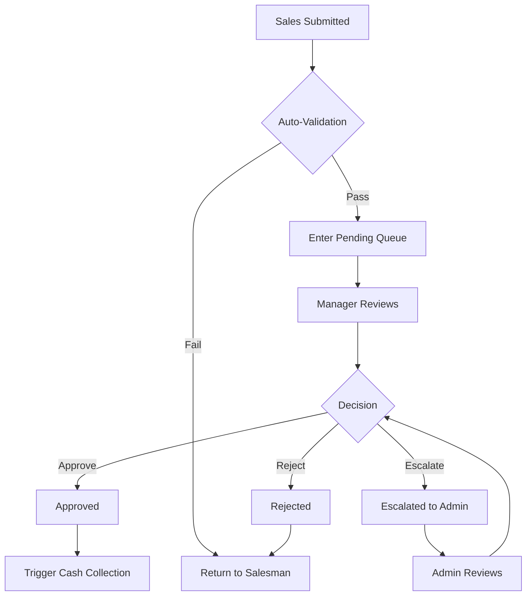
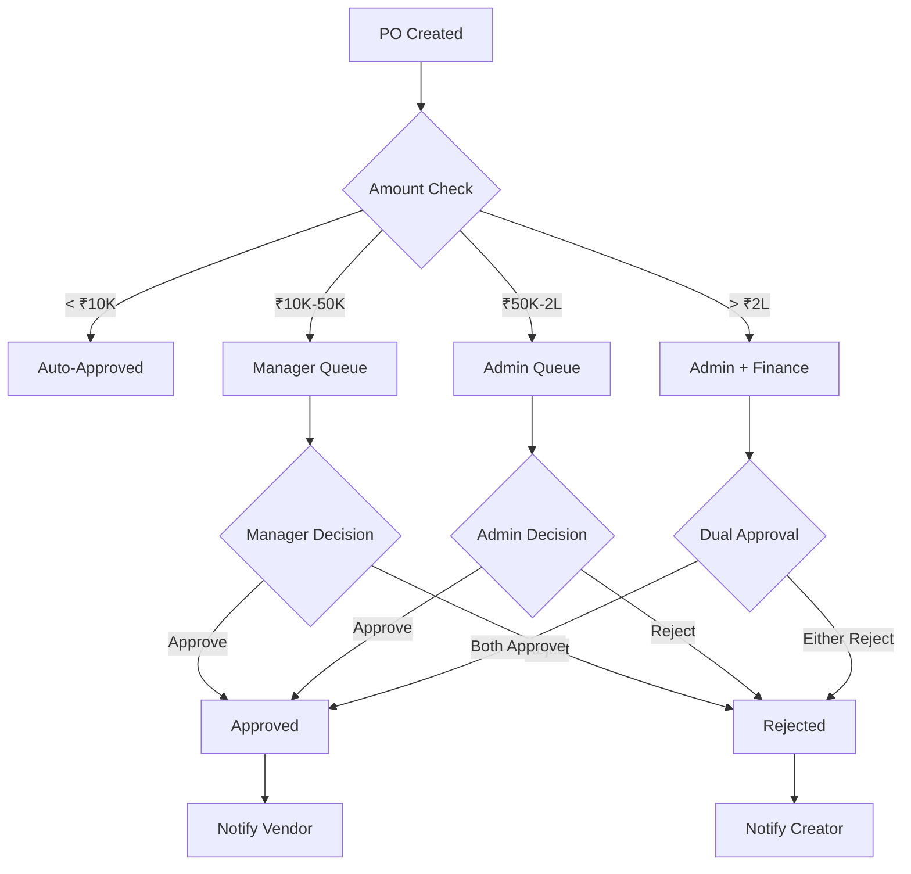
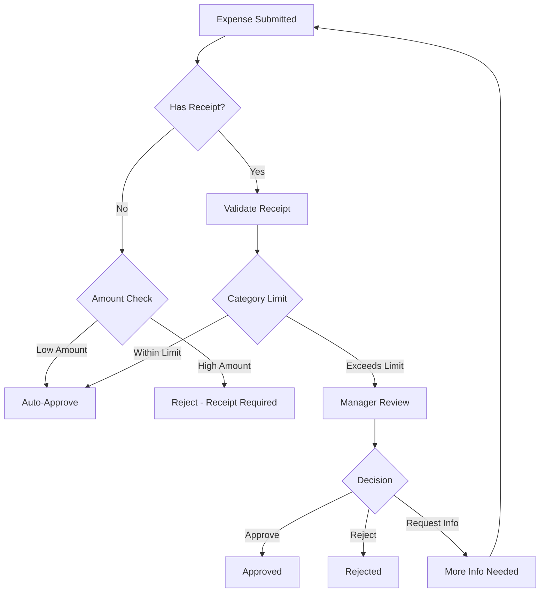
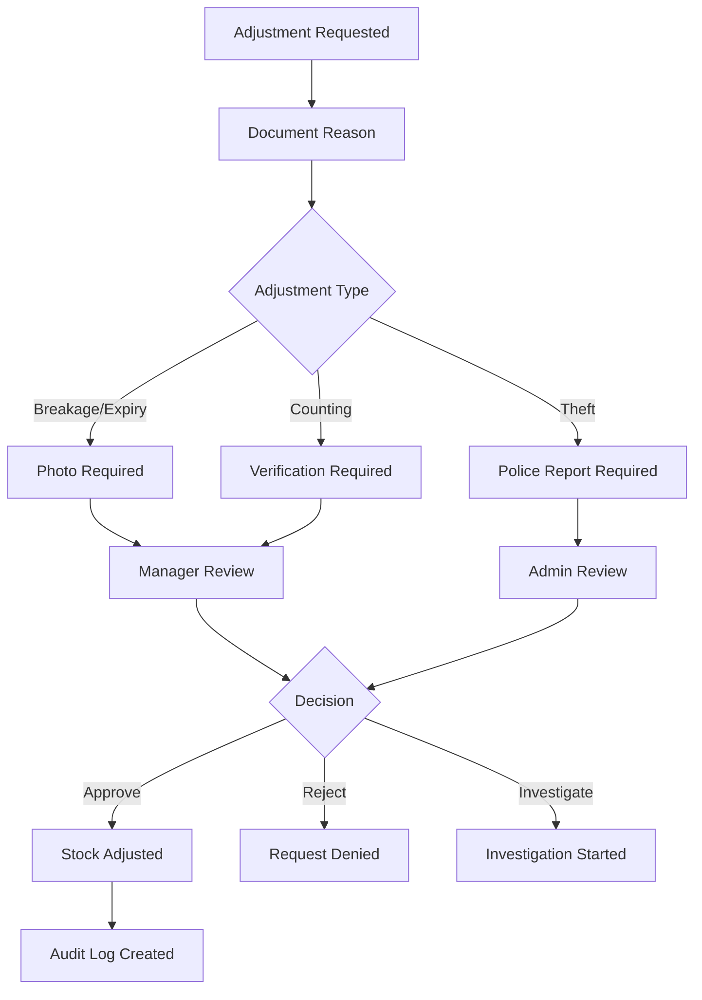
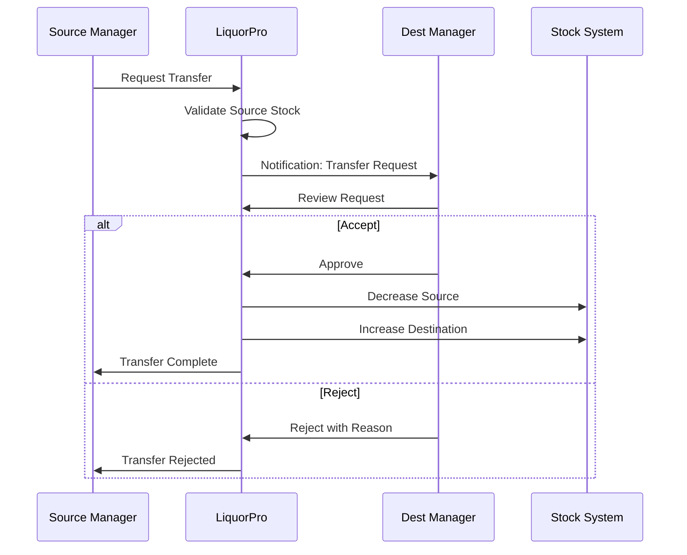
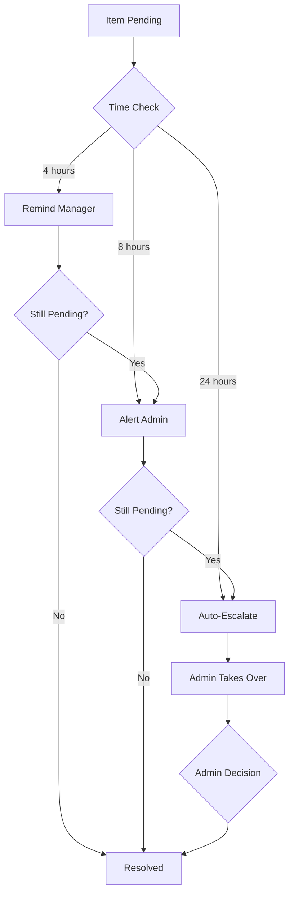

# Approval Workflow

## Overview

LiquorPro implements a comprehensive approval workflow system to ensure data accuracy, maintain accountability, and enforce business rules. This document details the approval processes for various operations.

---

## 1. Approval Types

| Type | Description | Approver Level |
|------|-------------|----------------|
| Daily Sales | Approve daily sales records | Manager |
| Purchase Orders | Approve stock purchases | Manager/Admin |
| Expenses | Approve expense claims | Manager |
| Stock Adjustments | Approve inventory changes | Manager |
| Transfers | Approve inter-shop transfers | Manager |
| Returns | Approve sales returns | Manager |

---

## 2. Daily Sales Approval

### 2.1 Workflow Diagram



### 2.2 Approval Interface

```
┌─────────────────────────────────────────────────────────────────┐
│                    Daily Sales Approval                         │
├─────────────────────────────────────────────────────────────────┤
│ Record ID: DSR-2025-0111-001                                    │
│ Date: January 11, 2025                                          │
│ Shop: Main Street Store                                         │
│ Salesman: John Doe                                              │
│ Submitted: 6:45 PM                                              │
├─────────────────────────────────────────────────────────────────┤
│                                                                 │
│ ┌─────────────────────────────────────────────────────────────┐ │
│ │ Summary                                                     │ │
│ ├─────────────────────────────────────────────────────────────┤ │
│ │ Total Items: 35                                             │ │
│ │ Sales Amount: ₹13,600                                       │ │
│ │ Discounts: ₹50                                              │ │
│ │ Expenses: ₹700                                              │ │
│ │ Grand Total: ₹14,300                                        │ │
│ └─────────────────────────────────────────────────────────────┘ │
│                                                                 │
│ ┌─────────────────────────────────────────────────────────────┐ │
│ │ Items Preview (showing 5 of 35)            [View All]       │ │
│ ├─────────────────────────────────────────────────────────────┤ │
│ │ Royal Challenge (750ml)      10 x ₹450 = ₹4,500            │ │
│ │ Blenders Pride (750ml)        5 x ₹540 = ₹2,700 (₹50 off)  │ │
│ │ McDowell's No.1 (750ml)      20 x ₹320 = ₹6,400            │ │
│ │ ...                                                         │ │
│ └─────────────────────────────────────────────────────────────┘ │
│                                                                 │
│ ┌─────────────────────────────────────────────────────────────┐ │
│ │ Comparison with Previous Days                               │ │
│ ├─────────────────────────────────────────────────────────────┤ │
│ │ Today:      ₹14,300 (35 items)                             │ │
│ │ Yesterday:  ₹12,500 (30 items)   ▲ +14.4%                  │ │
│ │ Last Week:  ₹11,800 (28 items)   ▲ +21.2%                  │ │
│ │ Avg (30d):  ₹13,200 (32 items)   ▲ +8.3%                   │ │
│ └─────────────────────────────────────────────────────────────┘ │
│                                                                 │
│ ┌─────────────────────────────────────────────────────────────┐ │
│ │ ⚠ Alerts                                                    │ │
│ ├─────────────────────────────────────────────────────────────┤ │
│ │ • Discount on Blenders Pride (₹50) - Within normal range   │ │
│ │ • Higher than average sales - Weekend effect likely        │ │
│ └─────────────────────────────────────────────────────────────┘ │
│                                                                 │
│ Comments:                                                       │
│ ┌─────────────────────────────────────────────────────────────┐ │
│ │ Good weekend sales. Approved.                               │ │
│ └─────────────────────────────────────────────────────────────┘ │
│                                                                 │
│     [← Previous]  [View Stock Impact]  [Compare Receipts]       │
│                                                                 │
│ ┌─────────────┐    ┌─────────────┐    ┌─────────────────────┐  │
│ │   Reject    │    │  Escalate   │    │     ✓ Approve       │  │
│ └─────────────┘    └─────────────┘    └─────────────────────┘  │
└─────────────────────────────────────────────────────────────────┘
```

### 2.3 Approval Criteria

**Auto-Approve Conditions** (configurable):
- Within normal sales range (±20% of average)
- No unusual discounts
- No flagged products
- Verified salesman

**Manual Review Triggers**:
- Sales outside normal range
- High discount amounts
- New products added
- First submission from salesman

### 2.4 Post-Approval Actions

1. **Status Update**: Record marked as "Approved"
2. **Cash Collection**: Money collection record created
3. **Timer Start**: 15-minute deadline initiated
4. **Stock Update**: Inventory levels decremented
5. **Notification**: Salesman and Asst. Manager notified
6. **Audit Log**: Action recorded with timestamp

---

## 3. Purchase Order Approval

### 3.1 Approval Levels

| Order Value | Approver |
|-------------|----------|
| < ₹10,000 | Auto-approve |
| ₹10,000 - ₹50,000 | Manager |
| ₹50,000 - ₹2,00,000 | Admin |
| > ₹2,00,000 | Admin + Finance |

### 3.2 Workflow



### 3.3 Approval Considerations

- **Vendor History**: Payment history, quality issues
- **Budget Availability**: Monthly purchase budget
- **Stock Levels**: Current vs. reorder levels
- **Price Comparison**: Historical pricing
- **Delivery Timeline**: Expected vs. needed

---

## 4. Expense Approval

### 4.1 Expense Categories

| Category | Auto-Approve Limit | Requires Receipt |
|----------|-------------------|------------------|
| Transport | ₹500 | No (< ₹200) |
| Packaging | ₹300 | Yes |
| Utilities | ₹2,000 | Yes |
| Maintenance | ₹1,000 | Yes |
| Miscellaneous | ₹0 | Always |

### 4.2 Workflow



---

## 5. Stock Adjustment Approval

### 5.1 Adjustment Types

| Type | Approval Required | Approver |
|------|-------------------|----------|
| Breakage | Yes | Manager |
| Expiry | Yes | Manager |
| Theft | Yes | Admin |
| Counting Error | Yes | Manager |
| System Correction | Yes | Admin |

### 5.2 Workflow



---

## 6. Inter-Shop Transfer Approval

### 6.1 Transfer Workflow



### 6.2 Transfer Approval Criteria

- **Source Stock**: Sufficient quantity available
- **Destination Need**: Valid business reason
- **Transit Risk**: Value and distance considered
- **Approval Authority**: Both managers must agree

---

## 7. Delegation & Escalation

### 7.1 Delegation Rules

```
Manager can delegate to:
├── Assistant Manager (limited scope)
│   └── Daily sales up to ₹50,000
│   └── Expenses up to ₹2,000
│
└── Another Manager (full scope)
    └── All approvals during absence
```

### 7.2 Escalation Triggers

| Condition | Escalation To | Timeframe |
|-----------|---------------|-----------|
| Pending > 4 hours | Manager reminder | Automatic |
| Pending > 8 hours | Admin notification | Automatic |
| Pending > 24 hours | Auto-escalate to Admin | Automatic |
| High value | Admin | Immediate |
| Anomaly detected | Admin | Immediate |

### 7.3 Escalation Flow



---

## 8. Audit Trail

### 8.1 Tracked Information

| Field | Description |
|-------|-------------|
| Action | approve, reject, escalate, delegate |
| Actor | User who performed action |
| Timestamp | When action occurred |
| IP Address | Location of action |
| Device | Device used |
| Previous State | State before action |
| New State | State after action |
| Comments | Any notes added |

### 8.2 Audit Log Entry Example

```json
{
  "id": "audit-uuid",
  "action": "approve",
  "resource_type": "daily_sales_record",
  "resource_id": "dsr-uuid",
  "actor": {
    "user_id": "manager-uuid",
    "name": "Jane Manager",
    "role": "manager"
  },
  "timestamp": "2025-01-11T19:00:00Z",
  "ip_address": "192.168.1.100",
  "device": "iPhone 15 Pro",
  "previous_state": "pending",
  "new_state": "approved",
  "comments": "Good weekend sales. Approved.",
  "metadata": {
    "amount": 14300.00,
    "items_count": 35
  }
}
```

---

## 9. Approval Metrics

### 9.1 KPIs Tracked

| Metric | Target | Calculation |
|--------|--------|-------------|
| Approval Time | < 2 hours | Avg time from submission to decision |
| Rejection Rate | < 5% | Rejections / Total submissions |
| Escalation Rate | < 2% | Escalations / Total submissions |
| Auto-Approval Rate | > 60% | Auto-approved / Total |

### 9.2 Dashboard

```
┌─────────────────────────────────────────────────────────────────┐
│                   Approval Metrics - January 2025               │
├─────────────────────────────────────────────────────────────────┤
│                                                                 │
│  Pending Approvals: 5        Average Approval Time: 1.5 hrs    │
│                                                                 │
│  ┌─────────────────────────────────────────────────────────┐   │
│  │ This Week                                               │   │
│  ├─────────────────────────────────────────────────────────┤   │
│  │ Submitted: 35    Approved: 32    Rejected: 2            │   │
│  │ Escalated: 1     Pending: 5                             │   │
│  │                                                         │   │
│  │ Approval Rate: 91.4%     Rejection Rate: 5.7%          │   │
│  └─────────────────────────────────────────────────────────┘   │
│                                                                 │
│  ┌─────────────────────────────────────────────────────────┐   │
│  │ Approval Time Distribution                              │   │
│  │                                                         │   │
│  │ < 1 hour:  ████████████████████  65%                   │   │
│  │ 1-2 hours: ████████              25%                   │   │
│  │ 2-4 hours: ███                   8%                    │   │
│  │ > 4 hours: █                     2%                    │   │
│  └─────────────────────────────────────────────────────────┘   │
│                                                                 │
└─────────────────────────────────────────────────────────────────┘
```

---

## 10. Best Practices

### 10.1 For Approvers

1. **Review Promptly**: Check pending items multiple times daily
2. **Provide Feedback**: Add comments explaining decisions
3. **Be Consistent**: Apply same standards to all submissions
4. **Investigate Anomalies**: Don't auto-approve unusual items
5. **Document Exceptions**: Record reasons for unusual approvals

### 10.2 For Submitters

1. **Complete Information**: Provide all required details
2. **Accurate Data**: Double-check before submitting
3. **Timely Submission**: Submit before deadlines
4. **Clear Notes**: Add context where helpful
5. **Respond Quickly**: Address rejections promptly

---

## Next Steps

- [Sales Workflow](sales-workflow.md) - Sales process details
- [Finance Workflow](finance-workflow.md) - Financial approvals
- [Inventory Workflow](inventory-workflow.md) - Stock management
