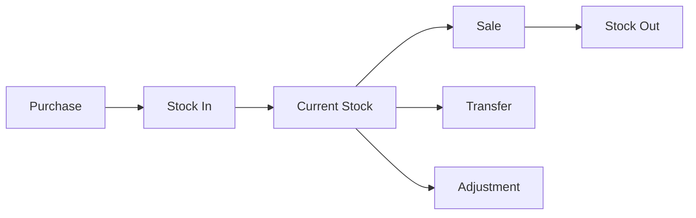

# Inventory Workflow

## Overview

The inventory workflow manages product catalog, stock levels, purchases, and transfers.

---

## 1. Stock Movement Flow



---

## 2. Purchase Order Workflow

### 2.1 States

| State | Description |
|-------|-------------|
| Pending | PO submitted, awaiting approval |
| Approved | Approved, ready for vendor |
| Received | Stock received and verified |
| Rejected | PO rejected by manager |

**Note:** Purchase drafts are stored in a separate `stock_purchase_drafts` table and are deleted upon submission.

### 2.2 Process

1. Create purchase order
2. Add products and quantities
3. Submit for approval
4. Manager reviews and approves
5. Vendor delivers goods
6. Receive and verify stock
7. Stock levels updated

---

## 3. Stock Transfer Workflow

### 3.1 Process

1. Source manager requests transfer (`POST /api/stocks/transfer`)
2. System validates source stock availability
3. Destination manager approves
4. Stock deducted from source shop
5. Stock added to destination shop

### 3.2 API Endpoint

**Transfer Stock:** `POST /api/stocks/transfer`

```json
{
  "from_shop_id": "shop-uuid-1",
  "to_shop_id": "shop-uuid-2",
  "items": [
    { "product_id": "product-uuid", "quantity": 5 }
  ],
  "notes": "Inter-shop transfer"
}
```

### 3.3 Approval Requirements

- Both shop managers must approve
- Transfer quantity validated against source stock
- Audit trail maintained in `stock_movements` table

---

## 4. Stock Adjustment Workflow

### 4.1 Adjustment Types

- Breakage
- Expiry
- Theft
- Counting error
- System correction

### 4.2 Approval Process

1. Request adjustment with reason
2. Attach photo evidence
3. Manager reviews
4. Approve or investigate
5. Stock adjusted

---

## 5. Low Stock Alerts

### 5.1 Trigger Conditions

- Stock falls below reorder level
- Product approaching expiry

### 5.2 Notification Flow

1. System detects low stock
2. Alert sent to manager
3. Manager reviews and creates PO
4. Stock replenished
