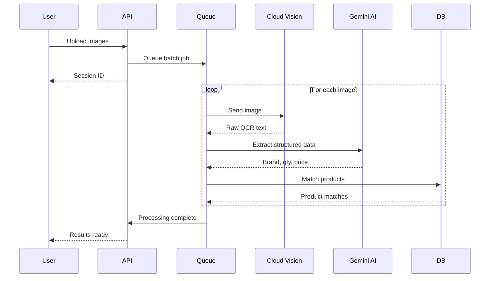

# OCR Processing Workflow

## Overview

LiquorPro uses AI-powered OCR to extract data from receipt images automatically.

---

## 1. OCR Pipeline

---

## 2. Processing Stages

### 2.1 Upload

1. User selects images (max 200)
2. Images uploaded to server
3. Batch session created
4. Processing begins

### 2.2 OCR Extraction

1. Image sent to Google Cloud Vision
2. DOCUMENT_TEXT_DETECTION applied
3. Raw text extracted
4. Text cleaned and normalized

### 2.3 AI Processing

1. Text sent to Gemini AI
2. Structured extraction:
   - Brand name
   - Size (ml)
   - Quantity
   - Unit price
   - Total amount
   - GST

### 2.4 Product Matching

1. Extracted brand matched to catalog
2. Fuzzy matching for variations
3. Confidence score calculated
4. Low confidence flagged for review

---

## 3. Confidence Handling

| Confidence | Action |
|------------|--------|
| > 90% | Auto-matched |
| 70-90% | Matched with review flag |
| < 70% | Manual review required |

---

## 4. Manual Review

### 4.1 Review Interface

1. Original image displayed
2. Extracted data shown
3. User can edit fields
4. Select correct product
5. Confirm and save

---

## 5. Accuracy Metrics

System tracks:
- Overall accuracy rate
- Field-level accuracy
- Common extraction errors
- Processing time

---

## 6. Best Practices

### 6.1 Image Quality

- Good lighting
- Clear, focused images
- Full receipt visible
- Avoid shadows

### 6.2 Batch Management

- Group similar receipts
- Process daily batches
- Review promptly
