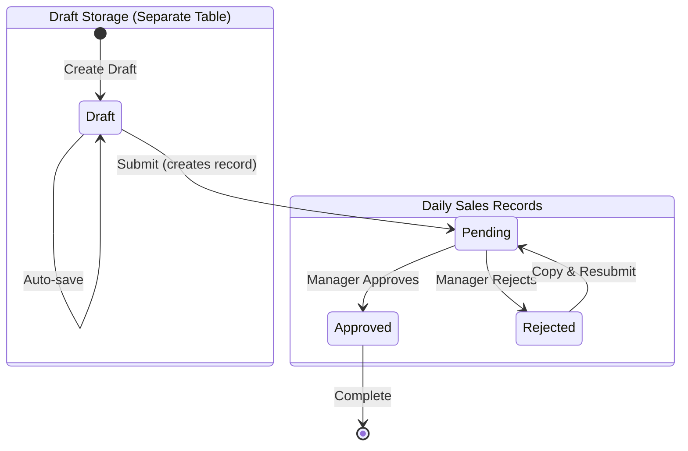
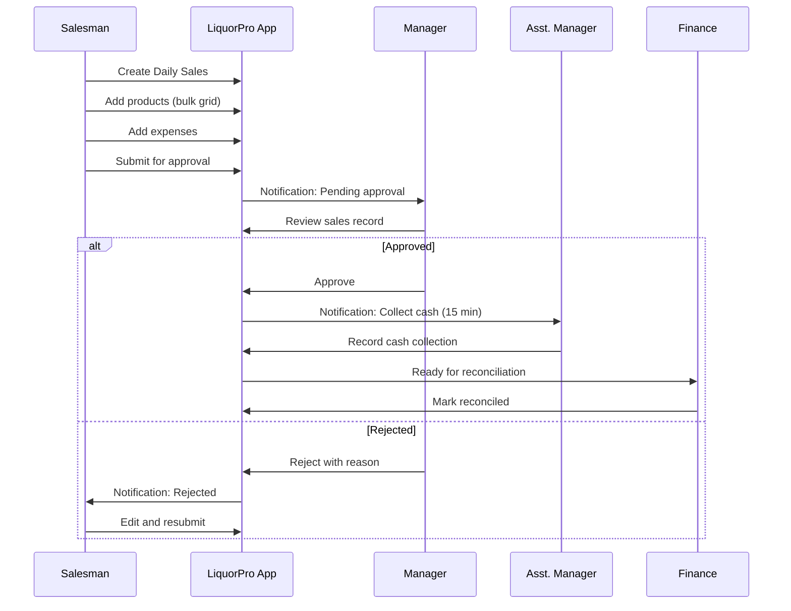
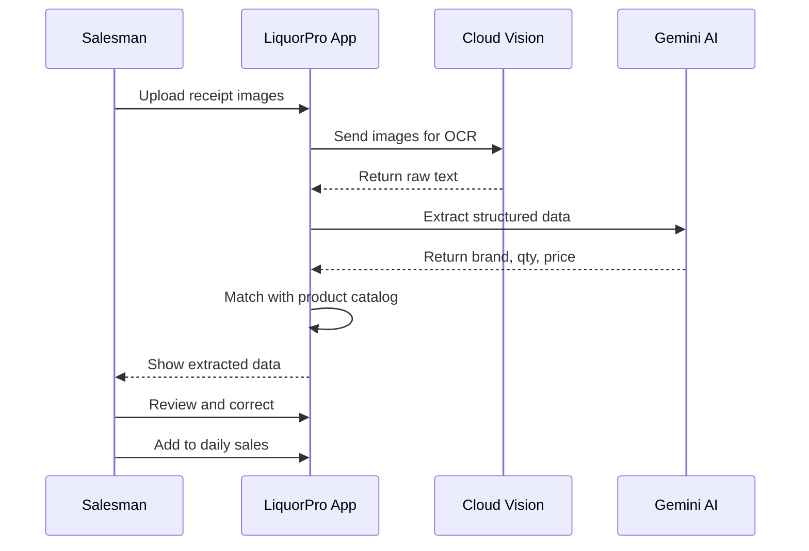

# Sales Workflow

## Overview

The sales workflow in LiquorPro is designed to streamline daily sales operations, reduce manual entry time from 45 minutes to under 5 minutes, and ensure proper approval and reconciliation processes.

---

## 1. Sales Workflow Diagram



**Note:** Drafts are stored in a separate `daily_sales_drafts` table and are deleted upon submission. The main `daily_sales_records` table only contains statuses: `pending`, `approved`, `rejected`.

---

## 2. Daily Sales Record Lifecycle

### 2.1 State Definitions

**Draft Storage (Separate Table: `daily_sales_drafts`):**

| State | Description | Actions Available |
|-------|-------------|-------------------|
| **Draft** | Data being created/edited | Edit, Auto-save, Submit, Delete |

**Main Record (Table: `daily_sales_records`):**

| State | Description | Actions Available |
|-------|-------------|-------------------|
| **Pending** | Awaiting manager approval | View only (salesman) |
| **Approved** | Approved by manager | Triggers cash collection deadline |
| **Rejected** | Rejected with reason | Copy record, Edit copy, Resubmit |

### 2.2 State Transitions

```
Draft → Pending (via Submit)
  Trigger: Salesman clicks "Submit for Approval" (`POST /api/daily-sales/draft/submit`)
  Validations:
    - At least one item required
    - All items have valid quantities
    - Total amount > 0
    - Date is not in future
  Actions:
    - Draft data converted to daily_sales_record (status: pending)
    - Draft deleted from daily_sales_drafts table

Pending → Approved
  Trigger: Manager clicks "Approve" (`POST /api/daily-records/:id/approve`)
  Validations:
    - Manager has approval permission
    - No duplicate for same shop/date
  Actions:
    - Create money collection record
    - Start collection deadline timer (default: 15 min, configurable per tenant)
    - Notify assistant manager
    - Update stock levels

Pending → Rejected
  Trigger: Manager clicks "Reject" (`POST /api/daily-records/:id/reject`)
  Validations:
    - Rejection reason is provided
  Actions:
    - Notify salesman
    - Salesman can use "Copy" to create editable version

Rejected → Pending (via Copy & Resubmit)
  Trigger: Salesman copies rejected record, edits, and resubmits
  Note: Original rejected record remains in history
```

---

## 3. Process Flows

### 3.1 Complete Sales Flow



### 3.2 OCR-Assisted Sales Entry



---

## 4. Role Responsibilities

### 4.1 Salesman

| Responsibility | Timing | SLA |
|----------------|--------|-----|
| Enter daily sales | Throughout day | Before end of day |
| Upload receipts | As received | Within 2 hours |
| Submit for approval | End of day | Before 9 PM |
| Correct rejections | Upon notification | Within 2 hours |

### 4.2 Manager

| Responsibility | Timing | SLA |
|----------------|--------|-----|
| Review pending sales | Multiple times/day | Within 4 hours |
| Approve/reject records | Upon review | Same day |
| Monitor deadline compliance | Real-time | Immediate |
| Handle escalations | As needed | Within 1 hour |

### 4.3 Assistant Manager

| Responsibility | Timing | SLA |
|----------------|--------|-----|
| Collect cash | After approval | **Configurable deadline** (default: 15 min) |
| Record collection | Upon collection | Immediate |
| Report issues | As encountered | Within 5 minutes |

> **Note:** The collection deadline is configurable per tenant via `TenantSettings.MoneyCollectionDeadlineMinutes`. Default is 15 minutes.

### 4.4 Finance

| Responsibility | Timing | SLA |
|----------------|--------|-----|
| Verify collections | Daily | End of day |
| Process deposits | Daily | End of day |
| Reconcile records | Daily | Next morning |
| Generate reports | On demand/scheduled | As configured |

---

## 5. Validation Rules

### 5.1 Entry Validations

| Field | Validation | Error Message |
|-------|------------|---------------|
| Date | Not future | "Cannot create sales for future date" |
| Date | Within 7 days | "Cannot backdate beyond 7 days" |
| Product | Must exist | "Product not found in catalog" |
| Quantity | > 0 | "Quantity must be greater than 0" |
| Quantity | <= Stock | "Insufficient stock (Available: X)" |
| Price | > 0 | "Price must be greater than 0" |
| Discount | <= Total | "Discount cannot exceed total" |

### 5.2 Submission Validations

| Rule | Description |
|------|-------------|
| Items Required | At least one item must be added |
| No Duplicates | Cannot have duplicate product entries |
| Total > 0 | Total amount must be positive |
| Shop Assignment | User must be assigned to the shop |

### 5.3 Approval Validations

| Rule | Description |
|------|-------------|
| Manager Role | Only manager or above can approve |
| Shop Access | Manager must have access to the shop |
| No Self-Approval | Cannot approve own submissions |

---

## 6. Notifications

### 6.1 Notification Triggers

| Event | Recipients | Channels |
|-------|------------|----------|
| Record submitted | Manager | Push, In-app |
| Record approved | Salesman, Asst. Manager | Push, In-app |
| Record rejected | Salesman | Push, In-app |
| Collection deadline (5 min) | Asst. Manager | Push, In-app |
| Collection deadline missed | Manager | Push, In-app, SMS |
| Record reconciled | Salesman | In-app |

### 6.2 Notification Templates

**Submission Notification:**
```
📋 New Daily Sales Pending
Shop: Main Street Store
Date: January 11, 2025
Total: ₹45,000
Submitted by: John Doe
[Review Now]
```

**Deadline Warning:**
```
⏰ Cash Collection Deadline Approaching
Record: Daily Sales - Jan 11
Amount: ₹45,000
Time Remaining: 5 minutes
[Collect Now]
```

---

## 7. Exception Handling

### 7.1 Late Submission

If sales cannot be submitted by end of day:

1. **Notify manager** immediately
2. **Document reason** in notes
3. **Submit as "late entry"** when possible
4. **Manager approval** still required

### 7.2 Rejected Record

When a record is rejected:

1. **Review rejection reason**
2. **Make necessary corrections**
3. **Add explanation** in notes
4. **Resubmit** for approval
5. **Maximum 3 rejections** before escalation

### 7.3 Discrepancy Found

If discrepancy discovered after approval:

1. **Do not modify** approved records
2. **Create adjustment record**
3. **Document reason** thoroughly
4. **Manager approval** for adjustment
5. **Audit trail** maintained

---

## 8. Reports Generated

### 8.1 Daily Reports

| Report | Description | Generated |
|--------|-------------|-----------|
| Daily Sales Summary | All sales for the day | End of day |
| Pending Approvals | Records awaiting approval | On demand |
| Rejection Summary | Rejected records and reasons | Daily |
| Collection Status | Cash collection compliance | Real-time |

### 8.2 Analytics

- **Sales Trends**: Daily/weekly/monthly comparisons
- **Product Performance**: Top sellers, slow movers
- **Salesman Performance**: Individual sales metrics
- **Approval Metrics**: Average approval time, rejection rate

---

## 9. Integration Points

### 9.1 Inventory Integration

When sales are approved:
- Stock levels automatically decremented
- Low stock alerts triggered if needed
- Cost of goods calculated

### 9.2 Finance Integration

When sales are approved:
- Money collection record created
- Cash flow updated
- Vendor payments affected

### 9.3 Reporting Integration

All sales data feeds into:
- Business intelligence dashboards
- Tax reports
- Compliance reports

---

## 10. Workflow Configuration

### 10.1 Configurable Parameters

| Parameter | Default | Range | Config Key |
|-----------|---------|-------|------------|
| Approval deadline | None | 0-24 hours | N/A |
| Cash collection deadline | 15 minutes | 5-60 minutes | `TenantSettings.MoneyCollectionDeadlineMinutes` |
| Max backdate days | 7 | 1-30 | Tenant settings |
| Auto-save interval | 30 seconds | 10-120 seconds | App config |
| Max items per record | 500 | 100-1000 | Tenant settings |

### 10.2 Workflow Customization

Administrators can configure:
- Approval hierarchies
- Notification preferences
- Deadline values
- Validation rules

---

## Next Steps

- [Approval Workflow](approval-workflow.md) - Detailed approval process
- [Inventory Workflow](inventory-workflow.md) - Stock impact
- [Finance Workflow](finance-workflow.md) - Financial reconciliation
